# Admin Dashboard Controller

English overview of `/api/admin/v2/dashboard/*` endpoints with links to controller and service. All require admin auth and accept filters `period` (week, month, all-time), `schoolId`, `campusId`. When `export=true`, the controller builds CSV; otherwise it returns JSON.

## Endpoints and data sources

### 1) Community creation — `/dashboard/community-creation`

- Implementation: controller ([src/controllers/admin/dashboard.controller.ts#L56](../../src/controllers/admin/dashboard.controller.ts#L56)), service ([src/services/admin/dashboard.service.ts#L34](../../src/services/admin/dashboard.service.ts#L34)).
- Data: counts of Event, Idea, and Space created per time slice, filtered by campus/school (ObjectId) and, for events, by creator or space campus.
- Source: MongoDB collections Event, Idea, and Space via the dashboard service; no cache, campus/school filters applied in queries.
- Sample JSON:

```json
{
  "labels": ["Week 1", "Week 2", "Week 3", "Week 4", "Week 5"],
  "subLabels": [
    "Dec 1 - Dec 6",
    "Dec 7 - Dec 13",
    "Dec 14 - Dec 20",
    "Dec 21 - Dec 27",
    "Dec 28 - Dec 31"
  ],
  "data": [
    {
      "events": 8,
      "ideas": 16,
      "spaces": 11
    },
    {
      "events": 17,
      "ideas": 1,
      "spaces": 1
    },
    {
      "events": 8,
      "ideas": 8,
      "spaces": 2
    },
    {
      "events": 0,
      "ideas": 0,
      "spaces": 0
    },
    {
      "events": 0,
      "ideas": 0,
      "spaces": 0
    }
  ]
}
```

<div align="center">
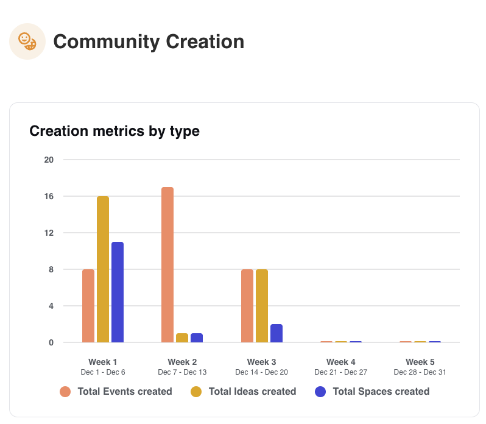
</div>

### Calculation notes (how each metric is calculated)

- events: count of Event documents whose `createdAt` falls in the slice; campus filter comes from event creator campus or linked space campus.
- ideas: count of Idea documents with `createdAt` in the slice and matching campus/school.
- spaces: count of Space documents with `createdAt` in the slice and matching campus/school.
- labels/subLabels: buckets derived from `period` (week, month split into weeks, or all-time rolling windows).

---

### 2) Engagement — `/dashboard/engagement`

- Implementation: controller ([src/controllers/admin/dashboard.controller.ts#L150](../../src/controllers/admin/dashboard.controller.ts#L150)), service ([src/services/admin/dashboard.service.ts#L105](../../src/services/admin/dashboard.service.ts#L105)).
- Data: active users (SessionTracking, User.lastLogin, Chat, Event, Idea, WalkInvite, PeerRequest), average session duration (SessionTracking), new chats (Chat). Donut uses Event.ownerType (space vs user).
- Source: MongoDB (SessionTracking, User, Chat, Event, Idea, WalkInvite, PeerRequest) aggregated in the dashboard service; no cache.
- Sample JSON:

```json
{
  "labels": ["Week 1", "Week 2", "Week 3", "Week 4", "Week 5"],
  "subLabels": [
    "Dec 1 - Dec 6",
    "Dec 7 - Dec 13",
    "Dec 14 - Dec 20",
    "Dec 21 - Dec 27",
    "Dec 28 - Dec 31"
  ],
  "userEngagement": [28, 11, 25, 4, 0],
  "sessionDuration": [0, 0, 8.4, 0, 0],
  "totalChats": [12, 0, 6, 0, 0],
  "donutData": [
    {
      "label": "Events organized by spaces",
      "value": 82,
      "percentage": "27.70%",
      "color": "#526ac9"
    },
    {
      "label": "Events organized by users",
      "value": 214,
      "percentage": "72.30%",
      "color": "#321fdb"
    }
  ]
}
```

<div align="center">
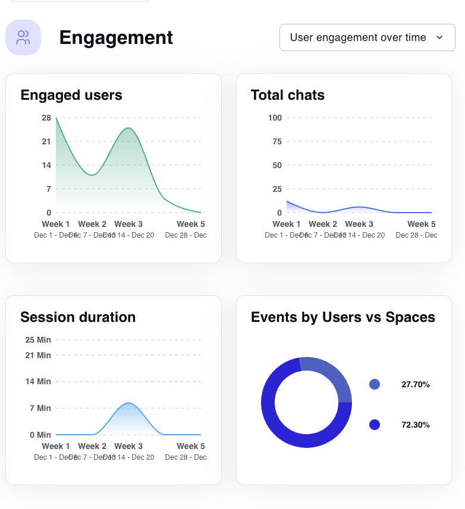
</div>

### Calculation notes (how each metric is calculated)

- userEngagement: take every `userId` seen in the slice from SessionTracking, every `senderId` from Chat, every creator/owner on Event and Idea, plus the relevant actor on WalkInvite and PeerRequest (created in the slice). Union those IDs, drop duplicates, and count them. Campus/school filters are applied to all underlying queries. **How engagement is calculated:** we count how many different students did anything in the app during that time bucket—sessions, chats, creating events/ideas, sending invites, or peer requests. Engaged = unique students who took a create action in chat, events, ideas, invites, or peer requests.
- sessionDuration: fetch `SessionTracking` rows inside the slice (and campus/school filters), average `durationMinutes` across them, return one average per slice.
- totalChats: count Chat documents whose `createdAt` falls in the slice after campus/school filters.
- donutData: group Event documents in the slice by `ownerType` (space|user), count each group, and compute their percentages over the total events in that slice (respecting campus/school filters).

---

### 3) Retention — `/dashboard/retention`

- Implementation: controller ([src/controllers/admin/dashboard.controller.ts#L236](../../src/controllers/admin/dashboard.controller.ts#L236)), service ([src/services/admin/dashboard.service.ts#L522](../../src/services/admin/dashboard.service.ts#L522)).
- Data: `connectionRate` (PeerRequest accepted/sent), `inactiveSignups` and `newRegistrations` (User), `avgAppOpens` (SessionTracking per active user). Filters applied by campus/school on users and peer requests.
- Source: MongoDB PeerRequest, User, and SessionTracking collections; campus/school filters and period windows applied in queries.
- Sample JSON:

```json
{
  "labels": ["Week 1", "Week 2", "Week 3", "Week 4", "Week 5"],
  "subLabels": [
    "Dec 1 - Dec 6",
    "Dec 7 - Dec 13",
    "Dec 14 - Dec 20",
    "Dec 21 - Dec 27",
    "Dec 28 - Dec 31"
  ],
  "connectionRate": [37.5, 40, 0, 0, 0],
  "inactiveSignups": [0, 0, 4, 0, 0],
  "newRegistrations": [4, 0, 4, 0, 0],
  "avgAppOpens": [8.9, 4.9, 6.8, 3.3, 0]
}
```

<div align="center">
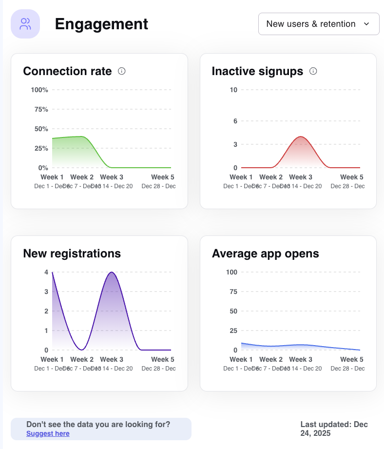
</div>

### Calculation notes (how each metric is calculated)

- connectionRate: `PeerRequest.status='accepted'` divided by sent (`createdAt` in slice), expressed in %.
- inactiveSignups: users with `createdAt` in slice and no SessionTracking or last activity (no `lastLogin`, chats, invites, or logs).
- newRegistrations: users with `createdAt` in slice (all signups).
- avgAppOpens: average `SessionTracking.opens` (or equivalent app-open counter) per active user in the slice.

---

### 4) Summary — `/dashboard/stats`

- Implementation: controller ([src/controllers/admin/dashboard.controller.ts#L344](../../src/controllers/admin/dashboard.controller.ts#L344)), service ([src/services/admin/dashboard.service.ts#L700](../../src/services/admin/dashboard.service.ts#L700)).
- Data: totals for active students, deactivated students, active events, spaces, ideas; computes period-over-period change when not all-time. Sources: User, Event, Space, Idea (events filtered by campus via creator/space lookup).
- Source: MongoDB User, Event, Space, and Idea collections; current slice vs previous slice computed in the dashboard service.
- Sample JSON:

```json
{
  "totalStudents": 7,
  "deactivatedStudents": 2,
  "totalActiveEvents": 10,
  "totalSpaces": 6,
  "totalIdeas": 13,
  "totalUsers": 7,
  "studentsChange": { "changePercentage": "133.3%", "changeDirection": "up" },
  "usersChange": { "changePercentage": "133.3%", "changeDirection": "up" },
  "deactivatedStudentsChange": {
    "changePercentage": "N/A",
    "changeDirection": "neutral"
  },
  "eventsChange": { "changePercentage": "N/A", "changeDirection": "neutral" },
  "spacesChange": { "changePercentage": "25%", "changeDirection": "down" },
  "ideasChange": { "changePercentage": "550%", "changeDirection": "up" }
}
```

  <div align="center">
  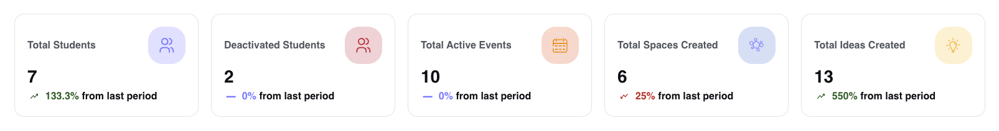
  </div>

### Calculation notes (how each metric is calculated)

- totalStudents/totalUsers: users with `isDeactivated=false` in scope; deactivatedStudents uses `isDeactivated=true`.
- totalActiveEvents: events with `status` not canceled whose `startDate`/`endDate` overlap the slice (and pass campus/school filter).
- totalSpaces/totalIdeas: Space and Idea documents with `createdAt` in scope.
- _Change_ fields: re-run the same counts for the previous slice and compute percentage + direction.

---

### 5) Popular features — `/dashboard/popular-features`

- Implementation: controller ([src/controllers/admin/dashboard.controller.ts#L421](../../src/controllers/admin/dashboard.controller.ts#L421)), service ([src/services/admin/dashboard.service.ts#L834](../../src/services/admin/dashboard.service.ts#L834)).
- Data: most selected interests (User/Interest), ways to connect (WalkInvite), visited places (Place + Event match by name/address), invitation categories (Event.interests), most engaged users (User.engagementScore), common interests (User.interest_ids), fields of study (User.study_main). Supports `sortBy` most/least_popular.
- Source: MongoDB User, Interest, WalkInvite, Place, and Event collections; aggregates built in the dashboard service with campus/school filters.
- Sample JSON:

```json
{
  "topInterests": [
    {
      "rank": 1,
      "label": "Pokémon Go",
      "icon": "https://cdn-stg.walkyapp.com/interests/images/3b9d3418-4543-4dc5-a8f2-14ba198f27d8.png",
      "count": 0
    },
    {
      "rank": 2,
      "label": "Theater",
      "count": 0
    },
    {
      "rank": 3,
      "label": "Karaoke",
      "count": 0
    }
  ],
  "popularWaysToConnect": [
    { "rank": 1, "label": "songwriting", "count": 0 },
    { "rank": 2, "label": "lifting", "count": 0 },
    { "rank": 3, "label": "weaving", "count": 0 }
  ],
  "visitedPlaces": [
    { "rank": 1, "label": "FIU Green Library", "count": 0 },
    { "rank": 2, "label": "Half Moon Empanadas", "count": 0 },
    { "rank": 3, "label": "Tropical Smoothie Cafe", "count": 0 }
  ],
  "topInvitationCategories": [
    { "rank": 1, "label": "singing", "count": 0 },
    { "rank": 2, "label": "frisbee", "count": 0 },
    { "rank": 3, "label": "tennis", "count": 0 }
  ],
  "mostEngaged": [
    { "rank": 1, "label": "Daniela Suarez" },
    { "rank": 2, "label": "Daniela Suarez" },
    { "rank": 3, "label": "Daniela Suarez" }
  ],
  "commonInterests": [
    { "rank": 1, "name": "Pokémon Go", "students": 0, "percentage": 0 },
    { "rank": 2, "name": "Baseball", "students": 0, "percentage": 0 },
    { "rank": 3, "name": "Reading", "students": 0, "percentage": 0 }
  ],
  "topFieldsOfStudy": [
    {
      "rank": 1,
      "name": "Fashion Merchandising",
      "students": 1,
      "avgInteractions": 0.2
    },
    { "rank": 2, "name": "Greek", "students": 1, "avgInteractions": 0 },
    {
      "rank": 3,
      "name": "Urban Planning",
      "students": 1,
      "avgInteractions": 0.3
    }
  ]
}
```

Arrays truncated for brevity.

<div align="center">
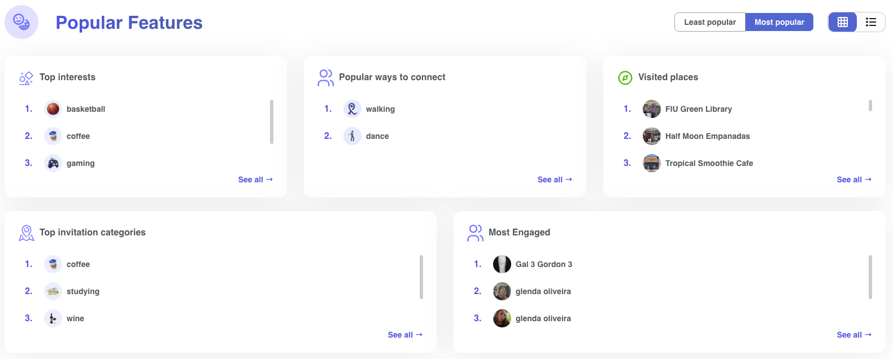
</div>

### Calculation notes (how each metric is calculated)

- topInterests: counts from `User.interest_ids` joined to Interest documents (`createdAt` in scope for user filters).
- popularWaysToConnect: `WalkInvite.category` grouped by `createdAt` in the slice.
- visitedPlaces: group by `Event.place.name`/`address` (or Place) for events in scope.
- topInvitationCategories: aggregate `Event.interests` values for events in scope.
- mostEngaged: users ordered by `User.engagementScore` within the slice filters.
- commonInterests: share of users selecting each `interest_id` (percentage of users in scope).
- topFieldsOfStudy: users grouped by `study_main`; `avgInteractions` derived from engagementScore/activity counts.

---

### 6) Events insights — `/dashboard/events-insights`

- Implementation: controller ([src/controllers/admin/dashboard.controller.ts#L582](../../src/controllers/admin/dashboard.controller.ts#L582)), service ([src/services/admin/dashboard.service.ts#L1161](../../src/services/admin/dashboard.service.ts#L1161)).
- Data: total public/private, average attendees (`participants.length`), expand_event usage, organizer split (space vs user), top interests, top public/private events ordered by attendees. Filters by date/campus/school on `createdAt`.
- Source: MongoDB Event (and related interest data) with aggregations on visibility, ownerType, participants, and interests; campus/school filters in the query.
- Sample JSON:

```json
{
  "stats": {
    "totalEvents": 51,
    "publicEvents": 45,
    "privateEvents": 6,
    "avgPublicAttendees": 2,
    "avgPrivateAttendees": 3
  },
  "expandReachData": [
    {
      "label": "Without expand Event reach",
      "value": 39,
      "percentage": "86.67%",
      "color": "#D6E9C7"
    },
    {
      "label": "With expand Event reach",
      "value": 6,
      "percentage": "13.33%",
      "color": "#3B7809"
    }
  ],
  "usersVsSpacesData": [
    {
      "label": "Events organized by Spaces",
      "value": 10,
      "percentage": "19.61%",
      "color": "#546FD9"
    },
    {
      "label": "Events organized by Users",
      "value": 41,
      "percentage": "80.39%",
      "color": "#CACAEE"
    }
  ],
  "interests": [
    {
      "name": "coffee",
      "icon": "https://cdn-stg.walkyapp.com/interests/icons/coffee_icon.png",
      "students": 6,
      "percentage": 11.8
    },
    {
      "name": "wine",
      "icon": "https://cdn-stg.walkyapp.com/interests/icons/wine_icon.png",
      "students": 5,
      "percentage": 9.8
    },
    {
      "name": "gaming",
      "icon": "https://cdn-stg.walkyapp.com/interests/icons/gaming_icon.png",
      "students": 5,
      "percentage": 9.8
    },
    {
      "name": "studying",
      "icon": "https://cdn-stg.walkyapp.com/interests/icons/studying_icon.png",
      "students": 5,
      "percentage": 9.8
    },
    {
      "name": "food",
      "icon": "https://cdn-stg.walkyapp.com/interests/images/c588d33b-90ff-4f20-8160-e49913bb7216.png",
      "students": 4,
      "percentage": 7.8
    }
  ],
  "publicEventsList": [
    {
      "rank": 1,
      "id": "6940743b8625829a97e9740e",
      "name": "billar",
      "attendees": 5,
      "image": "https://cdn-stg.walkyapp.com/interests/billiards.webp"
    },
    {
      "rank": 2,
      "id": "69445297e3730d330ff7fda1",
      "name": "event test admin",
      "attendees": 4,
      "image": "https://cdn-stg.walkyapp.com/interests/images/a0649ec9-ff90-4f30-b5b3-8ac1f8084f99.png"
    },
    {
      "rank": 3,
      "id": "6931ab792eb7ccf227f3471c",
      "name": "stef",
      "attendees": 4,
      "image": "https://cdn-stg.walkyapp.com/interests/hiking.webp"
    },
    {
      "rank": 4,
      "id": "6931ab332eb7ccf227f343e4",
      "name": "Holi",
      "attendees": 4,
      "image": "https://cdn-stg.walkyapp.com/interests/photography.webp"
    },
    {
      "rank": 5,
      "id": "69384381af1770378ef8eb6a",
      "name": "Public space test",
      "attendees": 3,
      "image": "https://cdn-stg.walkyapp.com/interests/gaming.webp"
    },
    {
      "rank": 6,
      "id": "6931a9ec2eb7ccf227f33f15",
      "name": "painel",
      "attendees": 3,
      "image": "https://cdn-stg.walkyapp.com/interests/cooking.webp"
    },
    {
      "rank": 7,
      "id": "69440e7adb9935f81b8548bc",
      "name": "test",
      "attendees": 3,
      "image": "https://cdn-stg.walkyapp.com/interests/golf.webp"
    },
    {
      "rank": 8,
      "id": "69384309af1770378ef8e8c7",
      "name": "Public test personal ",
      "attendees": 3,
      "image": "https://cdn-stg.walkyapp.com/interests/pickleball.webp"
    },
    {
      "rank": 9,
      "id": "69249c4d9e8901dcd7fc50c8",
      "name": "Dance",
      "attendees": 2,
      "image": "https://cdn-stg.walkyapp.com/interests/dance.webp"
    },
    {
      "rank": 10,
      "id": "6925cb2a0d1d901e5484c437",
      "name": "Wine 3",
      "attendees": 2,
      "image": "https://cdn-stg.walkyapp.com/interests/wine.webp"
    }
  ],
  "privateEventsList": [
    {
      "rank": 1,
      "id": "6931965c2eb7ccf227f31617",
      "name": "Books",
      "attendees": 4,
      "image": "https://cdn-stg.walkyapp.com/interests/books.webp"
    },
    {
      "rank": 2,
      "id": "69384429af1770378ef8eee5",
      "name": "Private personal test",
      "attendees": 3,
      "image": "https://cdn-stg.walkyapp.com/interests/studying.webp"
    },
    {
      "rank": 3,
      "id": "693844aaaf1770378ef8f1aa",
      "name": "Private space test ",
      "attendees": 3,
      "image": "https://cdn-stg.walkyapp.com/interests/images/476ff2ac-101a-41c3-a136-c08d9912d7d0.png"
    },
    {
      "rank": 4,
      "id": "6931a8ed2eb7ccf227f33ce3",
      "name": "test pvt painel",
      "attendees": 2,
      "image": "https://cdn-stg.walkyapp.com/interests/hiking.webp"
    },
    {
      "rank": 5,
      "id": "69384367af1770378ef8eb16",
      "name": "evento privado gustavo",
      "attendees": 2,
      "image": "https://cdn-stg.walkyapp.com/interests/coffee.webp"
    },
    {
      "rank": 6,
      "id": "69384576af1770378ef8f741",
      "name": "evento privado space gustavo",
      "attendees": 2,
      "image": "https://cdn-stg.walkyapp.com/interests/gym.webp"
    }
  ],
  "lastUpdated": "2025-12-24T11:55:37.755Z"
}
```

<div align="center">
  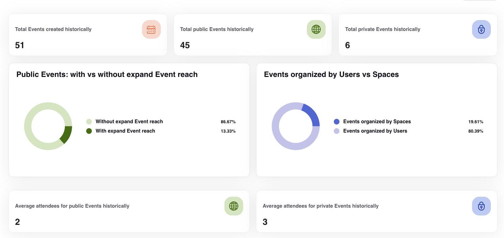
  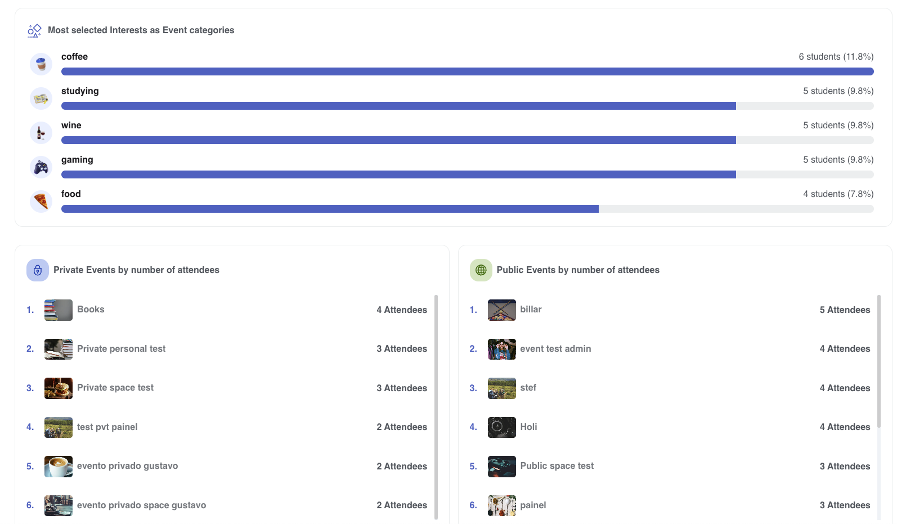
</div>

### Calculation notes (how each metric is calculated)

- stats: count Event documents by `isPublic` (or `visibility`) with `createdAt` in window; averages use `participants.length` for public vs private.
- expandReachData: count events where `expandEventReach=true` vs false; percentage over total events in window.
- usersVsSpacesData: split events by `ownerType` (space|user) using `createdAt` in window.
- interests: aggregate `Event.interests` weighted by attendee counts (`participants.length`) for events in window.
- publicEventsList/privateEventsList: events ordered by `participants.length` within their visibility tier.
- lastUpdated: ISO timestamp generated when the metrics response is built.

---

### 7) Student safety — `/dashboard/student-safety`

- Implementation: controller ([src/controllers/admin/dashboard.controller.ts#L692](../../src/controllers/admin/dashboard.controller.ts#L692)), service ([src/services/admin/dashboard.service.ts#L1301](../../src/services/admin/dashboard.service.ts#L1301)).
- Data: Report counts by type (user, event, space, idea, message) per time slice; filters by `campus_id` or `school_id` on Report.
- Source: MongoDB Report collection; grouped by type with campus/school filters and period window.
- Sample JSON:

```json
{
  "labels": [
    "Jan 2025",
    "Feb 2025",
    "Mar 2025",
    "Apr 2025",
    "May 2025",
    "Jun 2025",
    "Jul 2025",
    "Aug 2025",
    "Sep 2025",
    "Oct 2025",
    "Nov 2025",
    "Dec 2025"
  ],
  "reportsData": [
    {
      "reportedPeople": 0,
      "reportedEvents": 0,
      "reportedSpaces": 0,
      "reportedIdeas": 0,
      "reportedMessages": 0
    },
    {
      "reportedPeople": 0,
      "reportedEvents": 0,
      "reportedSpaces": 0,
      "reportedIdeas": 0,
      "reportedMessages": 0
    },
    {
      "reportedPeople": 0,
      "reportedEvents": 0,
      "reportedSpaces": 0,
      "reportedIdeas": 0,
      "reportedMessages": 0
    },
    {
      "reportedPeople": 0,
      "reportedEvents": 0,
      "reportedSpaces": 0,
      "reportedIdeas": 0,
      "reportedMessages": 0
    },
    {
      "reportedPeople": 0,
      "reportedEvents": 0,
      "reportedSpaces": 0,
      "reportedIdeas": 0,
      "reportedMessages": 0
    },
    {
      "reportedPeople": 0,
      "reportedEvents": 0,
      "reportedSpaces": 0,
      "reportedIdeas": 0,
      "reportedMessages": 0
    },
    {
      "reportedPeople": 0,
      "reportedEvents": 0,
      "reportedSpaces": 0,
      "reportedIdeas": 0,
      "reportedMessages": 0
    },
    {
      "reportedPeople": 0,
      "reportedEvents": 0,
      "reportedSpaces": 0,
      "reportedIdeas": 0,
      "reportedMessages": 0
    },
    {
      "reportedPeople": 0,
      "reportedEvents": 0,
      "reportedSpaces": 0,
      "reportedIdeas": 0,
      "reportedMessages": 0
    },
    {
      "reportedPeople": 9,
      "reportedEvents": 3,
      "reportedSpaces": 4,
      "reportedIdeas": 5,
      "reportedMessages": 7
    },
    {
      "reportedPeople": 0,
      "reportedEvents": 0,
      "reportedSpaces": 0,
      "reportedIdeas": 0,
      "reportedMessages": 0
    },
    {
      "reportedPeople": 20,
      "reportedEvents": 20,
      "reportedSpaces": 0,
      "reportedIdeas": 29,
      "reportedMessages": 17
    }
  ]
}
```

<div align="center">
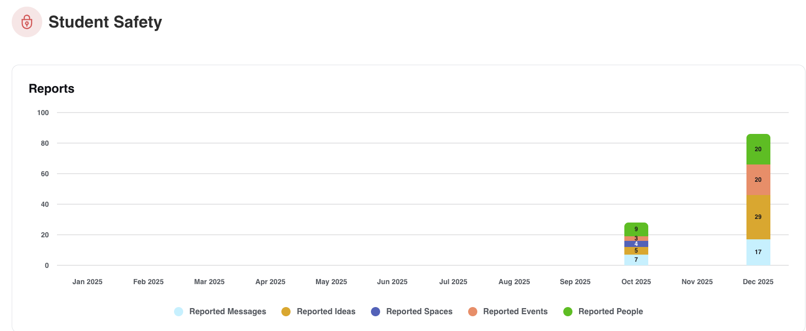
</div>

### Calculation notes (how each metric is calculated)

- reportedPeople/events/spaces/ideas/messages: counts of Report documents grouped by `type` with `createdAt` in slice and campus/school filters applied.

---

### 8) User interactions — `/dashboard/user-interactions`

- Implementation: controller ([src/controllers/admin/dashboard.controller.ts#L788](../../src/controllers/admin/dashboard.controller.ts#L788)), service ([src/services/admin/dashboard.service.ts#L1425](../../src/services/admin/dashboard.service.ts#L1425)).
- Data: invitations (Event.invites + WalkInvite) aggregated by status for sent/accepted/ignored; unique clicks on ideas/events via UserActivityLog (deduped by user+entity). Filters by campus/school in logs and events.
- Source: MongoDB Event, WalkInvite, and UserActivityLog collections; aggregates done per slice with campus/school filters.
- Sample JSON:

```json
{
  "labels": [
    "Jan 2025",
    "Feb 2025",
    "Mar 2025",
    "Apr 2025",
    "May 2025",
    "Jun 2025",
    "Jul 2025",
    "Aug 2025",
    "Sep 2025",
    "Oct 2025",
    "Nov 2025",
    "Dec 2025"
  ],
  "invitationsData": [
    { "sent": 2, "accepted": 2, "ignored": 0 },
    { "sent": 115, "accepted": 89, "ignored": 0 },
    { "sent": 5, "accepted": 4, "ignored": 0 },
    { "sent": 117, "accepted": 18, "ignored": 19 },
    { "sent": 0, "accepted": 0, "ignored": 0 },
    { "sent": 0, "accepted": 0, "ignored": 0 },
    { "sent": 4, "accepted": 0, "ignored": 0 },
    { "sent": 165, "accepted": 58, "ignored": 19 },
    { "sent": 53, "accepted": 9, "ignored": 7 },
    { "sent": 58, "accepted": 17, "ignored": 8 },
    { "sent": 14, "accepted": 2, "ignored": 0 },
    { "sent": 6, "accepted": 0, "ignored": 0 }
  ],
  "ideasClicksData": [0, 0, 0, 0, 0, 0, 0, 0, 0, 49, 78, 73],
  "eventsClicksData": [0, 0, 0, 0, 0, 0, 0, 0, 0, 129, 265, 131]
}
```

<div align="center">
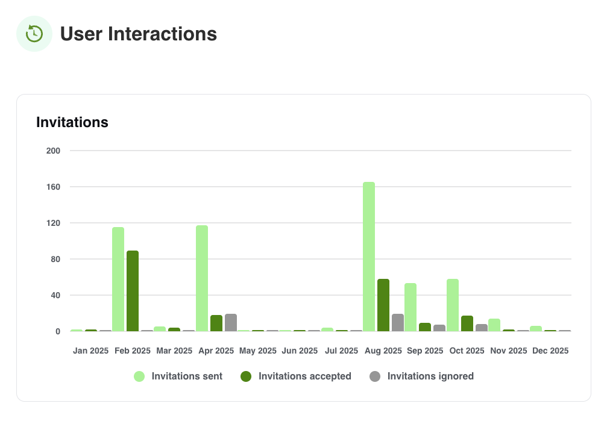
</div>

### Calculation notes (how each metric is calculated)

- invitationsData.sent/accepted/ignored: counts from Event `invites.status` plus `WalkInvite.status` grouped by `createdAt` in slice.
- ideasClicksData/eventsClicksData: unique `(userId, entityId)` pairs in UserActivityLog for `entityType=idea|event` (actions view/going/join/click) within the slice.

---

### 9) Student behavior — `/dashboard/student-behavior`

- Implementation: controller ([src/controllers/admin/dashboard.controller.ts#L502](../../src/controllers/admin/dashboard.controller.ts#L502)), service ([src/services/admin/dashboard.service.ts#L1851](../../src/services/admin/dashboard.service.ts#L1851)).
- Data: metric cards (avg peers per student, avg time to first interaction, % met in person via accepted WalkInvites, % joined a space) with comparison to previous period; completion metrics using WalkInvite (peer vs non-peer invites) and UserActivityLog (event participation, space joins, idea collaboration). `period` sets the window; `campusId` overrides `schoolId` in filters.
- Source: MongoDB User, WalkInvite, PeerRequest, SpaceMember, and UserActivityLog collections; calculations run in the dashboard service with period and campus/school filters.
- Sample JSON:

```json
{
  "metricCards": [
    {
      "title": "Average peers per student",
      "value": "1",
      "unit": "Peers",
      "change": "No change",
      "changeDirection": "neutral",
      "changePercentage": "0%",
      "hasTooltip": false
    },
    {
      "title": "Average time to first interaction",
      "value": "0",
      "unit": "Days",
      "change": "N/A",
      "changeDirection": "neutral",
      "changePercentage": "0%",
      "hasTooltip": true,
      "tooltipText": "Average time from registration to first interaction."
    },
    {
      "title": "Students who met in person",
      "value": "0",
      "unit": "%",
      "change": "N/A",
      "changeDirection": "neutral",
      "changePercentage": "0%",
      "hasTooltip": true,
      "tooltipText": "Percentage of students with at least one accepted and completed invitation"
    },
    {
      "title": "Students who joined a Space",
      "value": "0",
      "unit": "%",
      "change": "N/A",
      "changeDirection": "neutral",
      "changePercentage": "0%",
      "hasTooltip": true,
      "tooltipText": "Percentage of students who joined at least one space."
    }
  ],
  "completionMetrics": [
    {
      "label": "New connections invited",
      "percentage": 1.2,
      "description": "Percentage of students who completed the invitation flow by inviting someone they didn't already know.",
      "color": "#00c943",
      "textColor": "#18682c"
    },
    {
      "label": " Invited from Peers",
      "percentage": 0.4,
      "description": "Percentage of students who completed the invitation flow by inviting someone already in their peer list.",
      "color": "#00c943",
      "textColor": "#18682c"
    },
    {
      "label": "Event participation rate",
      "percentage": 0,
      "description": "Percentage of users who opened an event and clicked 'Going' vs those who only viewed it.",
      "color": "#ff9871",
      "textColor": "#ba5630"
    },
    {
      "label": "Space join rate",
      "percentage": 0,
      "description": "Percentage of users who entered a space and clicked 'Join' vs those who just viewed it",
      "color": "#576cc2",
      "textColor": "#4a4cd9"
    },
    {
      "label": "Idea collaboration rate",
      "percentage": 0,
      "description": "Percentage of users who opened an idea and clicked 'Collaborate' vs those who only viewed it.",
      "color": "#ebb129",
      "textColor": "#8a6818"
    }
  ]
}
```

<div align="center">
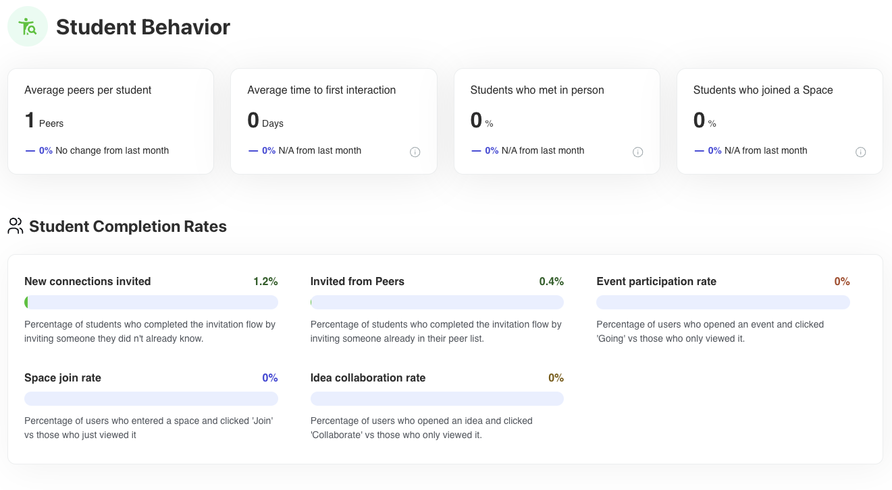
</div>

### Calculation notes (how each metric is calculated)

- Average peers per student: mean of `stats.totalPeers` per user (derived from peer graph) for students in the window.
- Average time to first interaction: days between `User.createdAt` and first qualifying action (WalkInvite accepted+completed, PeerRequest accepted, `UserActivityLog` event_going/space_join/idea_collaborate). If none, stays neutral.
- Students who met in person: percentage of students with at least one WalkInvite where `status='accepted'` and `isCompleted=true` in window.
- Students who joined a Space: percentage of students with a SpaceMember record `state='joined'` and `createdAt` in window.
- New connections invited: percentage of students who sent a WalkInvite to someone not already in their peers list (invite marked non-peer / not existing in peers) in window.
- Invited from peers: percentage of students who sent a WalkInvite to an existing peer (invite marked peer) in window.
- Event participation rate: unique users with `UserActivityLog` action event_going divided by unique users with event_view in window.
- Space join rate: unique users with `UserActivityLog` action space_join divided by unique users with space_view in window.
- Idea collaboration rate: unique users with `UserActivityLog` action idea_collaborate divided by unique users with idea_view in window.

### 10) Ideas insights — extra tile

- Data: paginated ideas with owner, collaboration count, and flag status; same shape as the admin ideas list, surfaced as an insights tile. Filters by campus/school/period; honors `limit` and `page`.
- Source: MongoDB Idea collection (with User populate for owner); filters and pagination applied in the dashboard service.
- Sample JSON:

```json
{
  "data": [
    {
      "id": "69459084b4a14127087b1b05",
      "ideaTitle": "Gustavo Teste",
      "owner": {
        "name": "Gustavo",
        "avatar": "https://cdn-stg.walkyapp.com/user/6841f7091091bd45c30fa002/110369166.webp"
      },
      "studentId": "6841f7091091bd45c30fa002",
      "collaborated": 1,
      "creationDate": "12/19/2025",
      "creationTime": "05:51 PM",
      "isFlagged": false,
      "flagReason": null
    }
    // ... more ideas trimmed for brevity ...
  ],
  "total": 131,
  "page": 1,
  "limit": 100
}
```

<div align="center">
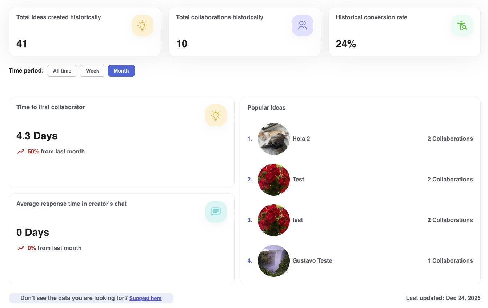
</div>

### Calculation notes (how each metric is calculated)

- data: Idea documents with `is_active=true`, filtered by `campusId`/`schoolId` and optional `period` on `createdAt`, sorted by most recent.
- owner: populated from User (`name`, `avatar`) via idea `owner` reference.
- collaborated: derived from `collaborators.length` on the idea.
- creationDate/creationTime: formatted from `Idea.createdAt` into local date/time strings.
- isFlagged/flagReason: taken from idea moderation fields (`isFlagged` boolean and `flagReason`).
- total/page/limit: pagination metadata from the query result.

---

### 11) Spaces insights — extra tile

- Data: aggregate view of spaces by category and popularity; totals of spaces and members, with top spaces ranked by membership. Filters by campus/school and optional `period` on `Space.createdAt`.
- Source: MongoDB Space and SpaceMember collections; category/grouping and member counts computed in the dashboard service with campus/school filters.
- Sample JSON:

```json
{
  "totalSpaces": 84,
  "totalMembers": 121,
  "popularCategories": [
    {
      "name": "Clubs",
      "emoji": "🏷️",
      "imageUrl": "https://cdn-stg.walkyapp.com/space-categories/clubs-1758032452091.png",
      "spaces": 34,
      "percentage": 40.5
    },
    {
      "name": "Academics & Honors",
      "emoji": "🏷️",
      "imageUrl": "https://cdn-stg.walkyapp.com/space-categories/academics-&-honors-1758032464479.png",
      "spaces": 18,
      "percentage": 21.4
    },
    {
      "name": "Sororities",
      "emoji": "🏷️",
      "imageUrl": "https://cdn-stg.walkyapp.com/space-categories/sororities-1758032493043.png",
      "spaces": 12,
      "percentage": 14.3
    },
    {
      "name": "Leadership & Government",
      "emoji": "🏷️",
      "imageUrl": "https://cdn-stg.walkyapp.com/space-categories/leadership-&-government-1758032473766.png",
      "spaces": 6,
      "percentage": 7.1
    },
    {
      "name": "Club Sports",
      "emoji": "🏷️",
      "imageUrl": "https://cdn-stg.walkyapp.com/space-categories/club-sports-1758032499868.png",
      "spaces": 5,
      "percentage": 6
    }
  ],
  "topSpaces": [
    {
      "rank": 1,
      "name": "Test 2",
      "logo": "https://cdn-stg.walkyapp.com/spaces/68e94ca74e7db4ad1cd49932/logo/logo_1760119978503.png",
      "members": 5
    },
    {
      "rank": 2,
      "name": "Flow",
      "logo": "https://cdn-stg.walkyapp.com/spaces/68dd4767151c39bb538e6a08/logo/logo_1759332201372.png",
      "members": 4
    },
    {
      "rank": 3,
      "name": "My first space3",
      "logo": "https://cdn-stg.walkyapp.com/spaces/68d41bf07fe69f58fbc5cb5e/logo/logo_1758731249347.jpg",
      "members": 3
    },
    {
      "rank": 4,
      "name": "Dog shelter BR",
      "logo": "https://cdn-stg.walkyapp.com/spaces/68d58eae4c5ca16d4d902ea6/logo/logo_1758826159508.png",
      "members": 3
    },
    {
      "rank": 5,
      "name": "Last",
      "logo": "https://cdn-stg.walkyapp.com/spaces/68d6c4d80be1eda2aca000bd/logo/logo_1758905561545.jpg",
      "members": 3
    }
  ]
}
```

<div align="center">
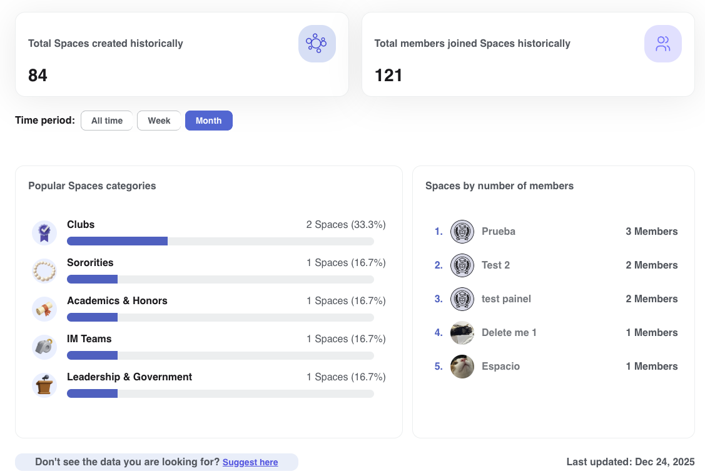
</div>

### Calculation notes (how each metric is calculated)

- totalSpaces: count of Space documents in scope (campus/school filters, `createdAt` within period when provided, `is_active`/visibility respected).
- totalMembers: sum of member counts across spaces in scope, based on Space membership collection (`space_members.count` or aggregate on SpaceMember where `state='joined'`).
- popularCategories: group spaces by `category.name` (or category id) within scope; `spaces` is count per category; `percentage` is `(category count / totalSpaces) * 100`.
- topSpaces: spaces ordered by member count (SpaceMember or stored `membersCount`), limited to top N; `logo` from `Space.logo`, `rank` is position in that ordering.

## Data reliability

- All numbers are computed directly from MongoDB via Mongoose models (User, Event, Space, Idea, Report, Place, Interest, SessionTracking, Chat, PeerRequest, WalkInvite, UserActivityLog, Campus). No mocks or cache.
- `period` controls the window (current week; current month broken into weeks; or last 12 months/all-time). `campusId` takes precedence over `schoolId` in filters.
- `export=true` produces CSV with download headers; otherwise JSON is returned for dashboard widgets.
