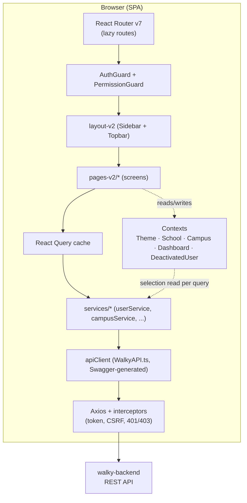
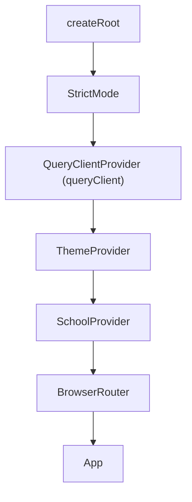
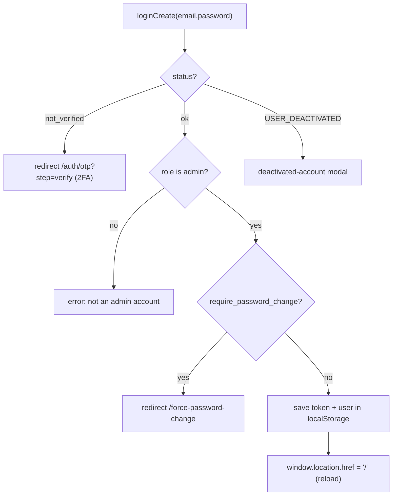
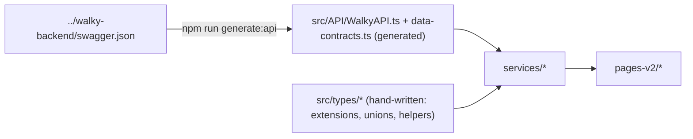
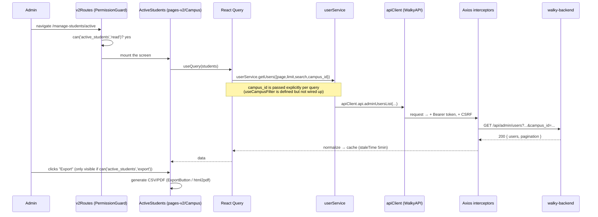

# Walky Admin — Architecture

> How the panel is assembled: React Router v7 with lazy routes, Context + React Query for state,
> a service layer over an Axios client generated from Swagger, RBAC with `AuthGuard`/`PermissionGuard`,
> and the `layout-v2` design system. This document explains the **data flow** and the **why** behind
> each decision.

## Table of Contents

- [1. High-level overview](#1-high-level-overview)
- [2. Bootstrap and provider tree](#2-bootstrap-and-provider-tree)
- [3. Routing (React Router v7 + lazy)](#3-routing-react-router-v7--lazy)
- [4. Data layer: generated Axios + services + React Query](#4-data-layer-generated-axios--services--react-query)
- [5. Authentication and RBAC](#5-authentication-and-rbac)
- [6. Multi-tenant: School and Campus](#6-multi-tenant-school-and-campus)
- [7. Theme and design tokens](#7-theme-and-design-tokens)
- [8. Swagger-generated types](#8-swagger-generated-types)
- [9. End-to-end data flow](#9-end-to-end-data-flow)
- [10. Decisions and trade-offs](#10-decisions-and-trade-offs)
- [Cross-links](#cross-links)

---

## 1. High-level overview



Principles:

- **SPA with no server state of its own** — all data comes from the backend; React Query is the cache.
- **State = Context + React Query** (no Redux/Zustand). Context for UI/selection; React Query for
  remote data.
- **Typed backend contract** — the HTTP client is **generated** from Swagger, not hand-written.
- **Two-layer security** — `AuthGuard` (authenticated?) and `PermissionGuard` (can access this
  resource?), mirroring the matrix in `lib/permissions.ts`.

## 2. Bootstrap and provider tree

Entry point [`src/main.tsx`](../src/main.tsx). Provider order matters (dependencies flow outside-in):



- Imports the global CSS: `@coreui/coreui/dist/css/coreui.min.css` + the `styles-v2/*.css` files
  (`ThemeComponents`, `design-tokens`, `global`).
- `App.tsx` adds: `DeactivatedUserProvider`, the react-hot-toast `<Toaster>` (styled to the Walky
  identity), and the `<Suspense>` that wraps the lazy routes.
- `CampusProvider` and `DashboardProvider` live **inside** `V2Routes` (they only exist in the
  authenticated area), whereas `School`/`Theme` are global (they wrap even the public login screens).

## 3. Routing (React Router v7 + lazy)

Two levels of routes.

**Level 1 — [`src/App.tsx`](../src/App.tsx):** separates **public** routes from **protected** ones.

| Route | Element |
|------|----------|
| `/login` | `LoginV2` (lazy) |
| `/recover-password`, `/auth/otp` | `RecoverPasswordV2` (lazy) |
| `/force-password-change` | `ForcePasswordChange` (lazy) |
| `/v2/*` | `V2RedirectHandler` — redirects legacy `/v2/...` paths to the root |
| `/*` | `<AuthGuard><V2Routes/></AuthGuard>` — **everything else requires authentication** |

**Level 2 — [`src/routes/v2Routes.tsx`](../src/routes/v2Routes.tsx):** inside `<LayoutV2/>`
(the shell with sidebar/topbar via `<Outlet/>`), each screen is **lazy-loaded** and wrapped in a
`<PermissionGuard resource="..." fallback="redirect">`. The index `/` redirects to
`dashboard/engagement`.

**Why lazy?** Per-route code-splitting: the initial bundle loads only the shell; each page becomes an
on-demand chunk (`React.lazy` + `Suspense`). Named barrel exports (`pages-v2/Events`, etc.) are
unwrapped via `.then(m => ({ default: m.Name }))`. The Playground (Three.js, heavy) lives entirely in
separate chunks. This complements Vite's `manualChunks` (`react-vendor`, `coreui`, `charts`, `query`).

## 4. Data layer: generated Axios + services + React Query

Three concentric rings.

### 4.1 Generated HTTP client — `src/API/`

- [`src/API/WalkyAPI.ts`](../src/API/WalkyAPI.ts) (~15k lines) is **generated** by
  `swagger-typescript-api` from `../walky-backend/swagger.json`. It contains the `Api` class (all
  typed endpoints) and the `HttpClient` (Axios wrapper). It is `// @ts-nocheck` — do not edit by hand.
- [`src/API/index.ts`](../src/API/index.ts) instantiates and **configures** the client:
  - `baseURL` = `VITE_API_BASE_URL` (default `http://localhost:8080/api`). Because Swagger mixes
    routes with and without the `/api` prefix, the code **strips `/api` from the `HttpClient` baseURL**
    (`baseURL.replace(/\/api\/?$/, "")`) so that admin routes (`/api/admin/...`) and legacy root
    routes (`/ambassadors`) both work.
  - **Request interceptor:** injects `Authorization: Bearer <token>` (from `localStorage`) and, on
    non-GET methods, adds CSRF headers (`X-CSRF-Token` / `X-XSRF-Token`) read from cookies
    (`csrf_cookie_rr`, `XSRF-TOKEN`, ...). `withCredentials: true` to send cookies.
  - **Response interceptor:** logs via `logger`; on **401** it clears the token and redirects to
    `/login`; on **403** with a `code` of `ACCOUNT_DEACTIVATED`/`USER_DEACTIVATED` it triggers the
    deactivated-account modal (`triggerDeactivatedModal`).
  - Exports `apiClient` (the `Api` instance) — this is what the services use.
  - Also exports a "raw" `API` axios instance with the same interceptors (for compatibility).

### 4.2 Service layer — `src/services/`

12 services (`userService`, `campusService`, `schoolService`, `ambassadorService`,
`analyticsService`, `reportService`, `rolesService`, `interestService`, `placeService`,
`placeTypeService`, `lockedUsersService`, `campusSyncService`). Common pattern:

```ts
import { apiClient } from "../API";
export const userService = {
  getUsers: async (params) => {
    const response = await apiClient.api.adminUsersList({ ... });
    return /* normalized data */;
  },
};
```

They all import the **generated `apiClient`** (none talk to the raw Axios), use try/catch, log via
`logger`, and **normalize** the response into the types the screens expect (e.g. mapping `_id → id`,
flattening pagination, merging generated types with types from `src/types/`). This is the boundary
between "backend shape" and "UI shape".

> **Why a service layer if the client is already typed?** To insulate the screens from the backend's
> idiosyncrasies (generated endpoint names like `adminUsersList`, inconsistent pagination, `_id` vs
> `id`) and to concentrate normalization in one place.

### 4.3 React Query — `src/lib/queryClient.ts`

`QueryClient` with defaults:

- `staleTime: 5min`, `gcTime: 10min` — admin data changes slowly; avoids aggressive refetching.
- Custom `retry`: does **not** retry 4xx (except 408); up to 3 attempts otherwise. Mutations: 1
  retry.
- `refetchOnWindowFocus: false`.

There is a `queryKeys` factory (campuses, campus, students, geofences, ambassadors, ...) for
consistent keys.

## 5. Authentication and RBAC

### 5.1 Session

There is no global auth context provider; the session lives in **`localStorage`** (`token`, `user`)
and is read by the [`src/hooks/useAuth.ts`](../src/hooks/useAuth.ts) hook:

- Reads `token` + `user` from storage; exposes `user`, `isAuthenticated`, `isLoading`, `hasRole`,
  `isSuperAdmin/isSchoolAdmin/isCampusAdmin`, `updateUser`.
- **Syncs across tabs**: listens to the browser `storage` event and a custom `auth:user-updated`
  event (fired by `updateUser`) — logging out in one tab is reflected in the others.

**Login** ([`pages-v2/LoginV2/LoginV2.tsx`](../src/pages-v2/LoginV2/LoginV2.tsx)) calls
`apiClient.api.loginCreate({ email, password })` and handles:



The role must be in an allowlist of admin accounts; the UI does `window.location.href = "/"` to
reload and reinitialize the auth state.

### 5.2 Guards

```mermaid
flowchart LR
    Route["Protected route"] --> AG{AuthGuard<br/>isLoading?}
    AG -->|loading| Null["render null"]
    AG -->|not authenticated| Login["Navigate /login (saves origin in state.from)"]
    AG -->|authenticated| PG{PermissionGuard<br/>can(resource, action)?}
    PG -->|loading| Null2["render null"]
    PG -->|no permission + fallback=redirect| Redir["Navigate /dashboard/engagement"]
    PG -->|no permission + fallback=hidden| Hidden["render null"]
    PG -->|allowed| Page["render screen"]
```

- [`AuthGuard`](../src/components-v2/AuthGuard/AuthGuard.tsx): wraps `V2Routes` (the entire
  authenticated app). Waits on `isLoading`, otherwise redirects to `/login`, preserving `location` in
  `state.from`.
- [`PermissionGuard`](../src/components-v2/PermissionGuard/PermissionGuard.tsx): props `resource`,
  `action` (default `read`), `fallback` (`'hidden' | 'redirect' | ReactNode`, default `hidden`),
  `redirectTo` (default `/dashboard/engagement`). Uses `usePermissions().can(...)`. Waits for auth to
  load before deciding (avoids a redirect loop on refresh). There is also a `withPermission()` HOC.
  - **As a route guard** (in `v2Routes.tsx`): `fallback="redirect"`.
  - **As an inline guard** (hiding an export/edit button): `fallback="hidden"` (default).

### 5.3 Permission matrix

[`src/lib/permissions.ts`](../src/lib/permissions.ts) is the source of truth for client-side RBAC:

- `permissionMatrix: Record<RoleName, Record<PermissionResource, ResourcePermission>>` — for each of
  the 5 roles and ~24 resources, an object with `read/create/update/delete/export/manage` flags.
- Helpers: `getPermissions`, `hasPermission`, `canAccessRoute` (+ `routeResourceMap`),
  `getAssignableRoles`/`canAssignRole` (assignment hierarchy), `roleDisplayNameMap`.
- [`usePermissions`](../src/hooks/usePermissions.ts) exposes `can/canRead/canCreate/canUpdate/
  canDelete/canExport/canManage/canAccessPath` + `isSuperAdmin/...` flags, memoized by `userRole`.

The **sidebar** ([`layout-v2/SidebarV2`](../src/layout-v2/SidebarV2/SidebarV2.tsx)) uses
`canRead(resource)` to **filter menu items**: an item without permission is removed; an empty submenu
disappears along with its parent. This way the user only sees what they can access — the UI, the route,
and the API all agree on the same matrix.

> **Defense in depth:** client-side RBAC is UX (hide/guard), **not** final security. The backend
> validates every request (JWT + permissions). The client avoids showing what it shouldn't, but the
> authority belongs to the server.

## 6. Multi-tenant: School and Campus

The platform is multi-tenant by **school** and **campus**. Two contexts (persisted to `localStorage`)
hold the current selection:

- [`SchoolContext`](../src/contexts/SchoolContext.tsx): `selectedSchool`, `availableSchools`,
  `setSelectedSchool` (persists `selectedSchool`), `clearSchoolSelection`.
- [`CampusContext`](../src/contexts/CampusContext.tsx): `selectedCampus`, `availableCampuses`,
  `setSelectedCampus` (persists `selectedCampus`), `clearCampusSelection`.

The selectors live in the **Topbar** ([`layout-v2/TopbarV2`](../src/layout-v2/TopbarV2/TopbarV2.tsx)):
super_admin picks the school/campus; for school_admin/campus_admin the selection is derived from their
`school_id`/`campus_id`.

**How the campus reaches the requests:** each query reads the selected campus/school from these
contexts and passes `campus_id`/`schoolId` **explicitly** as a parameter to the service call.

> **Caveat — the filter hooks are not wired up.** The hooks
> [`useCampusFilter`](../src/hooks/useCampusFilter.ts) and
> [`useSchoolFilter`](../src/hooks/useSchoolFilter.ts) are **defined but never invoked**: they were
> designed to register an Axios request interceptor that would automatically inject `campus_id`/
> `schoolId` (into `params` for GET and into the body for POST/PUT/PATCH). That mechanism is **not
> active**. In practice, the effective multi-tenant filter is applied by **passing `campus_id`/
> `schoolId` explicitly per query**, not through a global interceptor.

## 7. Theme and design tokens

A **dual** theme system (CoreUI + V2 tokens), in
[`ThemeProvider`](../src/contexts/ThemeProvider.tsx) + [`ThemeContext`](../src/contexts/ThemeContext.ts)
+ [`src/theme.ts`](../src/theme.ts):

- `isDarkMode` state initialized from `localStorage` (`theme`) or `prefers-color-scheme`.
- On toggle, it sets `data-coreui-theme` (for CoreUI) **and** `data-theme` on `<html>`, injects the
  colors as `--app-*` CSS vars, and toggles classes on `<body>` (`dark-theme`, and `dark-mode` via
  `App.tsx`).
- Design tokens live in `src/styles-v2/`: `design-tokens.css`/`.ts` (auto-generated from Figma),
  `theme-variables.css`, `ThemeComponents.css`, `global.css`. The `.ts` version (`design-tokens.ts`)
  exports `spacing`, `cornerRadius`, `colors`, etc., for use in JS.

## 8. Swagger-generated types



- **Generated:** `src/API/WalkyAPI.ts` (+ sibling files `Api.ts`, `data-contracts.ts`, `Admin.ts`,
  `Users.ts`, `Auth.ts`, `Analytics.ts`, `Ambassadors.ts`, `Audit.ts`, `Age.ts`, `http-client.ts`) —
  all carrying the "GENERATED VIA SWAGGER-TYPESCRIPT-API" header.
- **Hand-written:** `src/types/*` (`ambassador`, `analytics`, `api`, `campus`, `place`, `placeType`,
  `report`, `role`) — UI-specific extensions/unions that the services merge with the generated types
  (e.g. `UserWithRoles extends Omit<User, ...>` in `userService.ts`).

Regenerate after a backend contract change: `npm run generate:api`.

## 9. End-to-end data flow

Example: **open "Active Students" and export**.



Errors: 401 → interceptor clears the token and goes to `/login`; 403 `ACCOUNT_DEACTIVATED` → modal;
other 4xx → React Query does not retry.

## 10. Decisions and trade-offs

| Decision | Why | Trade-off |
|---------|--------|-----------|
| **Swagger-generated HTTP client** | Single contract with the backend; less drift; free types | Huge `// @ts-nocheck` file; must be regenerated when the backend changes |
| **Service layer over the generated client** | Insulates screens from backend names/formats; centralizes normalization (`_id→id`, pagination) | Extra layer of indirection |
| **Context + React Query (no Redux/Zustand)** | Remote state in React Query; UI/selection in simple Context; less boilerplate | No centralized store; multi-tenant selection spread across contexts |
| **Session in localStorage + event-based sync** | Simple; works across tabs; survives a reload | Susceptible to XSS (mitigated by CSP/backend); not httpOnly |
| **Client-side RBAC (matrix in `permissions.ts`)** | UX: hide what the user can't do; guard routes | Not security — the backend must enforce everything |
| **Lazy routes + manualChunks** | Small initial bundle; Playground/Three.js isolated | Suspense/loading flash per route |
| **`campus_id` passed explicitly per query** | Multi-tenant filtering that is easy to trace; no hidden global interceptor (the `useCampusFilter`/`useSchoolFilter` interceptor hooks exist but are not wired up) | Each query must remember to pass `campus_id`/`schoolId` |
| **`-v2` suffix on the UI layer** | Complete UI redesign while preserving the architecture (see folder-structure) | Coexisting names; legacy `assets/` alongside `assets-v2/` |

---

## Cross-links

- [Overview](./overview.md) — purpose, audience, stack.
- [Folder structure](./folder-structure.md) — each directory and the `-v2` suffix.
