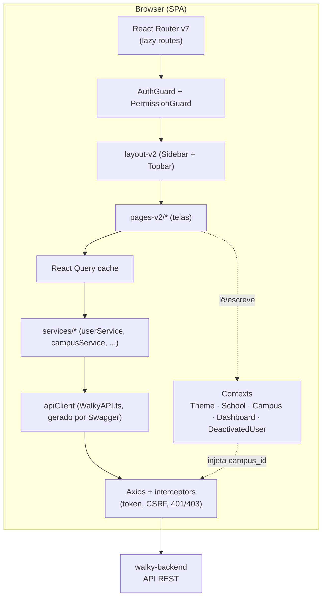
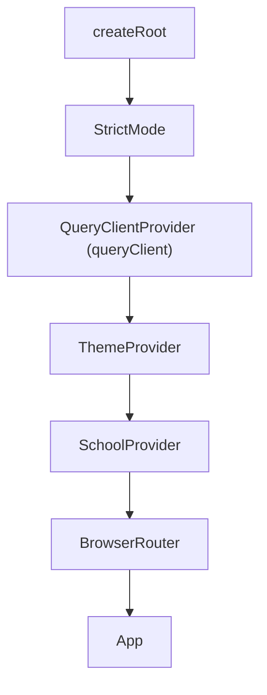
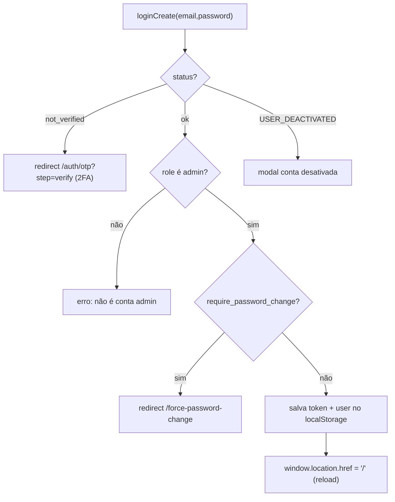
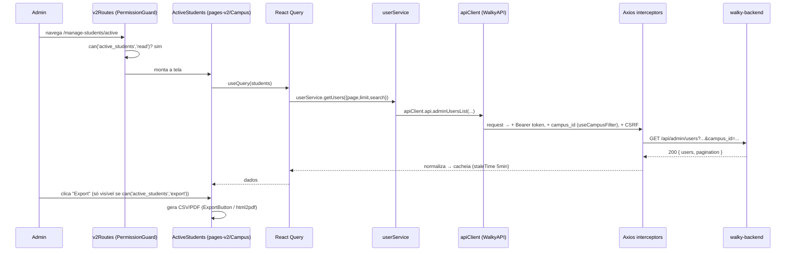

# Walky Admin — Arquitetura

> Como o painel é montado: React Router v7 com rotas lazy, Context + React Query para estado,
> uma service layer sobre um cliente Axios gerado por Swagger, RBAC com `AuthGuard`/`PermissionGuard`
> e o design system `layout-v2`. Este documento explica o **fluxo de dados** e o **porquê** de cada
> decisão.

## Índice

- [1. Visão macro](#1-visão-macro)
- [2. Bootstrap e árvore de providers](#2-bootstrap-e-árvore-de-providers)
- [3. Roteamento (React Router v7 + lazy)](#3-roteamento-react-router-v7--lazy)
- [4. Camada de dados: Axios gerado + services + React Query](#4-camada-de-dados-axios-gerado--services--react-query)
- [5. Autenticação e RBAC](#5-autenticação-e-rbac)
- [6. Multi-tenant: School e Campus](#6-multi-tenant-school-e-campus)
- [7. Tema e design tokens](#7-tema-e-design-tokens)
- [8. Tipos gerados por Swagger](#8-tipos-gerados-por-swagger)
- [9. Fluxo de dados ponta a ponta](#9-fluxo-de-dados-ponta-a-ponta)
- [10. Decisões e trade-offs](#10-decisões-e-trade-offs)
- [Cross-links](#cross-links)

---

## 1. Visão macro



Princípios:

- **SPA sem estado próprio de servidor** — todo dado vem do backend; React Query é o cache.
- **Estado = Context + React Query** (sem Redux/Zustand). Context para UI/seleção; React Query para
  dados remotos.
- **Contrato tipado do backend** — o cliente HTTP é **gerado** do Swagger, não escrito à mão.
- **Segurança em duas camadas** — `AuthGuard` (autenticado?) e `PermissionGuard` (pode este
  recurso?), espelhando a matriz de `lib/permissions.ts`.

## 2. Bootstrap e árvore de providers

Entry point [`src/main.tsx`](../src/main.tsx). A ordem dos providers importa (dependências de fora
para dentro):



- Importa os CSS globais: `@coreui/coreui/dist/css/coreui.min.css` + os `styles-v2/*.css`
  (`ThemeComponents`, `design-tokens`, `global`).
- `App.tsx` adiciona: `DeactivatedUserProvider`, o `<Toaster>` do react-hot-toast (estilizado à
  identidade Walky) e o `<Suspense>` que envolve as rotas lazy.
- `CampusProvider` e `DashboardProvider` ficam **dentro** de `V2Routes` (só existem na área
  autenticada), enquanto `School`/`Theme` são globais (envolvem inclusive as telas públicas de
  login).

## 3. Roteamento (React Router v7 + lazy)

Dois níveis de rotas.

**Nível 1 — [`src/App.tsx`](../src/App.tsx):** separa rotas **públicas** das **protegidas**.

| Rota | Elemento |
|------|----------|
| `/login` | `LoginV2` (lazy) |
| `/recover-password`, `/auth/otp` | `RecoverPasswordV2` (lazy) |
| `/force-password-change` | `ForcePasswordChange` (lazy) |
| `/v2/*` | `V2RedirectHandler` — redireciona paths legados `/v2/...` para a raiz |
| `/*` | `<AuthGuard><V2Routes/></AuthGuard>` — **tudo o mais exige autenticação** |

**Nível 2 — [`src/routes/v2Routes.tsx`](../src/routes/v2Routes.tsx):** dentro de `<LayoutV2/>`
(shell com sidebar/topbar via `<Outlet/>`), cada tela é **lazy-loaded** e envolvida por um
`<PermissionGuard resource="..." fallback="redirect">`. O índice `/` redireciona para
`dashboard/engagement`.

**Por que lazy?** Code-splitting por rota: o bundle inicial carrega só o shell; cada página vira um
chunk sob demanda (`React.lazy` + `Suspense`). Exports nomeados de barris (`pages-v2/Events`, etc.)
são desembrulhados via `.then(m => ({ default: m.Name }))`. O Playground (Three.js, pesado) fica
todo em chunks separados. Complementa o `manualChunks` do Vite (`react-vendor`, `coreui`, `charts`,
`query`).

## 4. Camada de dados: Axios gerado + services + React Query

Três anéis concêntricos.

### 4.1 Cliente HTTP gerado — `src/API/`

- [`src/API/WalkyAPI.ts`](../src/API/WalkyAPI.ts) (~15k linhas) é **gerado** por
  `swagger-typescript-api` a partir de `../walky-backend/swagger.json`. Contém a classe `Api` (todos
  os endpoints tipados) e o `HttpClient` (wrapper Axios). É `// @ts-nocheck` — não editar à mão.
- [`src/API/index.ts`](../src/API/index.ts) instancia e **configura** o cliente:
  - `baseURL` = `VITE_API_BASE_URL` (default `http://localhost:8080/api`). Como o Swagger mistura
    rotas com e sem prefixo `/api`, o código **remove o `/api` do baseURL** do `HttpClient`
    (`baseURL.replace(/\/api\/?$/, "")`) para que rotas admin (`/api/admin/...`) e rotas legadas na
    raiz (`/ambassadors`) funcionem.
  - **Interceptor de request:** injeta `Authorization: Bearer <token>` (de `localStorage`) e, em
    métodos não-GET, adiciona headers CSRF (`X-CSRF-Token` / `X-XSRF-Token`) lidos de cookies
    (`csrf_cookie_rr`, `XSRF-TOKEN`, ...). `withCredentials: true` para enviar cookies.
  - **Interceptor de response:** loga via `logger`; em **401** limpa o token e redireciona para
    `/login`; em **403** com `code` `ACCOUNT_DEACTIVATED`/`USER_DEACTIVATED` dispara o modal de conta
    desativada (`triggerDeactivatedModal`).
  - Exporta `apiClient` (a instância de `Api`) — é o que os services usam.
  - Também exporta um `API` axios "cru" com os mesmos interceptors (compatibilidade).

### 4.2 Service layer — `src/services/`

12 services (`userService`, `campusService`, `schoolService`, `ambassadorService`,
`analyticsService`, `reportService`, `rolesService`, `interestService`, `placeService`,
`placeTypeService`, `lockedUsersService`, `campusSyncService`). Padrão comum:

```ts
import { apiClient } from "../API";
export const userService = {
  getUsers: async (params) => {
    const response = await apiClient.api.adminUsersList({ ... });
    return /* dados normalizados */;
  },
};
```

Todos importam o **`apiClient` gerado** (nenhum fala com o Axios cru), fazem try/catch, logam via
`logger`, e **normalizam** a resposta para os tipos que as telas esperam (ex.: mapear `_id → id`,
achatar paginação, unir tipos gerados com tipos de `src/types/`). É a fronteira entre "forma do
backend" e "forma da UI".

> **Por que uma service layer se o cliente já é tipado?** Para isolar as telas das idiossincrasias
> do backend (nomes de endpoint gerados como `adminUsersList`, paginação inconsistente, `_id` vs
> `id`) e concentrar a normalização em um só lugar.

### 4.3 React Query — `src/lib/queryClient.ts`

`QueryClient` com defaults:

- `staleTime: 5min`, `gcTime: 10min` — dado admin muda devagar; evita refetch agressivo.
- `retry` custom: **não** retenta 4xx (exceto 408); até 3 tentativas caso contrário. Mutations: 1
  retry.
- `refetchOnWindowFocus: false`.

Há um `queryKeys` factory (campuses, campus, students, geofences, ambassadors, ...) para chaves
consistentes.

## 5. Autenticação e RBAC

### 5.1 Sessão

Não há AuthProvider global de contexto; a sessão vive em **`localStorage`** (`token`, `user`) e é
lida pelo hook [`src/hooks/useAuth.ts`](../src/hooks/useAuth.ts):

- Lê `token` + `user` do storage; expõe `user`, `isAuthenticated`, `isLoading`, `hasRole`,
  `isSuperAdmin/isSchoolAdmin/isCampusAdmin`, `updateUser`.
- **Sincroniza entre abas**: ouve o evento `storage` do browser e um evento custom
  `auth:user-updated` (disparado por `updateUser`) — logout em uma aba reflete nas outras.

O **login** ([`pages-v2/LoginV2/LoginV2.tsx`](../src/pages-v2/LoginV2/LoginV2.tsx)) chama
`apiClient.api.loginCreate({ email, password })` e trata:



O role precisa estar em uma allowlist de contas admin; a UI faz `window.location.href = "/"` para
recarregar e reinicializar o estado de auth.

### 5.2 Guards

```mermaid
flowchart LR
    Route["Rota protegida"] --> AG{AuthGuard<br/>isLoading?}
    AG -->|loading| Null["render null"]
    AG -->|não autenticado| Login["Navigate /login (guarda origem em state.from)"]
    AG -->|autenticado| PG{PermissionGuard<br/>can(resource, action)?}
    PG -->|loading| Null2["render null"]
    PG -->|sem permissão + fallback=redirect| Redir["Navigate /dashboard/engagement"]
    PG -->|sem permissão + fallback=hidden| Hidden["render null"]
    PG -->|permitido| Page["render tela"]
```

- [`AuthGuard`](../src/components-v2/AuthGuard/AuthGuard.tsx): envolve `V2Routes` (todo o app
  autenticado). Aguarda `isLoading`, senão redireciona a `/login` preservando `location` em
  `state.from`.
- [`PermissionGuard`](../src/components-v2/PermissionGuard/PermissionGuard.tsx): props `resource`,
  `action` (default `read`), `fallback` (`'hidden' | 'redirect' | ReactNode`, default `hidden`),
  `redirectTo` (default `/dashboard/engagement`). Usa `usePermissions().can(...)`. Espera o auth
  carregar antes de decidir (evita loop de redirect no refresh). Também há um HOC `withPermission()`.
  - **Como guarda de rota** (em `v2Routes.tsx`): `fallback="redirect"`.
  - **Como guarda inline** (esconder botão de export/editar): `fallback="hidden"` (default).

### 5.3 Matriz de permissões

[`src/lib/permissions.ts`](../src/lib/permissions.ts) é a fonte da verdade do RBAC no cliente:

- `permissionMatrix: Record<RoleName, Record<PermissionResource, ResourcePermission>>` — para cada
  um dos 5 roles e ~24 recursos, um objeto com flags `read/create/update/delete/export/manage`.
- Helpers: `getPermissions`, `hasPermission`, `canAccessRoute` (+ `routeResourceMap`),
  `getAssignableRoles`/`canAssignRole` (hierarquia de atribuição), `roleDisplayNameMap`.
- [`usePermissions`](../src/hooks/usePermissions.ts) expõe `can/canRead/canCreate/canUpdate/
  canDelete/canExport/canManage/canAccessPath` + flags `isSuperAdmin/...`, memoizados por `userRole`.

A **sidebar** ([`layout-v2/SidebarV2`](../src/layout-v2/SidebarV2/SidebarV2.tsx)) usa `canRead(resource)`
para **filtrar itens de menu**: item sem permissão é removido; submenu vazio some junto do pai.
Assim, o usuário só vê o que pode acessar — a UI, a rota e a API concordam com a mesma matriz.

> **Defesa em profundidade:** o RBAC do cliente é UX (esconder/guardar), **não** segurança final. O
> backend valida cada request (JWT + permissões). O cliente evita mostrar o que não deve, mas a
> autoridade é do servidor.

## 6. Multi-tenant: School e Campus

A plataforma é multi-tenant por **escola** e **campus**. Dois contexts (persistidos em
`localStorage`) guardam a seleção atual:

- [`SchoolContext`](../src/contexts/SchoolContext.tsx): `selectedSchool`, `availableSchools`,
  `setSelectedSchool` (persiste `selectedSchool`), `clearSchoolSelection`.
- [`CampusContext`](../src/contexts/CampusContext.tsx): `selectedCampus`, `availableCampuses`,
  `setSelectedCampus` (persiste `selectedCampus`), `clearCampusSelection`.

Os seletores ficam na **Topbar** ([`layout-v2/TopbarV2`](../src/layout-v2/TopbarV2/TopbarV2.tsx)):
super_admin escolhe escola/campus; para school_admin/campus_admin a seleção é derivada do seu
`school_id`/`campus_id`.

**Como o campus entra nas requests:** o hook
[`useCampusFilter`](../src/hooks/useCampusFilter.ts) registra um **interceptor de request** que
injeta `campus_id` automaticamente — em `params` para GET e no corpo para POST/PUT/PATCH — sempre que
há campus selecionado, e faz `eject` do interceptor ao trocar de campus/desmontar. Assim as telas
não precisam passar `campus_id` manualmente.

## 7. Tema e design tokens

Sistema de tema **dual** (CoreUI + tokens V2), em [`ThemeProvider`](../src/contexts/ThemeProvider.tsx)
+ [`ThemeContext`](../src/contexts/ThemeContext.ts) + [`src/theme.ts`](../src/theme.ts):

- Estado `isDarkMode` inicializado de `localStorage` (`theme`) ou `prefers-color-scheme`.
- Ao alternar, aplica no `<html>` `data-coreui-theme` (para o CoreUI) **e** `data-theme`, injeta as
  cores como CSS vars `--app-*`, e toggla classes no `<body>` (`dark-theme`, e `dark-mode` via
  `App.tsx`).
- Tokens de design ficam em `src/styles-v2/`: `design-tokens.css`/`.ts` (auto-gerados do Figma),
  `theme-variables.css`, `ThemeComponents.css`, `global.css`. A versão `.ts` (`design-tokens.ts`)
  exporta `spacing`, `cornerRadius`, `colors`, etc., para uso em JS.

## 8. Tipos gerados por Swagger


- **Gerado:** `src/API/WalkyAPI.ts` (+ arquivos irmãos `Api.ts`, `data-contracts.ts`, `Admin.ts`,
  `Users.ts`, `Auth.ts`, `Analytics.ts`, `Ambassadors.ts`, `Audit.ts`, `Age.ts`, `http-client.ts`) —
  todos com o header "GENERATED VIA SWAGGER-TYPESCRIPT-API".
- **Hand-written:** `src/types/*` (`ambassador`, `analytics`, `api`, `campus`, `place`, `placeType`,
  `report`, `role`) — extensões/uniões específicas da UI que os services combinam com os tipos
  gerados (ex.: `UserWithRoles extends Omit<User, ...>` em `userService.ts`).

Regenerar após mudança de contrato no backend: `npm run generate:api`.

## 9. Fluxo de dados ponta a ponta

Exemplo: **abrir "Active Students" e exportar**.



Erros: 401 → interceptor limpa token e vai a `/login`; 403 `ACCOUNT_DEACTIVATED` → modal;
outros 4xx → React Query não retenta.

## 10. Decisões e trade-offs

| Decisão | Porquê | Trade-off |
|---------|--------|-----------|
| **Cliente HTTP gerado por Swagger** | Contrato único com o backend; menos drift; tipos grátis | Arquivo enorme `// @ts-nocheck`; precisa regenerar quando o backend muda |
| **Service layer sobre o cliente gerado** | Isola telas de nomes/formatos do backend; centraliza normalização (`_id→id`, paginação) | Camada extra de indireção |
| **Context + React Query (sem Redux/Zustand)** | Estado remoto no React Query; UI/seleção em Context simples; menos boilerplate | Sem store centralizada; seleção multi-tenant espalhada em contexts |
| **Sessão em localStorage + sync por eventos** | Simples; funciona entre abas; sobrevive a reload | Suscetível a XSS (mitigado por CSP/backend); não é httpOnly |
| **RBAC no cliente (matriz em `permissions.ts`)** | UX: esconder o que o usuário não pode; guardar rotas | Não é segurança — o backend precisa reforçar tudo |
| **Rotas lazy + manualChunks** | Bundle inicial pequeno; Playground/Three.js isolados | Suspense/flash de loading por rota |
| **`campus_id` via interceptor (`useCampusFilter`)** | Multi-tenant transparente; telas não passam campus manualmente | Interceptor global com efeito "mágico"; cuidado ao depurar |
| **Sufixo `-v2` na camada de UI** | Redesign completo da UI preservando a arquitetura (ver folder-structure) | Coexistência de nomes; `assets/` legado ao lado de `assets-v2/` |

---

## Cross-links

- [Visão geral](./overview.md) — propósito, público, stack.
- [Estrutura de pastas](./folder-structure.md) — cada diretório e o sufixo `-v2`.
