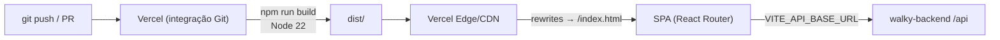

# Configuração e Deploy — walky-admin

> Como configurar, testar, validar e publicar o painel administrativo Walky
> (React 19 + CoreUI 5 + Vite 7 + Node ≥ 20). Reflete exatamente o
> [`package.json`](../package.json), [`vite.config.ts`](../vite.config.ts),
> [`vitest.config.ts`](../vitest.config.ts), [`vercel.json`](../vercel.json),
> [`.env.example`](../.env.example) e os workflows em `.github/workflows/`.

Documentos relacionados: [integrations.md](./integrations.md) · [TESTING.md](./TESTING.md) ·
Contexto do ecossistema: [`../AI_CONTEXT.md`](../AI_CONTEXT.md)

---

## Sumário

- [1. Requisitos](#1-requisitos)
- [2. Variáveis de ambiente](#2-variáveis-de-ambiente)
- [3. Scripts do package.json](#3-scripts-do-packagejson)
- [4. Setup local](#4-setup-local)
- [5. Build (Vite)](#5-build-vite)
- [6. Testes (Vitest + RTL + MSW)](#6-testes-vitest--rtl--msw)
- [7. Checagens de qualidade (test IDs, a11y, lint)](#7-checagens-de-qualidade-test-ids-a11y-lint)
- [8. Git hooks (Husky + lint-staged)](#8-git-hooks-husky--lint-staged)
- [9. CI/CD (GitHub Actions)](#9-cicd-github-actions)
- [10. Deploy (Vercel)](#10-deploy-vercel)

---

## 1. Requisitos

- **Node ≥ 20** — declarado em `package.json` (`"engines": { "node": ">=20.0.0" }`). Os workflows
  de CI usam Node 20; o build da Vercel usa Node 22 (`vercel.json` → `NODE_VERSION: "22"`).
- **Gerenciador de pacotes:** `npm` funciona; a CI e os hooks usam **Yarn** (`cache: yarn`,
  `yarn install --frozen-lockfile`). A build da Vercel usa `npm run build`.
- Para regenerar tipos (`generate:api`): repositório **`../walky-backend`** clonado ao lado, com
  `swagger.json` disponível. Ver [integrations.md §3](./integrations.md#3-swagger-typescript-api-geração-de-tipos).

---

## 2. Variáveis de ambiente

Todas prefixadas com `VITE_` (expostas ao client pelo Vite). Fonte: [`.env.example`](../.env.example).

| Variável | Exemplo | Usada no código? | Descrição |
|---|---|---|---|
| `VITE_API_BASE_URL` | `https://api.walkyapp.com/api` | **Sim** (`src/API/index.ts`, `src/test/handlers.ts`) | Base da API. Fallback `http://localhost:8080/api`. O cliente gerado remove o sufixo `/api`. |
| `VITE_APP_NAME` | `Walky Admin` | Não encontrada em `src/` | Nome da aplicação (sugestão do `.env.example`). |
| `VITE_ENV` | `production` | Não encontrada em `src/` | Ambiente lógico: `development` / `staging` / `production`. |
| `VITE_GOOGLE_MAPS_API_KEY` | `your_key` | **Não** (comentada no `.env.example`) | A chave do Google Maps está **hardcoded** em `CampusBoundary.tsx` — ver [integrations.md §4](./integrations.md#4-google-maps). |
| `VITE_SENTRY_DSN` | `your_dsn` | **Não** (comentada no `.env.example`) | Sem integração de Sentry no código — ver [integrations.md §5](./integrations.md#5-sentry). |

Valores de `VITE_API_BASE_URL` por ambiente (comentados no `.env.example`):

- Produção: `https://api.walkyapp.com/api`
- Staging: `https://staging.walkyapp.com/api`
- Local: `http://localhost:8081/api` (ou `8080`)

> Na prática, a **única** env var de aplicação lida em `src/` é `VITE_API_BASE_URL` (mais o built-in
> `import.meta.env.DEV`, usado pelo logger). As demais são placeholders no `.env.example`.

**Setup local:** copie `.env.example` para `.env` e ajuste `VITE_API_BASE_URL`. Na Vercel, defina as
env vars em *Project Settings → Environment Variables*.

---

## 3. Scripts do package.json

Todos os scripts (fonte: [`package.json`](../package.json)):

| Script | Comando | O que faz |
|---|---|---|
| `dev` | `vite` | Dev server (Vite) — porta padrão **5173** (ou próxima livre). |
| `build` | `tsc -b && vite build` | Type-check (`tsc -b`) e build de produção → `dist/`. |
| `preview` | `vite preview` | Servidor local para pré-visualizar o build de `dist/`. |
| `lint` | `eslint .` | ESLint em todo o repo (flat config `eslint.config.js`). |
| `tsc` | `tsc` | Compilador TypeScript (sem build incremental). |
| `type-check` | `tsc -b` | Type-check incremental (project references), sem emitir. |
| `clean` | `./clean-build.sh` | Script de limpeza de build. |
| `test` | `vitest` | Testes em modo watch (Vitest). Use `test -- --run` para rodar uma vez. |
| `test:ui` | `vitest --ui` | UI interativa do Vitest. |
| `test:coverage` | `vitest --coverage` | Testes + relatório de cobertura (v8). |
| `check:testids` | `node scripts/check-test-ids.js` | Valida `data-testid` em `<button>`, `<input>`, `<form>`. |
| `check:a11y` | `node scripts/check-accessibility.js` | Checagem de acessibilidade dos componentes. |
| `check:all` | `check:testids && check:a11y && test -- --run` | Roda os três gates de qualidade em sequência. |
| `generate:api` | `npx swagger-typescript-api generate -p ../walky-backend/swagger.json -o ./src/API --axios --name WalkyAPI.ts` | Gera cliente/tipos a partir do Swagger do backend. Ver [integrations.md §3](./integrations.md#3-swagger-typescript-api-geração-de-tipos). |
| `generate:icons` | `node scripts/generate-icons.cjs` | Gera componentes React de ícones a partir dos SVGs em `src/assets-v2/svg` → `src/components-v2/AssetIcon/`. |
| `generate:images` | `node scripts/generate-images.cjs` | Gera componentes de imagem a partir de PNG/JPEG em `src/assets-v2/images` → `src/components-v2/AssetImage/`. |
| `prepare` | `husky` | Instala os git hooks do Husky (roda no `install`). |

---

## 4. Setup local

```bash
# 1. Instalar dependências (Node ≥ 20)
yarn install          # ou: npm install

# 2. Configurar env
cp .env.example .env  # ajuste VITE_API_BASE_URL

# 3. (opcional) Regenerar tipos a partir do backend
yarn generate:api     # requer ../walky-backend/swagger.json

# 4. Rodar em dev
yarn dev              # http://localhost:5173
```

---

## 5. Build (Vite)

Config: [`vite.config.ts`](../vite.config.ts).

- **Plugins:** `@vitejs/plugin-react` e `vite-plugin-svgr` (importar SVG como componente via
  `*.svg?react`; `exportType: "default"`, `ref: true`, `titleProp: true`).
- **esbuild `pure`:** em builds de produção, remove `console.log/info/debug` (mantém `warn`/`error`).
- **Saída:** `dist/` (`outDir: "dist"`, `emptyOutDir: true`).
- **Manual chunks** (code splitting para vendor):
  - `react-vendor`: `react`, `react-dom`, `react-router-dom`
  - `coreui`: `@coreui/react`, `@coreui/coreui`, `@coreui/icons-react`, `@coreui/icons`
  - `charts`: `recharts`
  - `query`: `@tanstack/react-query`

O `build` roda `tsc -b` antes do `vite build`, então **erros de tipo bloqueiam o build**.

---

## 6. Testes (Vitest + RTL + MSW)

Config: [`vitest.config.ts`](../vitest.config.ts). Documento dedicado: [TESTING.md](./TESTING.md).

- **Runner:** Vitest 4 (`globals: true`, `environment: "jsdom"`, `css: true`).
- **Setup:** `setupFiles: "./src/test/setup.ts"`.
- **Alias:** `@` → `./src`.
- **Biblioteca de componentes:** React Testing Library + `@testing-library/jest-dom` +
  `@testing-library/user-event`.
- **Mock de rede:** **MSW** (`msw`). O servidor fica em `src/test/server.ts` (`setupServer(...handlers)`),
  os handlers padrão em `src/test/handlers.ts`, e o ciclo de vida em `src/test/setup.ts`:
  - `beforeAll`: `server.listen({ onUnhandledRequest: "error" })` — qualquer request sem handler
    **falha o teste** (nenhum teste toca a rede real).
  - `afterEach`: `cleanup()`, `server.resetHandlers()`, limpa `localStorage`/`sessionStorage`, `vi.clearAllMocks()`.
  - `afterAll`: `server.close()`.
  - `API_BASE` em `handlers.ts` espelha `src/API/index.ts` (usa `VITE_API_BASE_URL` e remove `/api`).
- **Polyfills jsdom** (em `setup.ts`): `matchMedia`, `ResizeObserver`, `IntersectionObserver`,
  `scrollTo`, `scrollIntoView`, `navigator.clipboard` — exigidos por ThemeProvider, recharts,
  simplebar e componentes CoreUI.
- **Utilitários:** `src/test/test-utils.tsx` (render com providers) e `src/test/factories.ts`.

**Cobertura** (`test:coverage`): provider `v8`, reporters `text`/`json`/`html`/`lcov`. Exclui
`node_modules`, `dist`, arquivos de teste/config, `scripts/**`, `src/main.tsx`, o gerado
`src/API/WalkyAPI.ts`, `*.d.ts` e `**/index.ts`. **Ratchet de thresholds** (só sobe):
`statements 80` · `branches 65` · `functions 78` · `lines 80`.

```bash
yarn test               # watch
yarn test -- --run      # uma execução (usado em CI)
yarn test:coverage      # com cobertura
yarn test:ui            # UI do Vitest
```

---

## 7. Checagens de qualidade (test IDs, a11y, lint)

- **`check:testids`** (`scripts/check-test-ids.js`): garante que `<button>`, `<input>` e `<form>`
  tenham `data-testid` (testabilidade). Roda no pre-commit.
- **`check:a11y`** (`scripts/check-accessibility.js`): valida regras de acessibilidade dos componentes.
- **`lint`** (`eslint .`): ESLint 9 flat config com `typescript-eslint`, `eslint-plugin-react-hooks`
  e `eslint-plugin-react-refresh`.
- **`check:all`**: encadeia `check:testids` + `check:a11y` + `test -- --run`.

---

## 8. Git hooks (Husky + lint-staged)

- **Husky** instalado via `prepare: "husky"`. Hook em `.husky/pre-commit` executa, na ordem:
  1. `yarn build` (bloqueia commit se o build falhar),
  2. `node scripts/check-test-ids.js`,
  3. `node scripts/check-accessibility.js`,
  4. `npx lint-staged`.
- **lint-staged** (config no `package.json`): para `*.{ts,tsx}` roda
  `./clean-build.sh` seguido de `eslint --fix` (com `--max-old-space-size=4096`).

---

## 9. CI/CD (GitHub Actions)

Dois workflows em `.github/workflows/` (todos com Node 20, cache `yarn`):

### `test.yml` — "CI"
- Dispara em `pull_request` e em `push` para `main`/`staging`. Usa `concurrency` para cancelar runs
  superados no mesmo ref.
- Instala com `yarn install --frozen-lockfile` (`HUSKY: 0` para pular hooks).
- **Gate rígido (bloqueia merge):** `yarn test --run` (testes unit/integração).
- **Gates informativos** (`continue-on-error: true`, não bloqueiam): `type-check`, `lint`,
  `check:testids`, `check:a11y`.

### `code-quality.yml` — "Code Quality Check"
- Dispara em `pull_request` para `main`/`develop`/`staging`/`feat/*` e em `push` para
  `main`/`develop`/`staging`.
- Quatro jobs paralelos: **Test IDs** (`yarn check:testids`), **Accessibility** (`yarn check:a11y`),
  **Unit Tests** (`yarn test --run --reporter=verbose`), **Lint** (`yarn lint`).

> Não há workflow de deploy nos Actions — o deploy é feito pela integração Git da **Vercel** (§10).

---

## 10. Deploy (Vercel)

Config: [`vercel.json`](../vercel.json).

```jsonc
{
  "rewrites": [{ "source": "/(.*)", "destination": "/index.html" }],
  "build": { "env": { "NODE_VERSION": "22" } },
  "buildCommand": "npm run build",
  "outputDirectory": "dist",
  "framework": "vite"
}
```

- **Framework:** Vite (detectado automaticamente).
- **Build:** `npm run build` (→ `tsc -b && vite build`), saída em `dist/`.
- **Node:** 22 no build da Vercel (o app exige ≥ 20).
- **SPA routing:** o `rewrites` reescreve **qualquer** rota para `/index.html`, deixando o
  React Router (v7) resolver a navegação client-side (evita 404 em refresh de rotas internas).
- **Env vars:** definidas no painel da Vercel (*Project Settings → Environment Variables*) — no
  mínimo `VITE_API_BASE_URL` para o ambiente correto.
- **Fluxo:** push no Git → build automática na Vercel → deploy. Preview deployments por PR; produção
  no branch de produção. Domínio/SSL geridos pela Vercel (ver [README](../README.md#-deploying-to-vercel)).


