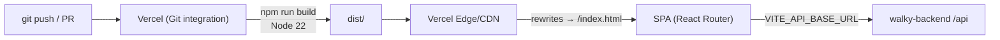

# Configuration and Deployment — walky-admin

> How to configure, test, validate, and publish the Walky admin panel
> (React 19 + CoreUI 5 + Vite 7 + Node ≥ 20). Mirrors exactly the
> [`package.json`](../package.json), [`vite.config.ts`](../vite.config.ts),
> [`vitest.config.ts`](../vitest.config.ts), [`vercel.json`](../vercel.json),
> [`.env.example`](../.env.example), and the workflows in `.github/workflows/`.

Related documents: [integrations.md](./integrations.md) · [TESTING.md](./TESTING.md) ·
Ecosystem context: [`../AI_CONTEXT.md`](../AI_CONTEXT.md)

---

## Table of Contents

- [1. Requirements](#1-requisitos)
- [2. Environment variables](#2-environment-variables)
- [3. package.json scripts](#3-scripts-do-packagejson)
- [4. Local setup](#4-setup-local)
- [5. Build (Vite)](#5-build-vite)
- [6. Testing (Vitest + RTL + MSW)](#6-testes-vitest--rtl--msw)
- [7. Quality checks (test IDs, a11y, lint)](#7-checagens-de-qualidade-test-ids-a11y-lint)
- [8. Git hooks (Husky + lint-staged)](#8-git-hooks-husky--lint-staged)
- [9. CI/CD (GitHub Actions)](#9-cicd-github-actions)
- [10. Deployment (Vercel)](#10-deploy-vercel)

---

## 1. Requirements

- **Node ≥ 20** — declared in `package.json` (`"engines": { "node": ">=20.0.0" }`). The CI workflows
  use Node 20; the Vercel build uses Node 22 (`vercel.json` → `NODE_VERSION: "22"`).
- **Package manager:** `npm` works; CI and the hooks use **Yarn** (`cache: yarn`,
  `yarn install --frozen-lockfile`). The Vercel build uses `npm run build`.
- To regenerate types (`generate:api`): the **`../walky-backend`** repository cloned alongside, with
  `swagger.json` available. See [integrations.md §3](./integrations.md#3-swagger-typescript-api-type-generation).

---

## 2. Environment variables

All prefixed with `VITE_` (exposed to the client by Vite). Source: [`.env.example`](../.env.example).

| Variable | Example | Used in code? | Description |
|---|---|---|---|
| `VITE_API_BASE_URL` | `https://api.walkyapp.com/api` | **Yes** (`src/API/index.ts`, `src/test/handlers.ts`) | API base URL. Fallback `http://localhost:8080/api`. The generated client strips the `/api` suffix. |
| `VITE_APP_NAME` | `Walky Admin` | Not found in `src/` | Application name (suggested by `.env.example`). |
| `VITE_ENV` | `production` | Not found in `src/` | Logical environment: `development` / `staging` / `production`. |
| `VITE_GOOGLE_MAPS_API_KEY` | `your_key` | **No** (commented out in `.env.example`) | The Google Maps key is **hardcoded** in `CampusBoundary.tsx` — see [integrations.md §4](./integrations.md#4-google-maps). |
| `VITE_SENTRY_DSN` | `your_dsn` | **No** (commented out in `.env.example`) | No Sentry integration in the code — see [integrations.md §5](./integrations.md#5-sentry). |

`VITE_API_BASE_URL` values per environment (commented out in `.env.example`):

- Production: `https://api.walkyapp.com/api`
- Staging: `https://staging.walkyapp.com/api`
- Local: `http://localhost:8081/api` (or `8080`)

> In practice, the **only** application env var read in `src/` is `VITE_API_BASE_URL` (plus the built-in
> `import.meta.env.DEV`, used by the logger). The rest are placeholders in `.env.example`.

**Local setup:** copy `.env.example` to `.env` and adjust `VITE_API_BASE_URL`. On Vercel, define the
env vars in *Project Settings → Environment Variables*.

---

## 3. package.json scripts

All scripts (source: [`package.json`](../package.json)):

| Script | Command | What it does |
|---|---|---|
| `dev` | `vite` | Dev server (Vite) — default port **5173** (or the next free one). |
| `build` | `tsc -b && vite build` | Type-check (`tsc -b`) and production build → `dist/`. |
| `preview` | `vite preview` | Local server to preview the `dist/` build. |
| `lint` | `eslint .` | ESLint across the whole repo (flat config `eslint.config.js`). |
| `tsc` | `tsc` | TypeScript compiler (no incremental build). |
| `type-check` | `tsc -b` | Incremental type-check (project references), no emit. |
| `clean` | `./clean-build.sh` | Build cleanup script. |
| `test` | `vitest` | Tests in watch mode (Vitest). Use `test -- --run` to run once. |
| `test:ui` | `vitest --ui` | Interactive Vitest UI. |
| `test:coverage` | `vitest --coverage` | Tests + coverage report (v8). |
| `check:testids` | `node scripts/check-test-ids.js` | Validates `data-testid` on `<button>`, `<input>`, `<form>`. |
| `check:a11y` | `node scripts/check-accessibility.js` | Accessibility check of the components. |
| `check:all` | `check:testids && check:a11y && test -- --run` | Runs the three quality gates in sequence. |
| `generate:api` | `npx swagger-typescript-api generate -p ../walky-backend/swagger.json -o ./src/API --axios --name WalkyAPI.ts` | Generates the client/types from the backend Swagger. See [integrations.md §3](./integrations.md#3-swagger-typescript-api-type-generation). |
| `generate:icons` | `node scripts/generate-icons.cjs` | Generates React icon components from the SVGs in `src/assets-v2/svg` → `src/components-v2/AssetIcon/`. |
| `generate:images` | `node scripts/generate-images.cjs` | Generates image components from PNG/JPEG in `src/assets-v2/images` → `src/components-v2/AssetImage/`. |
| `prepare` | `husky` | Installs the Husky git hooks (runs on `install`). |

---

## 4. Local setup

```bash
# 1. Install dependencies (Node ≥ 20)
yarn install          # or: npm install

# 2. Configure env
cp .env.example .env  # adjust VITE_API_BASE_URL

# 3. (optional) Regenerate types from the backend
yarn generate:api     # requires ../walky-backend/swagger.json

# 4. Run in dev
yarn dev              # http://localhost:5173
```

---

## 5. Build (Vite)

Config: [`vite.config.ts`](../vite.config.ts).

- **Plugins:** `@vitejs/plugin-react` and `vite-plugin-svgr` (import SVG as a component via
  `*.svg?react`; `exportType: "default"`, `ref: true`, `titleProp: true`).
- **esbuild `pure`:** in production builds, removes `console.log/info/debug` (keeps `warn`/`error`).
- **Output:** `dist/` (`outDir: "dist"`, `emptyOutDir: true`).
- **Manual chunks** (vendor code splitting):
  - `react-vendor`: `react`, `react-dom`, `react-router-dom`
  - `coreui`: `@coreui/react`, `@coreui/coreui`, `@coreui/icons-react`, `@coreui/icons`
  - `charts`: `recharts`
  - `query`: `@tanstack/react-query`

`build` runs `tsc -b` before `vite build`, so **type errors block the build**.

---

## 6. Testing (Vitest + RTL + MSW)

Config: [`vitest.config.ts`](../vitest.config.ts). Dedicated document: [TESTING.md](./TESTING.md).

- **Runner:** Vitest 4 (`globals: true`, `environment: "jsdom"`, `css: true`).
- **Setup:** `setupFiles: "./src/test/setup.ts"`.
- **Alias:** `@` → `./src`.
- **Component library:** React Testing Library + `@testing-library/jest-dom` +
  `@testing-library/user-event`.
- **Network mocking:** **MSW** (`msw`). The server lives in `src/test/server.ts` (`setupServer(...handlers)`),
  the default handlers in `src/test/handlers.ts`, and the lifecycle in `src/test/setup.ts`:
  - `beforeAll`: `server.listen({ onUnhandledRequest: "error" })` — any request without a handler
    **fails the test** (no test touches the real network).
  - `afterEach`: `cleanup()`, `server.resetHandlers()`, clears `localStorage`/`sessionStorage`, `vi.clearAllMocks()`.
  - `afterAll`: `server.close()`.
  - `API_BASE` in `handlers.ts` mirrors `src/API/index.ts` (uses `VITE_API_BASE_URL` and strips `/api`).
- **jsdom polyfills** (in `setup.ts`): `matchMedia`, `ResizeObserver`, `IntersectionObserver`,
  `scrollTo`, `scrollIntoView`, `navigator.clipboard` — required by ThemeProvider, recharts,
  simplebar, and CoreUI components.
- **Utilities:** `src/test/test-utils.tsx` (render with providers) and `src/test/factories.ts`.

**Coverage** (`test:coverage`): `v8` provider, `text`/`json`/`html`/`lcov` reporters. Excludes
`node_modules`, `dist`, test/config files, `scripts/**`, `src/main.tsx`, the generated
`src/API/WalkyAPI.ts`, `*.d.ts`, and `**/index.ts`. **Threshold ratchet** (can only go up):
`statements 80` · `branches 65` · `functions 78` · `lines 80`.

```bash
yarn test               # watch
yarn test -- --run      # single run (used in CI)
yarn test:coverage      # with coverage
yarn test:ui            # Vitest UI
```

---

## 7. Quality checks (test IDs, a11y, lint)

- **`check:testids`** (`scripts/check-test-ids.js`): ensures that `<button>`, `<input>`, and `<form>`
  have `data-testid` (testability). Runs on pre-commit.
- **`check:a11y`** (`scripts/check-accessibility.js`): validates the accessibility rules of the components.
- **`lint`** (`eslint .`): ESLint 9 flat config with `typescript-eslint`, `eslint-plugin-react-hooks`,
  and `eslint-plugin-react-refresh`.
- **`check:all`**: chains `check:testids` + `check:a11y` + `test -- --run`.

---

## 8. Git hooks (Husky + lint-staged)

- **Husky** installed via `prepare: "husky"`. The hook in `.husky/pre-commit` runs, in order:
  1. `yarn build` (blocks the commit if the build fails),
  2. `node scripts/check-test-ids.js`,
  3. `node scripts/check-accessibility.js`,
  4. `npx lint-staged`.
- **lint-staged** (config in `package.json`): for `*.{ts,tsx}` it runs
  `./clean-build.sh` followed by `eslint --fix` (with `--max-old-space-size=4096`).

---

## 9. CI/CD (GitHub Actions)

Two workflows in `.github/workflows/` (all on Node 20, `yarn` cache):

### `test.yml` — "CI"
- Triggers on `pull_request` and on `push` to `main`/`staging`. Uses `concurrency` to cancel superseded
  runs on the same ref.
- Installs with `yarn install --frozen-lockfile` (`HUSKY: 0` to skip hooks).
- **Hard gate (blocks merge):** `yarn test --run` (unit/integration tests).
- **Informational gates** (`continue-on-error: true`, non-blocking): `type-check`, `lint`,
  `check:testids`, `check:a11y`.

### `code-quality.yml` — "Code Quality Check"
- Triggers on `pull_request` to `main`/`develop`/`staging`/`feat/*` and on `push` to
  `main`/`develop`/`staging`.
- Four parallel jobs: **Test IDs** (`yarn check:testids`), **Accessibility** (`yarn check:a11y`),
  **Unit Tests** (`yarn test --run --reporter=verbose`), **Lint** (`yarn lint`).

> There is no deploy workflow in Actions — deployment is handled by the **Vercel** Git integration (§10).

---

## 10. Deployment (Vercel)

Config: [`vercel.json`](../vercel.json).

```jsonc
{
  "rewrites": [{ "source": "/(.*)", "destination": "/index.html" }],
  "build": { "env": { "NODE_VERSION": "22" } },
  "buildCommand": "npm run build",
  "outputDirectory": "dist",
  "framework": "vite"
}
```

- **Framework:** Vite (auto-detected).
- **Build:** `npm run build` (→ `tsc -b && vite build`), output in `dist/`.
- **Node:** 22 in the Vercel build (the app requires ≥ 20).
- **SPA routing:** the `rewrites` rewrite **any** route to `/index.html`, letting
  React Router (v7) resolve navigation client-side (avoids 404s when refreshing internal routes).
- **Env vars:** defined in the Vercel dashboard (*Project Settings → Environment Variables*) — at
  minimum `VITE_API_BASE_URL` for the correct environment.
- **Flow:** push to Git → automatic build on Vercel → deploy. Preview deployments per PR; production
  on the production branch. Domain/SSL managed by Vercel (see [README](../README.md#-deploying-to-vercel)).


