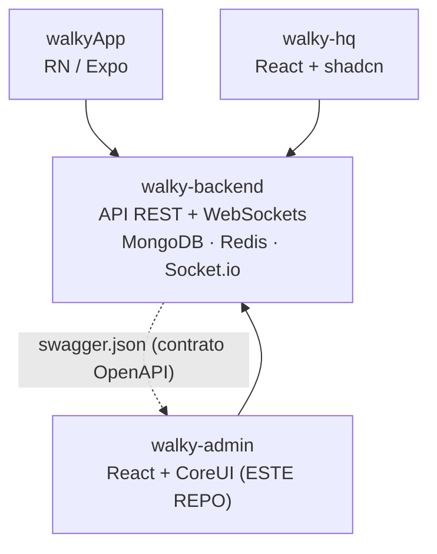

# Walky Admin — Visão Geral

> Painel administrativo da plataforma Walky. React 19 + CoreUI 5 + Vite 7. Cliente do
> `walky-backend`, com tipos TypeScript gerados a partir do Swagger/OpenAPI do backend.

## Índice

- [1. Propósito](#1-propósito)
- [2. O problema que resolve](#2-o-problema-que-resolve)
- [3. Papel no ecossistema Walky](#3-papel-no-ecossistema-walky)
- [4. Público-alvo (RBAC de roles)](#4-público-alvo-rbac-de-roles)
- [5. Quem consome / o que gerencia](#5-quem-consome--o-que-gerencia)
- [6. Stack completa (versões reais e o porquê)](#6-stack-completa-versões-reais-e-o-porquê)
- [7. Variáveis de ambiente](#7-variáveis-de-ambiente)
- [8. Scripts de build/run](#8-scripts-de-buildrun)
- [Cross-links](#cross-links)

---

## 1. Propósito

O **walky-admin** é o **painel administrativo web** da plataforma Walky — uma rede social para
campus universitários. Ele dá a **admins de campus, admins de escola, moderadores e super-admins**
(além de funcionários internos com visibilidade "read-only") as ferramentas operacionais para
gerenciar a comunidade de estudantes, o conteúdo gerado por eles e a configuração de cada campus.

É uma **Single Page Application (SPA)** construída com **CoreUI** (biblioteca de componentes de
admin sobre Bootstrap 5). Todo o seu estado de servidor vem do backend Walky via HTTP; ele não tem
banco de dados próprio.

O nome do pacote em `package.json` é literalmente `admin-panel` (`version: 0.0.0`, privado).

## 2. O problema que resolve

A operação de uma rede social de campus gera necessidades administrativas contínuas:

- **Moderação:** revisar denúncias (reports) de conteúdo/usuários, banir/desbanir estudantes,
  acompanhar histórico de moderação (Report Safety, Report History).
- **Gestão de estudantes:** ver estudantes ativos, banidos, desativados e "desengajados"; atualizar
  status; exportar listas.
- **Gestão de conteúdo:** administrar Events, Spaces e Ideas criados pelos estudantes (editar,
  remover, exportar).
- **Analytics operacional:** 6 dashboards (Engagement, Popular Features, User Interactions,
  Community, Student Safety, Student Behavior) para acompanhar a saúde de cada campus.
- **Configuração de campus:** geofences, embaixadores (ambassadors), gestão de roles/administradores.

Sem esse painel, essas tarefas exigiriam acesso direto ao banco/API. O admin encapsula tudo numa
interface com **RBAC** (controle de acesso por papel) que limita o que cada tipo de admin pode ver e
fazer, e por **campus/escola** (multi-tenant).

## 3. Papel no ecossistema Walky

A plataforma Walky tem **4 repositórios**, todos em `/Volumes/SSDDEV/DEV_PROJETOS/`:

| Repositório | Papel | Público |
|-------------|-------|---------|
| `walkyApp` | App móvel (RN/Expo) | Estudantes |
| `walky-backend` | API REST + WebSockets (Node/Express/Mongo) | serve todos |
| **`walky-admin`** | **Painel admin (CoreUI)** | **Admins de campus/escola, moderadores** |
| `walky-hq` | Painel super-admin/analytics (shadcn) | Super-admins internos Walky |



**Cliente do backend.** O admin **não fala com o banco**; consome a API REST do backend (base via
`VITE_API_BASE_URL`, tipicamente `https://api.walkyapp.com/api` em produção ou
`http://localhost:8080/api` em dev). Autentica via JWT Bearer (ver
[architecture.md](./architecture.md#5-autenticação-e-rbac)).

**Tipos gerados por Swagger.** O contrato de tipos do admin é **derivado do backend**. O script
`npm run generate:api` roda:

```
npx swagger-typescript-api generate -p ../walky-backend/swagger.json -o ./src/API --axios --name WalkyAPI.ts
```

Isso lê o `swagger.json` do repositório irmão `walky-backend` e gera o cliente Axios tipado
`src/API/WalkyAPI.ts` (~15k linhas). **Regra de ouro do ecossistema:** mudou o contrato no backend →
regenerar o cliente nos frontends. O `walkyApp` faz o equivalente com Orval; o `walky-hq` também usa
tipos derivados do mesmo Swagger.

**Diferença Admin vs HQ:** ambos têm sobreposição funcional (users, events, spaces, ideas, reports,
roles, campus). A distinção é de **escopo e público**: o **admin** é operação por **campus/escola**
(CoreUI, orientado a operação/moderação); o **HQ** é super-admin/analytics **global** (shadcn +
Tailwind, config de entidades core da plataforma).

## 4. Público-alvo (RBAC de roles)

O acesso é governado por uma **matriz de permissões** hardcoded em
[`src/lib/permissions.ts`](../src/lib/permissions.ts). Há **5 roles** (`RoleName`):

| Role interno | Nome de exibição | Escopo | Perfil de permissão |
|--------------|------------------|--------|---------------------|
| `super_admin` | Walky Admin | Todos os campi/escolas | Acesso total: dashboards+export, gestão de estudantes, CRUD de conteúdo, moderação, campuses/ambassadors, CRUD+manage de roles |
| `school_admin` | School Admin | Uma escola (todos os campi dela) | Igual ao super_admin na prática (matriz idêntica) |
| `campus_admin` | Campus Admin | Um campus | Igual ao super/school_admin na matriz |
| `moderator` | Moderator | Um campus | Dashboards read-only (sem export), **sem** gestão de estudantes/admin; **poder de moderação** (Report Safety/History: read/update/export) |
| `walky_internal` | Walky Internal | Visibilidade interna | **Read-only** em dashboards, events/spaces/ideas e campuses/ambassadors; **sem** moderação nem gestão de estudantes |

> **Nota fiel ao código:** na matriz atual (`permissionMatrix`), `super_admin`, `school_admin` e
> `campus_admin` têm **exatamente os mesmos direitos por recurso**. A diferença real de escopo entre
> eles é aplicada por **campus/escola** (contexts + filtros, e pelo backend), não pela matriz de
> ações. Ver [architecture.md](./architecture.md#5-autenticação-e-rbac).

**Hierarquia de atribuição de roles** (`roleHierarchy` em `permissions.ts`): quem pode criar/atribuir
quais roles — `super_admin` → School/Campus/Moderator; `school_admin` → Campus/Moderator;
`campus_admin` → Moderator; `moderator` e `walky_internal` → ninguém.

As 6 ações possíveis (`PermissionAction`) são: `read`, `create`, `update`, `delete`, `export`,
`manage`. Cada recurso (`PermissionResource`, ~24 recursos: dashboards, listas de estudantes,
events, spaces, ideas, moderação, campuses, ambassadors, role_management) recebe um objeto
`ResourcePermission` com essas 6 flags booleanas.

## 5. Quem consome / o que gerencia

Os usuários do painel (admins/moderadores) gerenciam, por telas (rotas em
[`src/routes/v2Routes.tsx`](../src/routes/v2Routes.tsx)):

- **Dashboards (6):** `dashboard/engagement`, `popular-features`, `user-interactions`, `community`,
  `student-safety`, `student-behavior`.
- **Estudantes (4 listas):** `manage-students/active | banned | deactivated | disengaged`.
- **Events:** `events` (Manager), `events/insights`, `events/check-in` (Check-In Analytics).
- **Spaces:** `spaces` (Manager), `spaces/insights`.
- **Ideas:** `ideas` (Manager), `ideas/insights`.
- **Moderação:** `report-safety`, `report-history`.
- **Administração:** `admin/campuses` (geofences), `admin/ambassadors`, `admin/role-management`,
  `admin/settings`.
- **Playground (14 rotas):** visualizações experimentais de dados (interest cloud/constellation/
  chord/pyramid + "active users" spiral/heat/rings/funnel/guitar/drums/chimes/waves/orbs/galaxy),
  várias usando Three.js.
- **Auth (públicas):** `login`, `recover-password` / `auth/otp`, `force-password-change`.

Ver o mapa completo de telas em
[folder-structure.md](./folder-structure.md#pages-v2--as-telas).

## 6. Stack completa (versões reais e o porquê)

Versões extraídas de [`package.json`](../package.json). Node **≥ 20** (`engines`); `.nvmrc` fixa
**22**; Vercel builda com `NODE_VERSION: 22`.

### Core

| Lib | Versão | Por quê |
|-----|--------|---------|
| **react** / **react-dom** | ^19.1.0 | Framework de UI. React 19 (última major). |
| **typescript** | ~5.8.3 | Tipagem estática; `strict: true` em `tsconfig.app.json`. |
| **vite** | ^7.0.4 | Bundler/dev-server rápido (ESBuild + Rollup). Substitui CRA/Webpack; HMR instantâneo. |
| **@vitejs/plugin-react** | ^4.6.0 | Integração React (Fast Refresh) no Vite. |
| **react-router-dom** | ^7.6.3 | Roteamento SPA. v7 com `BrowserRouter` + rotas aninhadas e `lazy` para code-splitting. |

### UI

| Lib | Versão | Por quê |
|-----|--------|---------|
| **@coreui/react** | ^5.7.0 | Framework de componentes de admin (dashboards, tabelas, cards, sidebar). Escolha do produto p/ padrão visual de painel. |
| **@coreui/coreui** | ^5.4.1 | CSS/estilos base do CoreUI (importado em `main.tsx`). |
| **@coreui/icons** / **@coreui/icons-react** | ^3.0.1 / ^2.3.0 | Ícones do CoreUI (`CIcon`). |
| **@coreui/utils** | ^2.0.2 | Utilitários do CoreUI. |
| **bootstrap** | ^5.3.7 | CoreUI é construído sobre Bootstrap 5. |
| **react-bootstrap** | ^2.10.10 | Componentes Bootstrap adicionais em React. |
| **lucide-react** | ^0.525.0 | Ícones adicionais (linha fina, usados na UI V2). |
| **react-hot-toast** | ^2.6.0 | Notificações toast (configurado globalmente em `App.tsx`). |
| **simplebar-react** | ^3.3.2 | Scrollbars customizadas (ex.: sidebar). |

### Dados / estado

| Lib | Versão | Por quê |
|-----|--------|---------|
| **axios** | ^1.10.0 | Cliente HTTP; usado pelo cliente gerado e pela instância raiz `src/API/index.ts` (interceptors de auth/CSRF/401/403). |
| **@tanstack/react-query** | ^5.82.0 | Estado de servidor (cache, stale-time, retry). `staleTime 5min`, `gcTime 10min`, retry custom (pula 4xx exceto 408). |
| **swagger-typescript-api** | (via `npx`) | Gera o cliente Axios tipado `WalkyAPI.ts` a partir do Swagger do backend. |

> **Estado:** o admin usa **React Context + React Query** — não há Zustand/Redux. Context para estado
> de UI/seleção (School, Campus, Theme, Dashboard, DeactivatedUser); React Query para dados remotos.

### Visualização

| Lib | Versão | Por quê |
|-----|--------|---------|
| **recharts** | ^3.4.1 | Gráficos dos dashboards (linhas, barras, pizza). |
| **three** | ^0.182.0 | Visualizações 3D experimentais do "Playground". |
| **@react-three/fiber** / **@react-three/drei** | ^9.4.2 / ^10.7.7 | React renderer + helpers para Three.js. |
| **@react-google-maps/api** + **@types/google.maps** | ^2.20.7 / ^3.58.1 | Mapas (geofences de campus, seleção de área). |

### Utilitários

| Lib | Versão | Por quê |
|-----|--------|---------|
| **date-fns** | ^4.1.0 | Manipulação/formatação de datas. |
| **html2canvas** + **html2pdf.js** | ^1.4.1 / ^0.12.1 | Exportação de dashboards/relatórios para PDF/imagem. |
| **react-is** | ^19.2.0 | Peer util de introspeção de elementos React. |

### Estilo

- **CSS + Sass** (`sass` ^1.89.2). Design tokens em **CSS variables** (dual: CoreUI + tokens V2):
  `src/styles-v2/design-tokens.css`, `theme-variables.css`, `ThemeComponents.css`, `global.css`, e a
  versão TS `src/styles-v2/design-tokens.ts` (auto-gerada do Figma). Dark mode via
  `data-coreui-theme` + `data-theme` + CSS vars `--app-*` (ver `ThemeProvider`).
- **vite-plugin-svgr** ^4.5.0: importa SVGs como componentes React (`*.svg?react`).

### Testes / qualidade

| Lib | Versão | Por quê |
|-----|--------|---------|
| **vitest** | ^4.0.8 | Test runner (ambiente `jsdom`, `globals: true`). Coverage V8 com **ratchet** (thresholds: stmts 80 / branches 65 / funcs 78 / lines 80). |
| **@testing-library/react** + **/dom** + **/jest-dom** + **/user-event** | 16.x / 10.x / 6.x / 14.x | Testes de componente centrados no usuário. |
| **msw** | ^2.14.6 | Mock de rede (Mock Service Worker) nos testes. |
| **eslint** + **typescript-eslint** + plugins react-hooks/react-refresh | 9.x / 8.x | Lint. |
| **husky** + **lint-staged** | 9.x / 16.x | Git hooks: em pré-commit roda `clean-build.sh` + `eslint --fix`. |
| **scripts próprios** | — | `check:testids` (garante `data-testid`) e `check:a11y` (acessibilidade) em `scripts/`. |

### Deploy

- **Vercel** (`vercel.json`): framework `vite`, `outputDirectory: dist`, SPA rewrite de `/(.*)` →
  `/index.html`, `NODE_VERSION: 22`.

## 7. Variáveis de ambiente

Prefixo `VITE_` (expostas ao bundle). De `.env.example`:

| Var | Obrigatória | Descrição |
|-----|-------------|-----------|
| `VITE_API_BASE_URL` | sim | Base da API. Prod `https://api.walkyapp.com/api`; staging `https://staging.walkyapp.com/api`; local `http://localhost:8081/api` (ou `8080/api`). Default no código: `http://localhost:8080/api`. |
| `VITE_APP_NAME` | — | Nome exibido (ex.: `Walky Admin`). |
| `VITE_ENV` | — | `development` / `staging` / `production`. |
| `VITE_GOOGLE_MAPS_API_KEY` | opc. | Google Maps (geofences). Comentada no example. |
| `VITE_SENTRY_DSN` | opc. | Sentry. Comentada no example. |

## 8. Scripts de build/run

De [`package.json`](../package.json):

| Script | O que faz |
|--------|-----------|
| `npm run dev` | Vite dev server (porta padrão **5173**). |
| `npm run build` | `tsc -b && vite build` → `dist/` (com `manualChunks`: react-vendor, coreui, charts, query). |
| `npm run preview` | Serve o build de produção localmente. |
| `npm run type-check` | `tsc -b` (checagem de tipos). |
| `npm run lint` | ESLint em todo o projeto. |
| `npm run test` / `test:ui` / `test:coverage` | Vitest (watch / UI / coverage). |
| `npm run check:testids` / `check:a11y` / `check:all` | Guardas de `data-testid`, a11y e suite completa. |
| `npm run generate:api` | Regenera `src/API/WalkyAPI.ts` do `../walky-backend/swagger.json`. |
| `npm run generate:icons` / `generate:images` | Geração de assets. |
| `npm run clean` | `./clean-build.sh`. |

Build em produção remove `console.log/info/debug` via `esbuild.pure` (mantém `warn`/`error`).

---

## Cross-links

- [Arquitetura](./architecture.md) — fluxo de dados, service layer, RBAC, decisões.
- [Estrutura de pastas](./folder-structure.md) — cada diretório e o porquê do sufixo `-v2`.
