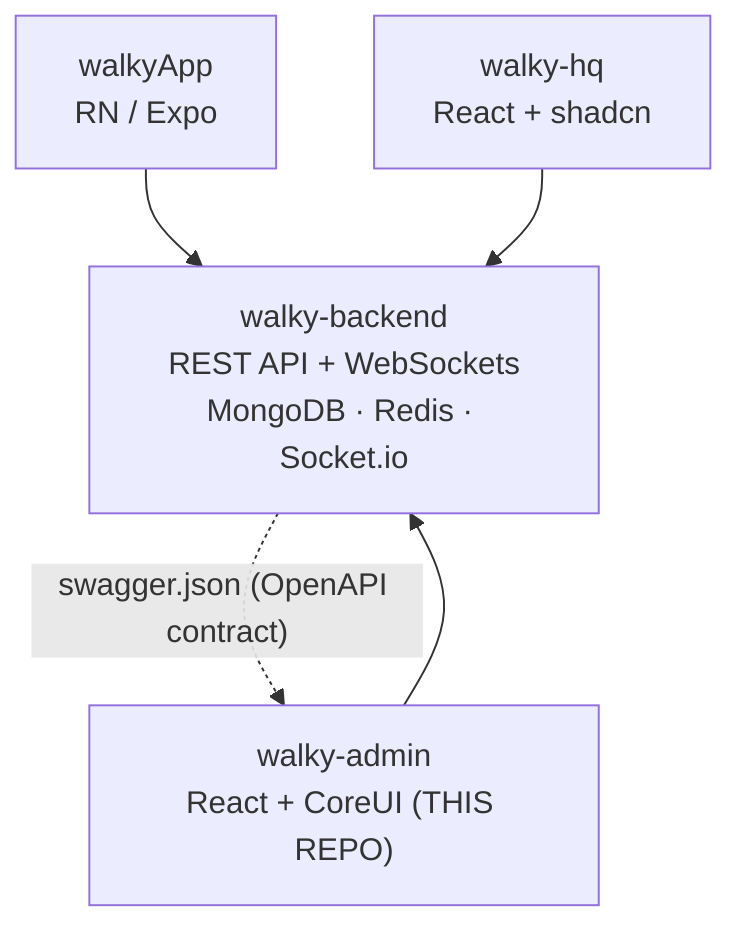

# Walky Admin — Overview

> Administrative panel of the Walky platform. React 19 + CoreUI 5 + Vite 7. Client of
> `walky-backend`, with TypeScript types generated from the backend's Swagger/OpenAPI.

## Table of Contents

- [1. Purpose](#1-purpose)
- [2. The problem it solves](#2-the-problem-it-solves)
- [3. Role in the Walky ecosystem](#3-role-in-the-walky-ecosystem)
- [4. Target audience (role-based RBAC)](#4-target-audience-role-based-rbac)
- [5. Who consumes it / what it manages](#5-who-consumes-it--what-it-manages)
- [6. Full stack (actual versions and the rationale)](#6-full-stack-actual-versions-and-the-rationale)
- [7. Environment variables](#7-environment-variables)
- [8. Build/run scripts](#8-buildrun-scripts)
- [Cross-links](#cross-links)

---

## 1. Purpose

**walky-admin** is the **web administrative panel** of the Walky platform — a social network for
university campuses. It gives **campus admins, school admins, moderators, and super-admins**
(plus internal staff with "read-only" visibility) the operational tools to
manage the student community, the content they generate, and the configuration of each campus.

It is a **Single Page Application (SPA)** built with **CoreUI** (an admin component
library on top of Bootstrap 5). All of its server state comes from the backend Walky via HTTP; it has no
database of its own.

The package name in `package.json` is literally `admin-panel` (`version: 0.0.0`, private).

## 2. The problem it solves

Operating a campus social network creates continuous administrative needs:

- **Moderation:** review content/user reports, ban/unban students,
  track moderation history (Report Safety, Report History).
- **Student management:** view active, banned, deactivated, and "disengaged" students; update
  status; export lists.
- **Content management:** administer Events, Spaces, and Ideas created by students (edit,
  remove, export).
- **Operational analytics:** 6 dashboards (Engagement, Popular Features, User Interactions,
  Community, Student Safety, Student Behavior) to track the health of each campus.
- **Campus configuration:** geofences, ambassadors, role/administrator management.

Without this panel, these tasks would require direct database/API access. The admin encapsulates everything in a
single interface with **RBAC** (role-based access control) that limits what each type of admin can see and
do, and by **campus/school** (multi-tenant).

## 3. Role in the Walky ecosystem

The Walky platform has **4 repositories**, all under `/Volumes/SSDDEV/DEV_PROJETOS/`:

| Repository | Role | Audience |
|-------------|-------|---------|
| `walkyApp` | Mobile app (RN/Expo) | Students |
| `walky-backend` | REST API + WebSockets (Node/Express/Mongo) | serves everyone |
| **`walky-admin`** | **Admin panel (CoreUI)** | **Campus/school admins, moderators** |
| `walky-hq` | Super-admin/analytics panel (shadcn) | Internal Walky super-admins |



**Client of the backend.** The admin **does not talk to the database**; it consumes the backend's REST API (base via
`VITE_API_BASE_URL`, typically `https://api.walkyapp.com/api` in production or
`http://localhost:8080/api` in dev). It authenticates via JWT Bearer (see
[architecture.md](./architecture.md#5-authentication-and-rbac)).

**Swagger-generated types.** The admin's type contract is **derived from the backend**. The
`npm run generate:api` script runs:

```
npx swagger-typescript-api generate -p ../walky-backend/swagger.json -o ./src/API --axios --name WalkyAPI.ts
```

This reads the `swagger.json` from the sibling `walky-backend` repository and generates the typed Axios client
`src/API/WalkyAPI.ts` (~15k lines). **Golden rule of the ecosystem:** if the contract changes in the backend →
regenerate the client in the frontends. The `walkyApp` does the equivalent with Orval; `walky-hq` also uses
types derived from the same Swagger.

**Admin vs. HQ difference:** both have functional overlap (users, events, spaces, ideas, reports,
roles, campus). The distinction is **scope and audience**: the **admin** is per-**campus/school** operation
(CoreUI, operation/moderation-oriented); the **HQ** is **global** super-admin/analytics (shadcn +
Tailwind, config of the platform's core entities).

## 4. Target audience (role-based RBAC)

Access is governed by a **permission matrix** hardcoded in
[`src/lib/permissions.ts`](../src/lib/permissions.ts). There are **5 roles** (`RoleName`):

| Internal role | Display name | Scope | Permission profile |
|--------------|------------------|--------|---------------------|
| `super_admin` | Walky Admin | All campuses/schools | Full access: dashboards+export, student management, content CRUD, moderation, campuses/ambassadors, role CRUD+manage |
| `school_admin` | School Admin | One school (all its campuses) | Same as super_admin in practice (identical matrix) |
| `campus_admin` | Campus Admin | One campus | Same as super/school_admin in the matrix |
| `moderator` | Moderator | One campus | Read-only dashboards (no export), **no** student/admin management; **moderation power** (Report Safety/History: read/update/export) |
| `walky_internal` | Walky Internal | Internal visibility | **Read-only** on dashboards, events/spaces/ideas, and campuses/ambassadors; **no** moderation or student management |

> **Note faithful to the code:** in the current matrix (`permissionMatrix`), `super_admin`, `school_admin`, and
> `campus_admin` have **exactly the same rights per resource**. The real scope difference between
> them is enforced per **campus/school** (contexts + filters, and by the backend), not by the action
> matrix. See [architecture.md](./architecture.md#5-authentication-and-rbac).

**Role assignment hierarchy** (`roleHierarchy` in `permissions.ts`): who can create/assign
which roles — `super_admin` → School/Campus/Moderator; `school_admin` → Campus/Moderator;
`campus_admin` → Moderator; `moderator` and `walky_internal` → no one.

The 6 possible actions (`PermissionAction`) are: `read`, `create`, `update`, `delete`, `export`,
`manage`. Each resource (`PermissionResource`, ~24 resources: dashboards, student lists,
events, spaces, ideas, moderation, campuses, ambassadors, role_management) receives a
`ResourcePermission` object with these 6 boolean flags.

## 5. Who consumes it / what it manages

Panel users (admins/moderators) manage, via screens (routes in
[`src/routes/v2Routes.tsx`](../src/routes/v2Routes.tsx)):

- **Dashboards (6):** `dashboard/engagement`, `popular-features`, `user-interactions`, `community`,
  `student-safety`, `student-behavior`.
- **Students (4 lists):** `manage-students/active | banned | deactivated | disengaged`.
- **Events:** `events` (Manager), `events/insights`, `events/check-in` (Check-In Analytics).
- **Spaces:** `spaces` (Manager), `spaces/insights`.
- **Ideas:** `ideas` (Manager), `ideas/insights`.
- **Moderation:** `report-safety`, `report-history`.
- **Administration:** `admin/campuses` (geofences), `admin/ambassadors`, `admin/role-management`,
  `admin/settings`.
- **Playground (14 routes):** experimental data visualizations (interest cloud/constellation/
  chord/pyramid + "active users" spiral/heat/rings/funnel/guitar/drums/chimes/waves/orbs/galaxy),
  several using Three.js.
- **Auth (public):** `login`, `recover-password` / `auth/otp`, `force-password-change`.

See the complete screen map in
[folder-structure.md](./folder-structure.md#pages-v2--as-telas).

## 6. Full stack (actual versions and the rationale)

Versions extracted from [`package.json`](../package.json). Node **≥ 20** (`engines`); `.nvmrc` pins
**22**; Vercel builds with `NODE_VERSION: 22`.

### Core

| Lib | Version | Why |
|-----|--------|---------|
| **react** / **react-dom** | ^19.1.0 | UI framework. React 19 (latest major). |
| **typescript** | ~5.8.3 | Static typing; `strict: true` in `tsconfig.app.json`. |
| **vite** | ^7.0.4 | Fast bundler/dev-server (ESBuild + Rollup). Replaces CRA/Webpack; instant HMR. |
| **@vitejs/plugin-react** | ^4.6.0 | React integration (Fast Refresh) in Vite. |
| **react-router-dom** | ^7.6.3 | SPA routing. v7 with `BrowserRouter` + nested routes and `lazy` for code-splitting. |

### UI

| Lib | Version | Why |
|-----|--------|---------|
| **@coreui/react** | ^5.7.0 | Admin component framework (dashboards, tables, cards, sidebar). Product choice for the panel visual standard. |
| **@coreui/coreui** | ^5.4.1 | CoreUI base CSS/styles (imported in `main.tsx`). |
| **@coreui/icons** / **@coreui/icons-react** | ^3.0.1 / ^2.3.0 | CoreUI icons (`CIcon`). |
| **@coreui/utils** | ^2.0.2 | CoreUI utilities. |
| **bootstrap** | ^5.3.7 | CoreUI is built on top of Bootstrap 5. |
| **react-bootstrap** | ^2.10.10 | Additional Bootstrap components in React. |
| **lucide-react** | ^0.525.0 | Additional icons (thin line, used in the V2 UI). |
| **react-hot-toast** | ^2.6.0 | Toast notifications (configured globally in `App.tsx`). |
| **simplebar-react** | ^3.3.2 | Custom scrollbars (e.g., sidebar). |

### Data / state

| Lib | Version | Why |
|-----|--------|---------|
| **axios** | ^1.10.0 | HTTP client; used by the generated client and the root instance `src/API/index.ts` (auth/CSRF/401/403 interceptors). |
| **@tanstack/react-query** | ^5.82.0 | Server state (cache, stale-time, retry). `staleTime 5min`, `gcTime 10min`, custom retry (skips 4xx except 408). |
| **swagger-typescript-api** | (via `npx`) | Generates the typed Axios client `WalkyAPI.ts` from the backend's Swagger. |

> **State:** the admin uses **React Context + React Query** — there is no Zustand/Redux. Context for
> UI/selection state (School, Campus, Theme, Dashboard, DeactivatedUser); React Query for remote data.

### Visualization

| Lib | Version | Why |
|-----|--------|---------|
| **recharts** | ^3.4.1 | Dashboard charts (lines, bars, pie). |
| **three** | ^0.182.0 | Experimental 3D visualizations in the "Playground". |
| **@react-three/fiber** / **@react-three/drei** | ^9.4.2 / ^10.7.7 | React renderer + helpers for Three.js. |
| **@react-google-maps/api** + **@types/google.maps** | ^2.20.7 / ^3.58.1 | Maps (campus geofences, area selection). |

### Utilities

| Lib | Version | Why |
|-----|--------|---------|
| **date-fns** | ^4.1.0 | Date manipulation/formatting. |
| **html2canvas** + **html2pdf.js** | ^1.4.1 / ^0.12.1 | Exporting dashboards/reports to PDF/image. |
| **react-is** | ^19.2.0 | Peer utility for React element introspection. |

### Styling

- **CSS + Sass** (`sass` ^1.89.2). Design tokens as **CSS variables** (dual: CoreUI + V2 tokens):
  `src/styles-v2/design-tokens.css`, `theme-variables.css`, `ThemeComponents.css`, `global.css`, and the
  TS version `src/styles-v2/design-tokens.ts` (auto-generated from Figma). Dark mode via
  `data-coreui-theme` + `data-theme` + `--app-*` CSS vars (see `ThemeProvider`).
- **vite-plugin-svgr** ^4.5.0: imports SVGs as React components (`*.svg?react`).

### Testing / quality

| Lib | Version | Why |
|-----|--------|---------|
| **vitest** | ^4.0.8 | Test runner (`jsdom` environment, `globals: true`). V8 coverage with a **ratchet** (thresholds: stmts 80 / branches 65 / funcs 78 / lines 80). |
| **@testing-library/react** + **/dom** + **/jest-dom** + **/user-event** | 16.x / 10.x / 6.x / 14.x | User-centric component tests. |
| **msw** | ^2.14.6 | Network mocking (Mock Service Worker) in tests. |
| **eslint** + **typescript-eslint** + react-hooks/react-refresh plugins | 9.x / 8.x | Linting. |
| **husky** + **lint-staged** | 9.x / 16.x | Git hooks: pre-commit runs `clean-build.sh` + `eslint --fix`. |
| **custom scripts** | — | `check:testids` (ensures `data-testid`) and `check:a11y` (accessibility) in `scripts/`. |

### Deploy

- **Vercel** (`vercel.json`): framework `vite`, `outputDirectory: dist`, SPA rewrite of `/(.*)` →
  `/index.html`, `NODE_VERSION: 22`.

## 7. Environment variables

Prefix `VITE_` (exposed to the bundle). From `.env.example`:

| Var | Required | Description |
|-----|-------------|-----------|
| `VITE_API_BASE_URL` | yes | API base. Prod `https://api.walkyapp.com/api`; staging `https://staging.walkyapp.com/api`; local `http://localhost:8081/api` (or `8080/api`). Default in code: `http://localhost:8080/api`. |
| `VITE_APP_NAME` | — | Display name (e.g., `Walky Admin`). |
| `VITE_ENV` | — | `development` / `staging` / `production`. |
| `VITE_GOOGLE_MAPS_API_KEY` | opt. | Google Maps (geofences). Commented out in the example. |
| `VITE_SENTRY_DSN` | opt. | Sentry. Commented out in the example. |

## 8. Build/run scripts

From [`package.json`](../package.json):

| Script | What it does |
|--------|-----------|
| `npm run dev` | Vite dev server (default port **5173**). |
| `npm run build` | `tsc -b && vite build` → `dist/` (with `manualChunks`: react-vendor, coreui, charts, query). |
| `npm run preview` | Serves the production build locally. |
| `npm run type-check` | `tsc -b` (type checking). |
| `npm run lint` | ESLint across the whole project. |
| `npm run test` / `test:ui` / `test:coverage` | Vitest (watch / UI / coverage). |
| `npm run check:testids` / `check:a11y` / `check:all` | `data-testid`, a11y, and full-suite guards. |
| `npm run generate:api` | Regenerates `src/API/WalkyAPI.ts` from `../walky-backend/swagger.json`. |
| `npm run generate:icons` / `generate:images` | Asset generation. |
| `npm run clean` | `./clean-build.sh`. |

Production builds strip `console.log/info/debug` via `esbuild.pure` (keeps `warn`/`error`).

---

## Cross-links

- [Architecture](./architecture.md) — data flow, service layer, RBAC, decisions.
- [Folder structure](./folder-structure.md) — each directory and the rationale for the `-v2` suffix.
