# Walky Admin — Fluxos (Workflows)

> Fluxos de ponta a ponta do painel **walky-admin** (React 19 + CoreUI 5 + Vite 7), extraídos do
> código. Cada fluxo traz um diagrama Mermaid e cita os arquivos reais que o implementam. Todo
> estado de servidor vem do backend Walky via HTTP; o admin não tem banco próprio.
>
> Documento-irmão: [business-rules.md](./business-rules.md) (regras extraídas do código).
> Ver também [overview.md](./overview.md), [integrations.md](./integrations.md),
> [conventions.md](./conventions.md).

## Índice

- [1. Login / Autenticação](#1-login--autenticação)
- [2. Sessão, sync entre abas e logout](#2-sessão-sync-entre-abas-e-logout)
- [3. Troca forçada de senha (require_password_change)](#3-troca-forçada-de-senha-require_password_change)
- [4. Recuperação de senha (Forgot → OTP → Reset)](#4-recuperação-de-senha-forgot--otp--reset)
- [5. Autorização RBAC (roles → matriz → guards)](#5-autorização-rbac-roles--matriz--guards)
- [6. Troca de escola / campus (multi-tenant)](#6-troca-de-escola--campus-multi-tenant)
- [7. Carregamento de dashboards / analytics](#7-carregamento-de-dashboards--analytics)
- [8. Gestão de estudantes (ban / deactivate / activate / flag)](#8-gestão-de-estudantes-ban--deactivate--activate--flag)
- [9. Moderação de reports](#9-moderação-de-reports)
- [10. Gestão de campus e geofences](#10-gestão-de-campus-e-geofences)
- [11. Ambassadors](#11-ambassadors)
- [12. Role Management / Administrator Settings / 2FA](#12-role-management--administrator-settings--2fa)
- [Fluxos técnicos transversais](#fluxos-técnicos-transversais)
  - [T1. Camada Axios: interceptors, CSRF, token](#t1-camada-axios-interceptors-csrf-token)
  - [T2. Tratamento de erro 401 / 403 (ACCOUNT_DEACTIVATED)](#t2-tratamento-de-erro-401--403-account_deactivated)
  - [T3. Cache React Query (valores reais)](#t3-cache-react-query-valores-reais)
- [Cross-links](#cross-links)

---

## 1. Login / Autenticação

**Arquivos:** `src/pages-v2/LoginV2/LoginV2.tsx`, `src/API/index.ts` (interceptors),
`src/API/Api.ts` (`api.loginCreate` → `POST /api/login`), `src/hooks/useAuth.ts`.

O login é feito por um formulário controlado (email/senha). Não há um "AuthProvider" central: o
`LoginV2` chama a API diretamente, grava `token` e `user` no `localStorage` e força um
`window.location.href = "/"` (reload) para que o `useAuth` releia o estado do storage no mount.

### Regras embutidas no fluxo (de `LoginV2.tsx`)

1. **Resposta `status === "not_verified"`** (mesmo com HTTP 200, ou via erro): redireciona para
   `"/auth/otp?step=verify&email=…&phoneNumber=…"`, preservando o `+` do email
   (`replace(/ /g, "+")`).
2. **Sem `access_token` na resposta:** lança `Error("Token not found in response.")`.
3. **Allowlist de role** — só entram no painel os roles:
   `super_admin`, `walky_internal`, `school_admin`, `campus_admin`, `editor`, `moderator`, `staff`,
   `viewer`. Caso contrário: `"Access denied: You are not authorized for the admin panel."`
4. **Normalização de IDs:** `school_id`/`campus_id` podem vir como objeto populado; extrai `_id`/`id`.
5. **`require_password_change === true`:** redireciona para `/force-password-change` (ver §3).
6. **Erro `code === "USER_DEACTIVATED"`:** abre o modal de conta desativada (inline no `LoginV2`).
7. **Outros erros:** mostra `data.message` ou `"Invalid email or password."`.

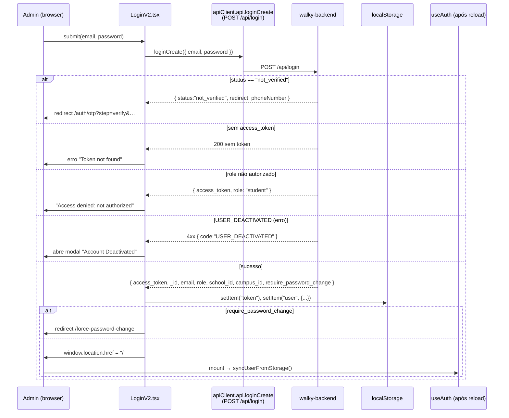

> **Nota:** o backend também expõe `POST /api/refresh-token` e `POST /api/logout`
> (`api.refreshTokenCreate`, `api.logoutCreate` em `src/API/Api.ts`), **mas o admin não usa refresh
> token**: no 401 ele simplesmente descarta o token e manda para `/login` (ver §T2). O `refresh_token`
> retornado pelo login **não é persistido** pelo `LoginV2`.

Ver a matriz de roles em [business-rules.md §1](./business-rules.md#1-matriz-de-permissões-por-role).

---

## 2. Sessão, sync entre abas e logout

**Arquivos:** `src/hooks/useAuth.ts`, `src/layout-v2/TopbarV2/TopbarV2.tsx` (logout),
`src/contexts/DeactivatedUserContext.tsx` (logout de conta desativada).

`useAuth` é um hook **local** (não é Context): cada componente que o usa tem seu próprio estado,
mas todos leem a mesma fonte de verdade (`localStorage`) e se sincronizam por **eventos**.

### O que `useAuth` faz

- No mount: `syncUserFromStorage()` lê `token` + `user` do `localStorage`. Se o `user` estiver
  corrompido (JSON inválido), limpa `token` e `user`.
- Escuta dois eventos e re-sincroniza:
  - **`window "storage"`** (disparado por *outras* abas) — filtra por `key === "user" | "token" | null`.
  - **`window "auth:user-updated"`** (evento custom disparado por `updateUser` na *mesma* aba).
- Expõe `user`, `isAuthenticated`, `isLoading`, `hasRole(roles[])`, `isSuperAdmin/SchoolAdmin/CampusAdmin`,
  e `updateUser(nextUser)`.
- `updateUser(null)` = logout local (remove `user` + `token`) e dispara `auth:user-updated`.

### Logout (Topbar)

`TopbarV2.handleLogout` remove `token` e `user` do `localStorage` e faz
`window.location.href = "/login"` (`src/layout-v2/TopbarV2/TopbarV2.tsx`). Note que **não** remove
`selectedSchool`/`selectedCampus` — essas seleções persistem entre logins na mesma máquina.

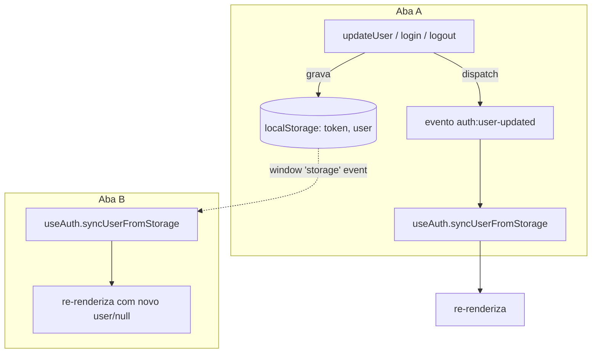

> **Assimetria conhecida:** o logout do Topbar e o da conta desativada removem chaves manualmente
> (`token`, `user`, às vezes `refreshToken`) e forçam `window.location.href`. Só o
> `updateUser` dispara `auth:user-updated`; um logout via `location.href` recarrega a página, então
> o sync entre abas continua funcionando via o evento nativo `storage`.

---

## 3. Troca forçada de senha (require_password_change)

**Arquivo:** `src/pages-v2/ForcePasswordChange/ForcePasswordChange.tsx`
(→ `apiClient.api.adminV2SettingsPasswordUpdate`).

Fluxo obrigatório quando o backend marca `require_password_change: true` no login (ex.: senha
provisória de um admin recém-criado). A rota `/force-password-change` é **pública** no roteador
(fora do `AuthGuard`), mas a própria página faz sua verificação de sessão.

### Regras (do componente)

- No mount: se não houver `token`+`user` no storage → `/login`. Se `user.require_password_change`
  for falso → `/` (não precisa trocar). Se `user` corrompido → limpa storage e `/login`.
- Validações do form: `newPassword === confirmPassword` e `newPassword.length >= 8`.
- Sucesso: chama `adminV2SettingsPasswordUpdate({ currentPassword: "", newPassword })` (currentPassword
  vazio porque é reset forçado), toast de sucesso, zera `user.require_password_change` no storage e
  faz `window.location.href = "/"`.

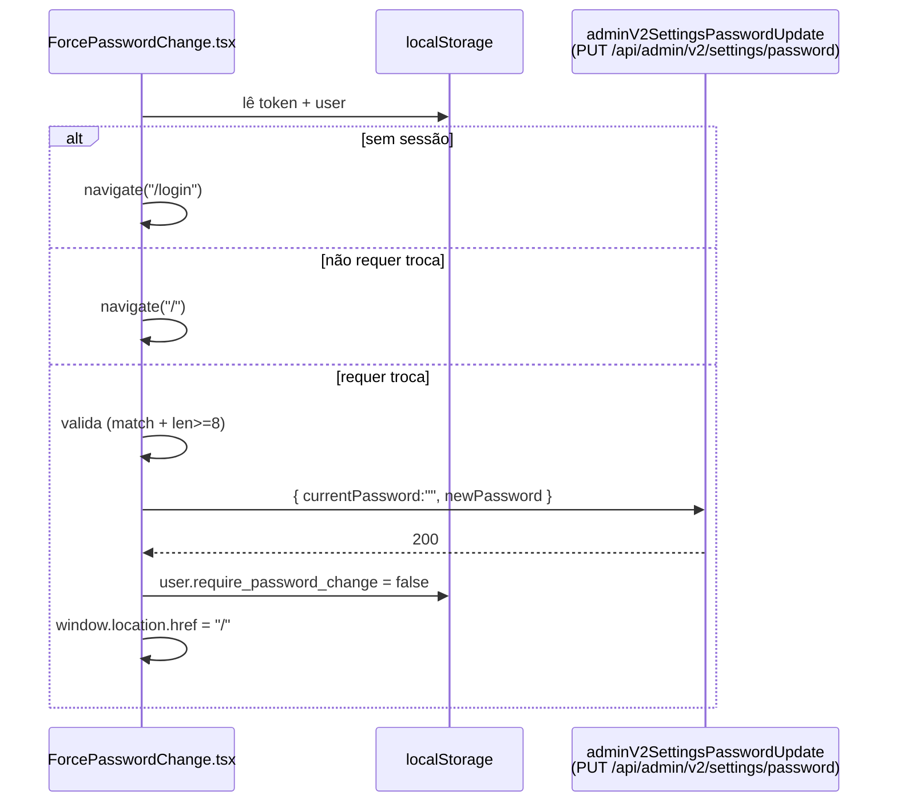

---

## 4. Recuperação de senha (Forgot → OTP → Reset)

**Arquivos:** `src/pages-v2/RecoverPasswordV2/RecoverPasswordV2/RecoverPasswordV2.tsx`
(orquestra os passos), `.../VerifyCodeStep/VerifyCodeStep.tsx`, `.../ResetPasswordStep/ResetPasswordStep.tsx`.
Endpoints (em `src/API/Api.ts`): `api.forgotPasswordCreate` (`POST /api/forgot-password`),
`api.verifyOtpCreate` (`POST /api/verify-otp`), `api.resetPasswordCreate` (`POST /api/reset-password`).

Rotas: `/recover-password` e `/auth/otp` (ambas montam o mesmo `RecoverPasswordV2`, que decide o
passo pela query `?step=verify`). É um fluxo de 3 passos com a mesma tela hospedeira.

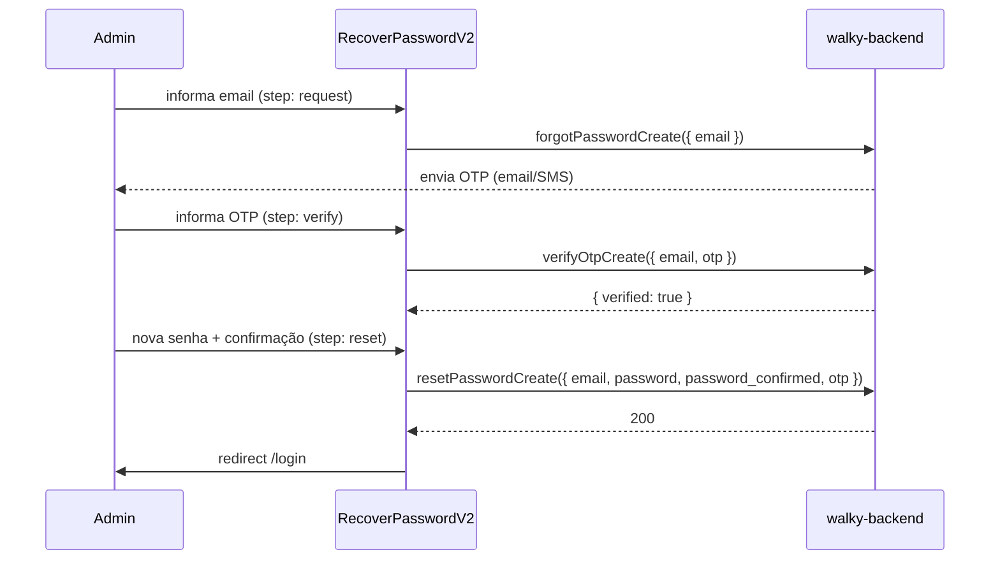

### Validações verificadas nos componentes

- **Step 1 (email):** `forgotPasswordCreate({ email })`; validação HTML5 de email.
- **Step 2 (OTP):** `verifyOtpCreate({ email, otp })`; **OTP = exatamente 6 dígitos** (`/^\d{6}$/`),
  trim antes de enviar. Erros do backend: `locked` (muitas tentativas — máx 6), `expired`,
  `remainingAttempts` → mensagens "Too many failed attempts…", "…has expired…", "…N attempts remaining."
- **Step 3 (reset):** `resetPasswordCreate({ email, otp, password, password_confirmed })`; **senha mín.
  8 chars**, `password === confirm`. Se o backend retornar `message === "Password validation failed"`,
  a lista de erros é mostrada em bullets. Sucesso → toast e redirect a `/login` após 2s.

Resumo consolidado em [business-rules.md §7](./business-rules.md#7-validações-de-formulários).

---

## 5. Autorização RBAC (roles → matriz → guards)

**Arquivos:** `src/lib/permissions.ts` (matriz + helpers), `src/hooks/usePermissions.ts`,
`src/components-v2/PermissionGuard/PermissionGuard.tsx`, `src/components-v2/AuthGuard/AuthGuard.tsx`,
`src/routes/v2Routes.tsx` (guards por rota).

O RBAC é **client-side** e declarativo. A matriz completa (o que cada role pode em cada recurso)
está em [business-rules.md §1](./business-rules.md#1-matriz-de-permissões-por-role). Aqui está o
fluxo de decisão.

### Peças

- **`permissionMatrix`** (`permissions.ts`): `Record<RoleName, Record<PermissionResource, ResourcePermission>>`,
  onde `ResourcePermission = { read, create, update, delete, export, manage }` (booleans).
- **`hasPermission(role, resource, action)`** → lê a matriz. Role desconhecido → `noPermissions`.
- **`usePermissions()`** deriva `userRole` de `useAuth().user?.role` e expõe `can`, `canRead`,
  `canCreate`, `canUpdate`, `canDelete`, `canExport`, `canManage`, `canAccessPath`, e flags de role.
- **`AuthGuard`** — protege a árvore autenticada: enquanto `isLoading` renderiza `null`; se não
  autenticado, `Navigate to="/login"` preservando `state.from`; senão renderiza filhos.
- **`PermissionGuard`** — protege recurso/ação: `fallback` pode ser `'hidden'` (default), `'redirect'`
  (default para `/dashboard/engagement`) ou um React node. Também espera `isLoading` (evita redirect
  no refresh antes do auth inicializar).

### Cadeia de proteção de rota (de `App.tsx` + `v2Routes.tsx`)

- `App.tsx`: rota `/*` é envolvida por `<AuthGuard><V2Routes/></AuthGuard>`.
- `v2Routes.tsx`: **cada** rota de página é envolvida por `<PermissionGuard resource=… fallback="redirect">`.
  Exceções sem guard: `admin/settings` (AdministratorSettings), redirects legados, Playground e o `*` (404).
- **Botões/ações inline** (ex.: `ExportButton`) usam `canExport(...)` / `<PermissionGuard>` com
  `fallback="hidden"` para simplesmente sumir quando falta permissão — visto em
  `ActiveStudents.tsx` (`const showExport = canExport("active_students")`).

> Segurança: o RBAC do admin é **apenas de UX** — a autorização real é do backend. Ver
> [business-rules.md §5](./business-rules.md#5-regras-de-sessão-e-segurança).

---

## 6. Troca de escola / campus (multi-tenant)

**Arquivos:** `src/contexts/SchoolContext.tsx`, `src/contexts/CampusContext.tsx`,
`src/layout-v2/TopbarV2/TopbarV2.tsx` (seletores + fetch), `src/services/schoolService.ts`,
`src/services/campusService.ts`. Hooks auxiliares (definidos, ver nota): `src/hooks/useSchoolFilter.ts`,
`src/hooks/useCampusFilter.ts`.

O admin é multi-tenant por **escola → campus**. `SchoolProvider` é montado no `main.tsx` (nível mais
alto); `CampusProvider` é montado dentro de `v2Routes.tsx` (dentro da área autenticada). Ambos
persistem a seleção em `localStorage` (`selectedSchool`, `selectedCampus`) e reidratam no mount.

### Quem pode trocar o quê (de `TopbarV2.tsx`)

| Role | Seletor de escola | Seletor de campus |
|---|---|---|
| `super_admin` | Dropdown interativo (todas as escolas via `adminV2SchoolsList`) | Dropdown (campi da escola selecionada via `adminV2CampusesList`) |
| `school_admin` | **Read-only** (sua escola, via `schoolDetail`) | Dropdown (campi da sua escola) |
| Demais (`campus_admin`, `moderator`, `walky_internal`, …) | Read-only | Read-only (seu campus via `campusesDetail`) |

- **Auto-seleção:** ao carregar, se nenhuma escola/campus estiver selecionada, seleciona a primeira.
  Ao trocar de escola, se o campus atual não estiver na nova lista, reseta para o primeiro (ou `null`).
- No mobile, os seletores viram modais (`CModal`) para super_admin (escola+campus) e school_admin (campus).

### Como a troca propaga para os dados

Na prática, **as páginas leem `selectedSchool?._id` / `selectedCampus?._id` diretamente** e os
incluem tanto na `queryKey` do React Query quanto nos params da chamada — ex. em
`ActiveStudents.tsx` e nos dashboards (`Engagement.tsx`). Trocar a seleção muda a `queryKey`, o que
dispara um refetch automático do React Query. Ver §7.

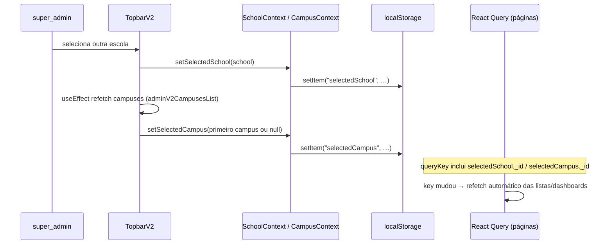

> **Nota de código (verificado):** existem os hooks `useSchoolFilter` e `useCampusFilter` que
> instalam um interceptor Axios para injetar `school_id`/`campus_id` em GET/POST/PUT/PATCH e
> invalidar queries. **Nenhuma tela os invoca** (`grep` não encontra usos fora dos próprios
> arquivos). O filtro multi-tenant efetivo é feito passando os IDs explicitamente nas queries. Há
> ainda `useDashboardPrefetch` (prefetch de todos os períodos), também **não referenciado** por
> páginas. Documentados aqui por existirem, mas marcados como **não conectados**.

---

## 7. Carregamento de dashboards / analytics

**Arquivos:** `src/pages-v2/Dashboard/*` (6 telas), `src/contexts/DashboardContext.tsx`
(`timePeriod`), `src/API/Api.ts` (`adminV2Dashboard*List`), `src/lib/queryClient.ts`.
Há também um `src/services/analyticsService.ts` (métricas de campus por `campus_id`), usado por
telas de analytics de campus/segurança.

Existem 6 dashboards: Engagement, Popular Features, User Interactions, Community, Student Safety,
Student Behavior (rotas em `v2Routes.tsx`, protegidas por `PermissionGuard`).

### Padrão de fetch (ex. `Engagement.tsx`)

- Lê `selectedSchool`, `selectedCampus` (contexts) e `timePeriod` (DashboardContext, default `"month"`).
- Usa `useQuery` do React Query, com `queryKey` = `[nome, timePeriod, schoolId, campusId]`.
- `queryFn` chama endpoints como `adminV2DashboardStatsList`, `adminV2DashboardEngagementList`,
  `adminV2DashboardRetentionList`, `adminV2DashboardCommunityCreationList`, passando
  `{ period, schoolId, campusId }`.
- Trocar período/escola/campus muda a key → refetch.

### `analyticsService` (métricas de campus)

Camada de service que envelopa endpoints `adminCampusMetrics*` e `adminCampusAlerts*`, convertendo
períodos (`'7d'|'30d'|'90d'|'all'` → `undefined` para `all`) e desserializando datas:
`getSocialHealthMetrics`, `getWellbeingMetrics`, `getCampusKPIs`, `getActivityTimeline`,
`getCampusAlerts`, `markAlertAsRead`, `markAllAlertsAsRead`.

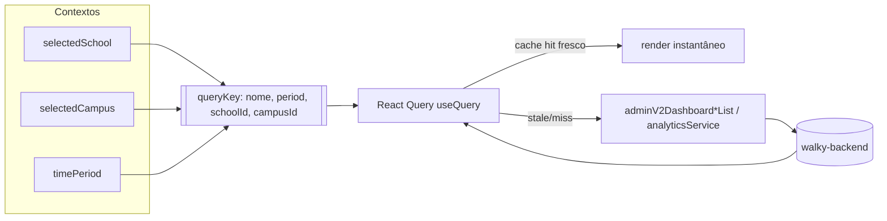

Configuração de cache: ver [§T3](#t3-cache-react-query-valores-reais).

---

## 8. Gestão de estudantes (ban / deactivate / activate / flag)

**Arquivos de listagem:** `src/pages-v2/Campus/ActiveStudents`, `BannedStudents`,
`DeactivatedStudents`, `DisengagedStudents` + `src/pages-v2/Campus/components/*` (StudentTable,
StatsCard, etc.). **Modais de ação:** `src/components-v2/{BanUserModal, UnbanUserModal,
DeactivateUserModal, ActivateUserModal, FlagUserModal, WriteNoteModal, SendPasswordResetModal,
LogoutAllDevicesModal, StudentProfileModal}`.

As listas seguem o mesmo padrão de `ActiveStudents.tsx`: `useQuery` com key incluindo
`school/campus/página/busca/sort`, chamando `adminV2StudentsList({ status, page, limit, search,
sortBy, sortOrder, schoolId, campusId })` + `adminV2StudentsStatsList`. Export condicionado a
`canExport(<resource>)`.

### Ações e endpoints reais (verificado)

As mutations vivem nas tabelas em `src/pages-v2/Campus/components/` (`StudentTable.tsx`,
`BannedStudentTable.tsx`, `DeactivatedStudentTable.tsx`), disparadas via `ActionDropdown`/modais e
também a partir do `StudentProfileModal` (por callbacks `onBanUser/onDeactivateUser/onUnbanUser/onActivateUser`).
Todas usam `useMutation` do React Query + toast + invalidação de `["students"]` (e `["studentStats"]`).

| Ação | `apiClient` | Endpoint | Payload | Invalida | Toast sucesso |
|---|---|---|---|---|---|
| **Ban** | `api.adminV2StudentsLockSettingsUpdate(id, …)` | `PUT /api/admin/v2/students/{id}/lock-settings` | `{ isLocked:true, lockReason, lockDuration }` (dias) | `students`, `studentStats` | "Student banned successfully" |
| **Unban** | `api.adminV2StudentsUnbanCreate(id)` | `POST /api/admin/v2/students/{id}/unban` | — | `students`, `studentStats` | "User unbanned successfully" |
| **Deactivate** | `api.adminV2StudentsDelete(id)` | `DELETE /api/admin/v2/students/{id}` | — | `students`, `studentStats` | "Student deactivated successfully" |
| **Activate** | `api.adminV2StudentsActivateCreate(id)` | `POST /api/admin/v2/students/{id}/activate` | — | `students`, `studentStats` | "User activated successfully" |
| **Flag** | `api.adminV2StudentsFlagCreate(id, { reason })` | `POST /api/admin/v2/students/{id}/flag` | `{ reason }` | `students` | "Student flagged successfully" |
| **Unflag** | `api.adminV2StudentsUnflagCreate(id)` | `POST /api/admin/v2/students/{id}/unflag` | — | `students` | "Student unflagged successfully" |

Mapeamento de duração do ban (`BanUserModal` → dias): 1/3/7/14/30/90 dias; "Permanent" → **36500**.

> **Atenção (divergência de código):** existe `src/services/reportService.ts` com métodos
> `banUserFromReport`, `getBannedUsers`, `unbanUser`, `getUserBanHistory`, `removeUser` que apontam
> para endpoints **`adminReports*` / `adminUsersBanned*` / `adminUsers…Remove`** (rotas antigas). As
> telas de estudante **não** usam esse service — elas chamam diretamente os endpoints
> `adminV2Students*` da tabela acima. O `reportService` é usado no fluxo de reports (ver §9) e/ou é
> legado. Documentado como **caminho alternativo/legado**.

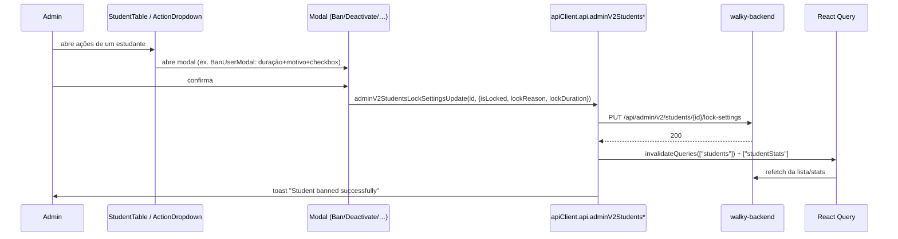

Regras de negócio (durações de ban, quem pode banir, notificação por email na deactivate, etc.):
[business-rules.md §3](./business-rules.md#3-regras-de-moderação-e-gestão-de-estudantes).

---

## 9. Moderação de reports

**Arquivos:** `src/pages-v2/Moderation/{ReportSafety, ReportHistory}`,
`src/components-v2/{ReportDetailModal, ReportDetailsModal, FlagModal, UnflagModal}`,
`src/services/reportService.ts`.

### Endpoints reais usados pela tela (verificado em `ReportSafety.tsx`)

A tela `ReportSafety` usa **diretamente** os endpoints `adminV2Reports*` (via `useQuery`/`useMutation`),
não o `reportService`. Filtros: `page`, `limit: 10`, `search`, `type` (Event/Idea/Space/Message/User,
CSV), `status` (CSV), `sortBy: "reportDate"`, `sortOrder`, `schoolId`, `campusId`.
**Status válidos (labels desta tela):** `Pending review | Under evaluation | Resolved | Dismissed`.

| Ação | `apiClient` | Endpoint |
|---|---|---|
| Listar | `api.adminV2ReportsList(query)` | `GET /api/admin/v2/reports` |
| Stats | `api.adminV2ReportsStatsList({schoolId,campusId})` | `GET /api/admin/v2/reports/stats` |
| Detalhe | `api.adminV2ReportsDetail(id)` | `GET /api/admin/v2/reports/{id}` |
| Mudar status | `api.adminV2ReportsStatusPartialUpdate(id, { status })` | `PATCH /api/admin/v2/reports/{id}/status` |
| Adicionar nota | `api.adminV2ReportsNoteCreate(id, { note })` | `POST /api/admin/v2/reports/{id}/note` |
| Flag do item denunciado | `api.adminV2{Students,Events,Ideas,Spaces}FlagCreate(id,{reason})` | `POST /api/admin/v2/{...}/{id}/flag` |
| Unflag do item | `api.adminV2{Students,Events,Ideas,Spaces}UnflagCreate(id)` | `POST /api/admin/v2/{...}/{id}/unflag` |
| Banir usuário do report | `api.adminV2StudentsLockSettingsUpdate(id,{isLocked,lockReason,lockDuration})` | `PUT /api/admin/v2/students/{id}/lock-settings` |
| Desativar usuário do report | `api.adminV2StudentsDelete(id)` | `DELETE /api/admin/v2/students/{id}` |

**Regra "nota obrigatória":** no `StatusDropdown`, mudar para **Resolved** ou **Dismissed** dispara
`onNoteRequired` → abre `WriteNoteModal` (nota obrigatória, não-vazia, `maxCharacters` 500) →
`adminV2ReportsNoteCreate` → **depois** `adminV2ReportsStatusPartialUpdate`. Outros status mudam
direto. Invalidação: `["reports"]`, `["reportStats"]`, `["history-reports"]`, `["history-report-stats"]`.

> **Divergência:** `src/services/reportService.ts` expõe `getReports/updateReportStatus/
> banUserFromReport/bulkUpdateReports` apontando para endpoints `adminReports*` (sem `v2`) com status
> `pending|under_review|resolved|dismissed` e `bulk action: resolve|dismiss|under_review`. **A tela
> `ReportSafety` não usa esse service** — usa `adminV2Reports*`. O `reportService` parece ser a
> camada antiga; documentado em [business-rules.md §3](./business-rules.md#3-regras-de-moderação-e-gestão-de-estudantes)
> como caminho legado.

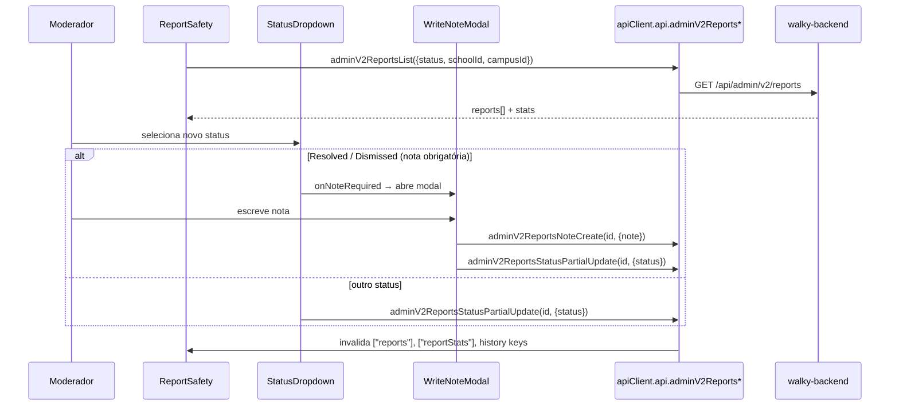

Ver [business-rules.md §3](./business-rules.md#3-regras-de-moderação-e-gestão-de-estudantes) e o
controller do backend em [docs/admin/admin-reports-controller.md](./admin/admin-reports-controller.md).

---

## 10. Gestão de campus e geofences

**Arquivos:** `src/pages-v2/Admin/Campuses*`, `src/pages-v2/CampusBoundary/*`,
`src/services/campusService.ts`, `src/services/campusSyncService.ts`,
`src/services/placeService.ts`.

`campusService` (confirmado) faz o CRUD de campus (`campusesList/Create/Update/Delete`), mapeando
`_id → id`. O geofence é o campo `coordinates` (`type: "Polygon"`, `coordinates: number[][][]`).

`campusSyncService` (confirmado) cuida da **sincronização de places** por boundary via Google Places:
- `syncCampus(id)` → `adminCampusSyncSyncCreate`
- `syncAllCampuses()` → `adminCampusSyncSyncAllCreate`
- `getSyncLogs(params)` → `adminCampusSyncLogsList`
- `getCampusesWithSyncStatus()` → `adminCampusSyncCampusesList`
- `previewCampusBoundary(id)` → `adminCampusSyncCampusPreviewList` (retorna bounds/center/area/search_points)

### Detalhes verificados

- **Listagem** (`src/pages-v2/Admin/Campuses/Campuses.tsx`): usa `api.adminV2CampusesList({ school_id })`,
  paginação de 10, expande cada campus para ver a boundary num mapa read-only.
- **Geofence** (`src/pages-v2/CampusBoundary/CampusBoundary.tsx`): Google Maps (`@react-google-maps/api`,
  libs `["places"]`). Desenho manual do polígono por cliques (mínimo **3** vértices); ao finalizar,
  fecha o anel (repete o primeiro ponto) e gera GeoJSON `Polygon` com coords `[lng, lat]` (WGS84). O
  polígono fica editável (arrastar vértices) e emite `onBoundaryChange`.
  > **Nota de segurança:** a **chave do Google Maps está hardcoded** em `CampusBoundary.tsx`
  > (`VITE_GOOGLE_MAPS_API_KEY` do `.env.example` **não** é usada). Confirma a nota de
  > [overview.md/integrations.md](./integrations.md).
- **Sync de places:** `previewCampusBoundary(id)` mostra bounds/center/área/search_points antes;
  `syncCampus(id)` executa e retorna `{ places_added, places_updated, places_removed, api_calls_used,
  sync_status }`.

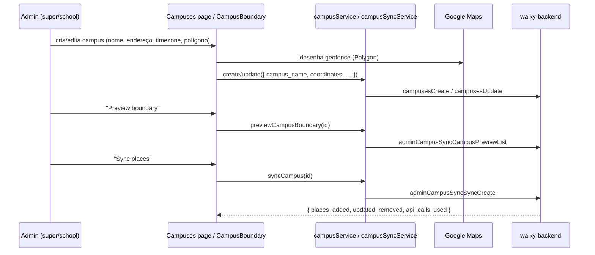

Regras/validações de campus: [business-rules.md §6](./business-rules.md#6-regras-de-campus-geofences-e-ambassadors).

---

## 11. Ambassadors

**Arquivos:** `src/pages-v2/Admin/Ambassadors*`, `src/services/ambassadorService.ts`,
`src/components-v2/{AddAmbassadorModal, DeleteAmbassadorModal}`.

`ambassadorService` (confirmado) usa o cliente `apiClient.ambassadors.*` (router legado na raiz):
`ambassadorsList`, `ambassadorsDetail`, `ambassadorsCreate`, `ambassadorsUpdate`, `ambassadorsDelete`,
`campusDetail(campusId)` (ambassadors por campus). `getAll` retorna `[]` em erro (fail-soft);
`getById`/create/update/delete propagam o erro.

A tela `src/pages-v2/Admin/Ambassadors/Ambassadors.tsx` na prática usa endpoints v2
(`api.adminAmbassadorsList({ schoolId, campusId })`, `adminAmbassadorsCreate`, `adminAmbassadorsDelete`),
enquanto o `ambassadorService` usa o router legado `apiClient.ambassadors.*`. O
`AddAmbassadorModal` busca estudantes por nome exato via
`api.adminV2MembersList({ search, role:"student", limit:20, exactMatch:true, schoolId, campusId })`
e cria um ambassador por estudante selecionado com
`{ name, email, user_id, school_id, campuses_id[] }`. Ações condicionadas a `canCreate("ambassadors")`
e `canDelete("ambassadors")`.

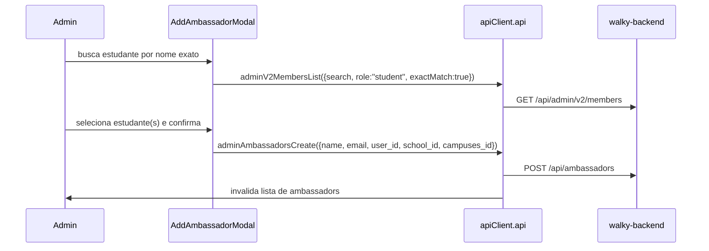

Ver [business-rules.md §6](./business-rules.md#6-regras-de-campus-geofences-e-ambassadors).

---

## 12. Role Management / Administrator Settings / 2FA

**Arquivos:** `src/pages-v2/Admin/{RoleManagement, AdministratorSettings}*`,
`src/services/rolesService.ts`, `src/lib/permissions.ts` (hierarquia de atribuição),
`src/components-v2/{CreateMemberModal, ChangeRoleModal, RolePermissionsModal, LogoutAllDevicesModal}`.
Endpoints de perfil (`src/API/Api.ts`): `adminV2SettingsPasswordUpdate`,
`adminProfile2FaEnableCreate` (`POST /api/admin/profile/2fa/enable`),
`adminProfile2FaDisableCreate` (`POST /api/admin/profile/2fa/disable`),
`adminProfileLogoutAllCreate` (`POST /api/admin/profile/logout-all`).

`rolesService` (confirmado): `getRoles`, `getPermissions`, `getUserRoles`, `assignRole`,
`removeRole`, `checkPermission`, `createRole`, `updateRole`, `deleteRole`, `createPermission`,
`deletePermission`.

### Hierarquia de atribuição (de `permissions.ts → roleHierarchy`)

- `super_admin` pode atribuir: `school_admin`, `campus_admin`, `moderator`
- `school_admin` pode atribuir: `campus_admin`, `moderator`
- `campus_admin` pode atribuir: `moderator`
- `moderator` / `walky_internal`: nada

Helpers: `getAssignableRoles`, `getAssignableRoleDisplayNames`, `canAssignRole`,
`canAssignRoleByDisplayName`.

### AdministratorSettings (verificado) — 3 abas

`src/pages-v2/Admin/AdministratorSettings/AdministratorSettings.tsx`.

- **Personal Information:** `api.adminProfileList()` (carregar), `api.adminV2SettingsProfileUpdate({ firstName, lastName, position })`, avatar via `api.adminProfileAvatarCreate({ avatar: File })` (imagem, máx 5MB). Email/nome são read-only; só `position` é editável.
- **Security:** trocar senha via `api.adminV2SettingsPasswordUpdate({ currentPassword, newPassword })` (nova senha mín. 8, confirmar igual); toggle **2FA** via `api.adminProfile2FaEnableCreate()` / `api.adminProfile2FaDisableCreate()`; logout de todos os dispositivos via `api.adminV2SettingsLogoutAllCreate()`.
- **Danger Zone:** pedir exclusão de conta `api.adminV2SettingsDeleteAccountCreate({ reason })`, cancelar `…DeleteAccountCancelCreate`, status `…DeleteAccountStatusList`.

### RoleManagement (verificado)

`src/pages-v2/Admin/RoleManagement/RoleManagement.tsx` — lista membros via
`api.adminV2MembersList({ page, limit, search, role, sortBy, sortOrder, schoolId, campusId })`.
Criar (`adminV2MembersCreate({ name, email, role, title, school_id, campus_id })` — gera convite por
email), mudar role (`adminV2MembersRolePartialUpdate(id, { role })`), remover
(`adminV2MembersDelete(id)`), reset de senha (`adminV2MembersPasswordResetCreate(id)`), ativar/desativar
(`adminV2MembersStatusPartialUpdate(id, { isActive })`). O dropdown de role no `CreateMemberModal`/
`ChangeRoleModal` é filtrado por `getAssignableRoleDisplayNames(userRole)`. O `RolePermissionsModal`
mostra a matriz read/create/update/delete/export/manage por recurso.

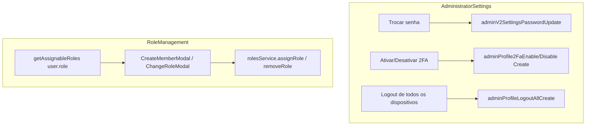

Regras completas: [business-rules.md §5](./business-rules.md#5-regras-de-sessão-e-segurança) e
[§1](./business-rules.md#1-matriz-de-permissões-por-role).

---

## Fluxos técnicos transversais

### T1. Camada Axios: interceptors, CSRF, token

**Arquivo:** `src/API/index.ts` (+ `src/API/http-client.ts` gerado, `src/API/WalkyAPI.ts`).

Há **duas** instâncias Axios com interceptors idênticos:
1. `API` (default export) — `axios.create({ baseURL: VITE_API_BASE_URL ?? "http://localhost:8080/api", withCredentials: true })`.
2. `apiClient` = `new Api(new HttpClient({ baseURL: baseURL.replace(/\/api\/?$/, "") }))` — o cliente
   gerado por Swagger. O sufixo `/api` é **removido** do baseURL porque as rotas admin já incluem
   `/api/...` e as legadas batem na raiz (`/ambassadors`, `/campus`, …). `withCredentials = true`.

**Request interceptor** (ambas as instâncias):
- Injeta `Authorization: Bearer <token>` a partir do `localStorage.getItem("token")` (warn se ausente).
- **CSRF em não-GET:** para métodos que não sejam `get/head/options`, procura o token CSRF em cookies
  (`csrf_cookie_rr`, `XSRF-TOKEN`, `csrf_token`, `_csrf`, nessa ordem) e o envia em **dois** headers:
  `X-CSRF-Token` e `X-XSRF-Token`.

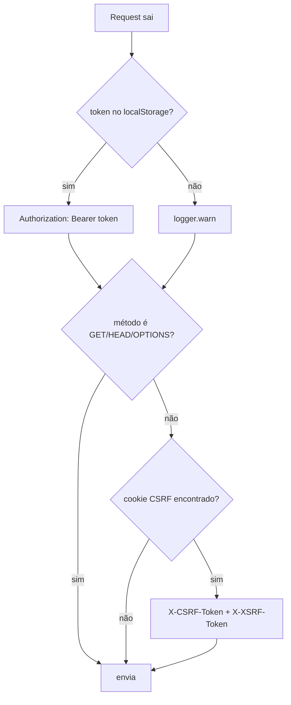

### T2. Tratamento de erro 401 / 403 (ACCOUNT_DEACTIVATED)

**Arquivos:** `src/API/index.ts` (response interceptor), `src/contexts/DeactivatedUserContext.tsx`,
`src/components-v2/DeactivatedUserModal/DeactivatedUserModal.tsx`, `src/layout-v2/LayoutV2.tsx`.

**Response interceptor** (ambas as instâncias):
- **401:** remove `token` do `localStorage` e, se não estiver já em `/login`, faz
  `window.location.href = "/login"`. (Não há tentativa de refresh.)
- **403 com `code === "ACCOUNT_DEACTIVATED"` ou `"USER_DEACTIVATED"`:** chama `triggerDeactivatedModal()`.
  Um 403 comum (permissão) **não** abre o modal.

**Ponte fora do React:** `DeactivatedUserContext` expõe `registerDeactivatedSetter(setter)` e um
`triggerDeactivatedModal()` global. `LayoutV2` registra o setter no mount. Assim o interceptor
(código fora da árvore React) consegue acionar o modal. O botão "Log Out" do modal limpa `token`,
`refreshToken`, `user` e vai para `/login`.

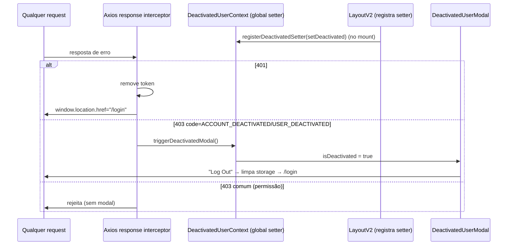

### T3. Cache React Query (valores reais)

**Arquivo:** `src/lib/queryClient.ts` (+ `main.tsx` que injeta o `QueryClientProvider`).

Valores **reais** do `QueryClient`:

| Opção | Valor | Efeito |
|---|---|---|
| `queries.staleTime` | `1000 * 60 * 5` (**5 min**) | Dados considerados frescos por 5 min (sem refetch). |
| `queries.gcTime` | `1000 * 60 * 10` (**10 min**) | Cache inativo é coletado após 10 min. |
| `queries.retry` | função custom | **Não** re-tenta em 4xx (exceto **408**); senão até **3** tentativas. |
| `queries.refetchOnWindowFocus` | `false` | Não refaz fetch ao focar a janela. |
| `mutations.retry` | `1` | Mutations re-tentam 1 vez. |

Há uma `queryKeys` factory (`campuses`, `campus(id)`, `students`, `geofences(campusId)`,
`ambassadors`, `ambassador(id)`, `ambassadorsByCampus(campusId)`), embora várias telas montem keys
inline (ex.: `["students", page, search, status, sort, schoolId, campusId]`).

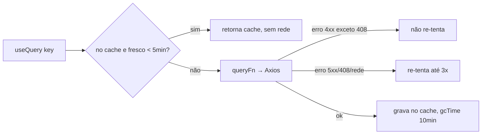

---

## Cross-links

- [business-rules.md](./business-rules.md) — regras de negócio extraídas do código (matriz RBAC,
  sessão, moderação, campus/ambassadors, validações de forms).
- [overview.md](./overview.md) — propósito, stack, público-alvo, env vars.
- [integrations.md](./integrations.md) — integrações e camada de API.
- [conventions.md](./conventions.md) — convenções de código.
- [admin/admin-reports-controller.md](./admin/admin-reports-controller.md),
  [admin/admin-students-controller.md](./admin/admin-students-controller.md),
  [admin/admin-dashboard-controller.md](./admin/admin-dashboard-controller.md),
  [admin/admin-settings-controller.md](./admin/admin-settings-controller.md),
  [admin/admin-ambassadors-controller.md](./admin/admin-ambassadors-controller.md) — contratos do backend.
