# Walky Admin — Workflows

> End-to-end flows of the **walky-admin** panel (React 19 + CoreUI 5 + Vite 7), extracted from the
> code. Each flow includes a Mermaid diagram and cites the actual files that implement it. All
> server state comes from the Walky backend over HTTP; the admin has no database of its own.
>
> Companion document: [business-rules.md](./business-rules.md) (rules extracted from the code).
> See also [overview.md](./overview.md), [integrations.md](./integrations.md),
> [conventions.md](./conventions.md).

## Table of Contents

- [1. Login / Authentication](#1-login--authentication)
- [2. Session, cross-tab sync, and logout](#2-session-cross-tab-sync-and-logout)
- [3. Forced password change (require_password_change)](#3-forced-password-change-require_password_change)
- [4. Password recovery (Forgot → OTP → Reset)](#4-password-recovery-forgot--otp--reset)
- [5. RBAC authorization (roles → matrix → guards)](#5-rbac-authorization-roles--matrix--guards)
- [6. Switching school / campus (multi-tenant)](#6-switching-school--campus-multi-tenant)
- [7. Loading dashboards / analytics](#7-loading-dashboards--analytics)
- [8. Student management (ban / deactivate / activate / flag)](#8-student-management-ban--deactivate--activate--flag)
- [9. Report moderation](#9-report-moderation)
- [10. Campus and geofence management](#10-campus-and-geofence-management)
- [11. Ambassadors](#11-ambassadors)
- [12. Role Management / Administrator Settings / 2FA](#12-role-management--administrator-settings--2fa)
- [Cross-cutting technical flows](#cross-cutting-technical-flows)
  - [T1. Axios layer: interceptors, CSRF, token](#t1-axios-layer-interceptors-csrf-token)
  - [T2. Handling 401 / 403 errors (ACCOUNT_DEACTIVATED)](#t2-handling-401--403-errors-account_deactivated)
  - [T3. React Query cache (actual values)](#t3-react-query-cache-actual-values)
- [Cross-links](#cross-links)

---

## 1. Login / Authentication

**Files:** `src/pages-v2/LoginV2/LoginV2.tsx`, `src/API/index.ts` (interceptors),
`src/API/Api.ts` (`api.loginCreate` → `POST /api/login`), `src/hooks/useAuth.ts`.

Login is handled by a controlled form (email/password). There is no central "AuthProvider": the
`LoginV2` calls the API directly, writes `token` and `user` to `localStorage`, and forces a
`window.location.href = "/"` (reload) so that `useAuth` re-reads the state from storage on mount.

### Rules embedded in the flow (from `LoginV2.tsx`)

1. **Response `status === "not_verified"`** (even with HTTP 200, or via an error): redirects to
   `"/auth/otp?step=verify&email=…&phoneNumber=…"`, preserving the `+` in the email
   (`replace(/ /g, "+")`).
2. **No `access_token` in the response:** throws `Error("Token not found in response.")`.
3. **Role allowlist** — only these roles are allowed into the panel:
   `super_admin`, `walky_internal`, `school_admin`, `campus_admin`, `editor`, `moderator`, `staff`,
   `viewer`. Otherwise: `"Access denied: You are not authorized for the admin panel."`
4. **ID normalization:** `school_id`/`campus_id` may arrive as a populated object; extract `_id`/`id`.
5. **`require_password_change === true`:** redirects to `/force-password-change` (see §3).
6. **Error `code === "USER_DEACTIVATED"`:** opens the deactivated-account modal (inline in `LoginV2`).
7. **Other errors:** shows `data.message` or `"Invalid email or password."`.

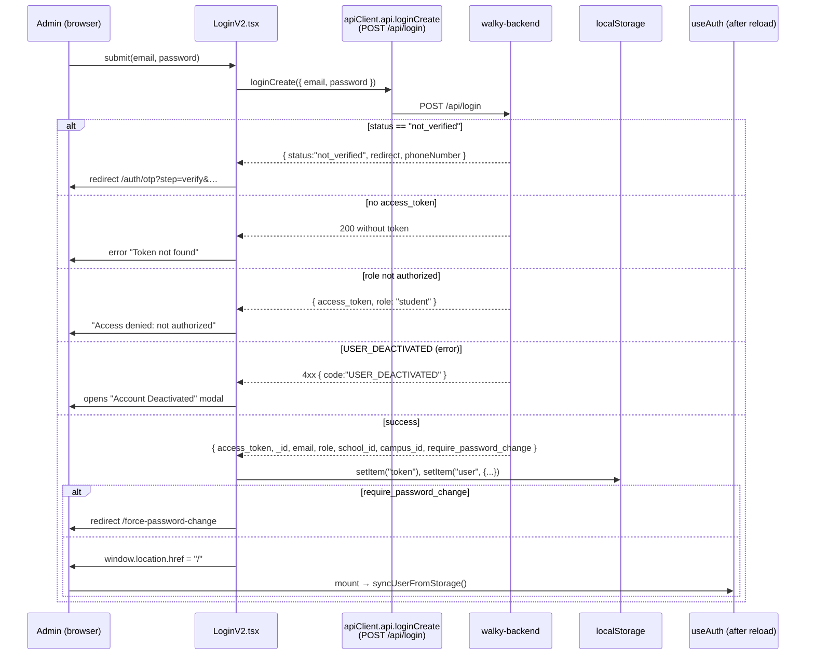

> **Note:** the backend also exposes `POST /api/refresh-token` and `POST /api/logout`
> (`api.refreshTokenCreate`, `api.logoutCreate` in `src/API/Api.ts`), **but the admin does not use a
> refresh token**: on a 401 it simply discards the token and sends the user to `/login` (see §T2). The
> `refresh_token` returned by login **is not persisted** by `LoginV2`.

See the role matrix in [business-rules.md §1](./business-rules.md#1-permission-matrix-by-role).

---

## 2. Session, cross-tab sync, and logout

**Files:** `src/hooks/useAuth.ts`, `src/layout-v2/TopbarV2/TopbarV2.tsx` (logout),
`src/contexts/DeactivatedUserContext.tsx` (deactivated-account logout).

`useAuth` is a **local** hook (not a Context): each component that uses it has its own state, but
they all read the same source of truth (`localStorage`) and stay in sync via **events**.

### What `useAuth` does

- On mount: `syncUserFromStorage()` reads `token` + `user` from `localStorage`. If `user` is
  corrupted (invalid JSON), it clears `token` and `user`.
- Listens to two events and re-syncs:
  - **`window "storage"`** (fired by *other* tabs) — filters by `key === "user" | "token" | null`.
  - **`window "auth:user-updated"`** (custom event fired by `updateUser` in the *same* tab).
- Exposes `user`, `isAuthenticated`, `isLoading`, `hasRole(roles[])`, `isSuperAdmin/SchoolAdmin/CampusAdmin`,
  and `updateUser(nextUser)`.
- `updateUser(null)` = local logout (removes `user` + `token`) and fires `auth:user-updated`.

### Logout (Topbar)

`TopbarV2.handleLogout` removes `token` and `user` from `localStorage` and does
`window.location.href = "/login"` (`src/layout-v2/TopbarV2/TopbarV2.tsx`). Note that it does **not**
remove `selectedSchool`/`selectedCampus` — these selections persist across logins on the same machine.

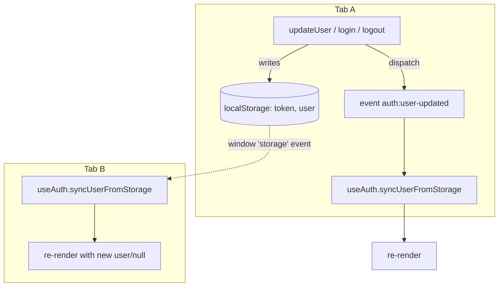

> **Known asymmetry:** the Topbar logout and the deactivated-account logout remove keys manually
> (`token`, `user`, sometimes `refreshToken`) and force `window.location.href`. Only `updateUser`
> fires `auth:user-updated`; a logout via `location.href` reloads the page, so cross-tab sync still
> works via the native `storage` event.

---

## 3. Forced password change (require_password_change)

**File:** `src/pages-v2/ForcePasswordChange/ForcePasswordChange.tsx`
(→ `apiClient.api.adminV2SettingsPasswordUpdate`).

A mandatory flow when the backend sets `require_password_change: true` at login (e.g., a temporary
password for a newly created admin). The `/force-password-change` route is **public** in the router
(outside the `AuthGuard`), but the page itself performs its own session check.

### Rules (from the component)

- On mount: if there is no `token`+`user` in storage → `/login`. If `user.require_password_change`
  is false → `/` (no change needed). If `user` is corrupted → clear storage and `/login`.
- Form validations: `newPassword === confirmPassword` and `newPassword.length >= 8`.
- Success: calls `adminV2SettingsPasswordUpdate({ currentPassword: "", newPassword })` (currentPassword
  empty because it is a forced reset), success toast, resets `user.require_password_change` in storage,
  and does `window.location.href = "/"`.

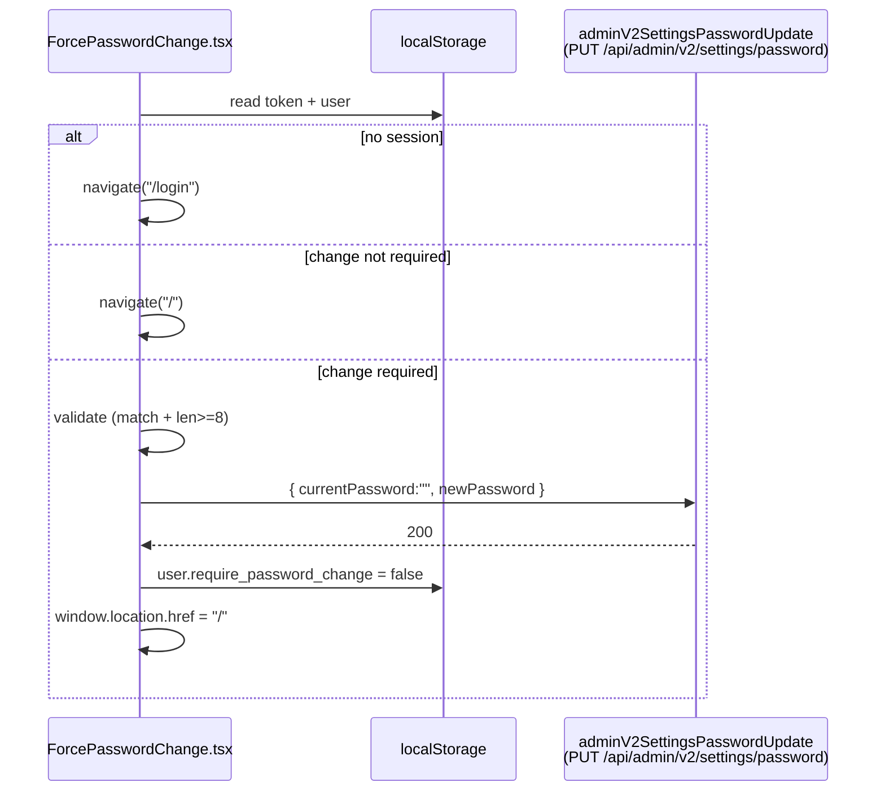

---

## 4. Password recovery (Forgot → OTP → Reset)

**Files:** `src/pages-v2/RecoverPasswordV2/RecoverPasswordV2/RecoverPasswordV2.tsx`
(orchestrates the steps), `.../VerifyCodeStep/VerifyCodeStep.tsx`, `.../ResetPasswordStep/ResetPasswordStep.tsx`.
Endpoints (in `src/API/Api.ts`): `api.forgotPasswordCreate` (`POST /api/forgot-password`),
`api.verifyOtpCreate` (`POST /api/verify-otp`), `api.resetPasswordCreate` (`POST /api/reset-password`).

Routes: `/recover-password` and `/auth/otp` (both mount the same `RecoverPasswordV2`, which decides
the step from the `?step=verify` query). It is a 3-step flow with the same host screen.

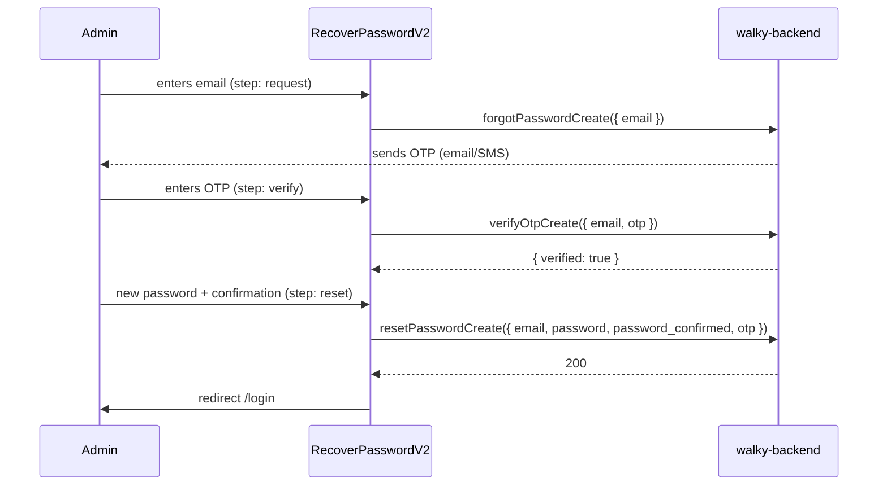

### Validations verified in the components

- **Step 1 (email):** `forgotPasswordCreate({ email })`; HTML5 email validation.
- **Step 2 (OTP):** `verifyOtpCreate({ email, otp })`; **OTP = exactly 6 digits** (`/^\d{6}$/`),
  trimmed before sending. Backend errors: `locked` (too many attempts — max 6), `expired`,
  `remainingAttempts` → messages "Too many failed attempts…", "…has expired…", "…N attempts remaining."
- **Step 3 (reset):** `resetPasswordCreate({ email, otp, password, password_confirmed })`; **password
  min. 8 chars**, `password === confirm`. If the backend returns `message === "Password validation failed"`,
  the list of errors is shown as bullets. Success → toast and redirect to `/login` after 2s.

Consolidated summary in [business-rules.md §7](./business-rules.md#7-form-validations).

---

## 5. RBAC authorization (roles → matrix → guards)

**Files:** `src/lib/permissions.ts` (matrix + helpers), `src/hooks/usePermissions.ts`,
`src/components-v2/PermissionGuard/PermissionGuard.tsx`, `src/components-v2/AuthGuard/AuthGuard.tsx`,
`src/routes/v2Routes.tsx` (per-route guards).

RBAC is **client-side** and declarative. The full matrix (what each role can do on each resource)
is in [business-rules.md §1](./business-rules.md#1-permission-matrix-by-role). Here is the decision
flow.

### Pieces

- **`permissionMatrix`** (`permissions.ts`): `Record<RoleName, Record<PermissionResource, ResourcePermission>>`,
  where `ResourcePermission = { read, create, update, delete, export, manage }` (booleans).
- **`hasPermission(role, resource, action)`** → reads the matrix. Unknown role → `noPermissions`.
- **`usePermissions()`** derives `userRole` from `useAuth().user?.role` and exposes `can`, `canRead`,
  `canCreate`, `canUpdate`, `canDelete`, `canExport`, `canManage`, `canAccessPath`, and role flags.
- **`AuthGuard`** — protects the authenticated tree: while `isLoading` it renders `null`; if not
  authenticated, `Navigate to="/login"` preserving `state.from`; otherwise it renders children.
- **`PermissionGuard`** — protects a resource/action: `fallback` can be `'hidden'` (default),
  `'redirect'` (defaults to `/dashboard/engagement`), or a React node. It also waits for `isLoading`
  (avoids a redirect on refresh before auth initializes).

### Route protection chain (from `App.tsx` + `v2Routes.tsx`)

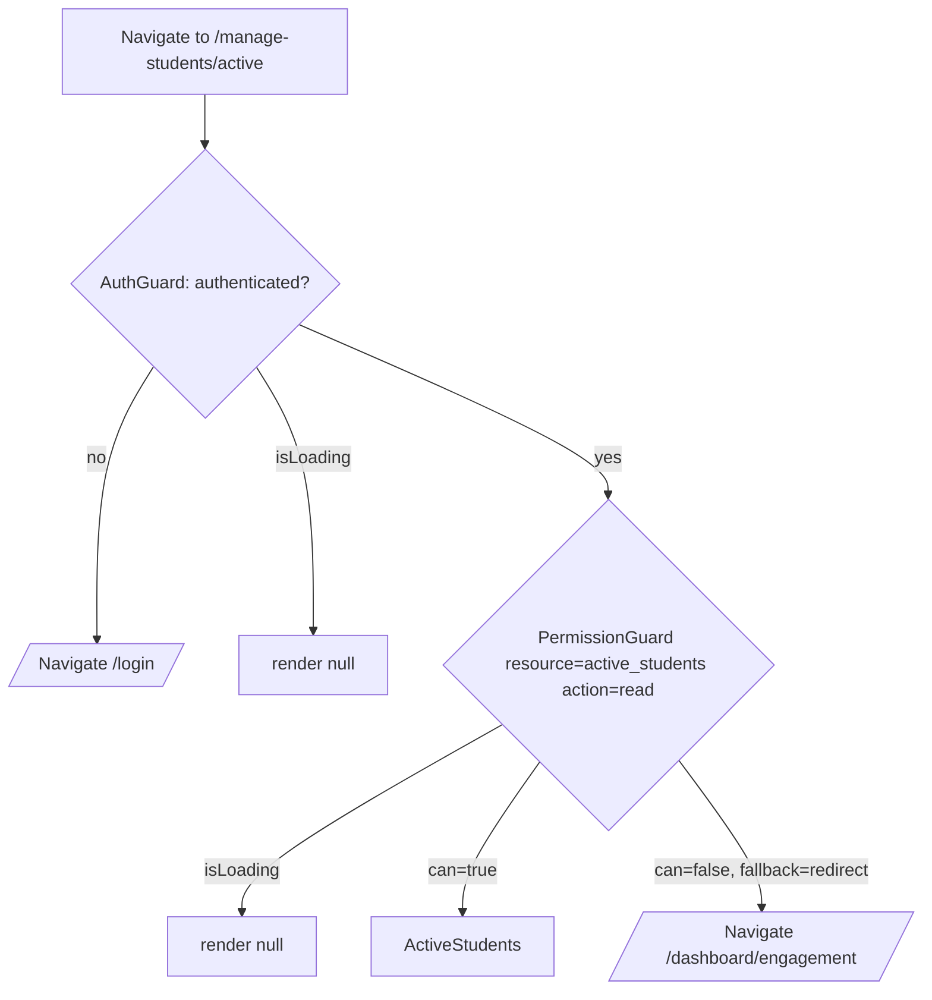

- `App.tsx`: the `/*` route is wrapped by `<AuthGuard><V2Routes/></AuthGuard>`.
- `v2Routes.tsx`: **every** page route is wrapped by `<PermissionGuard resource=… fallback="redirect">`.
  Exceptions without a guard: `admin/settings` (AdministratorSettings), legacy redirects, Playground,
  and the `*` (404).
- **Inline buttons/actions** (e.g., `ExportButton`) use `canExport(...)` / `<PermissionGuard>` with
  `fallback="hidden"` to simply disappear when a permission is missing — seen in
  `ActiveStudents.tsx` (`const showExport = canExport("active_students")`).

> Security: the admin's RBAC is **UX-only** — real authorization lives in the backend. See
> [business-rules.md §5](./business-rules.md#5-session-and-security-rules).

---

## 6. Switching school / campus (multi-tenant)

**Files:** `src/contexts/SchoolContext.tsx`, `src/contexts/CampusContext.tsx`,
`src/layout-v2/TopbarV2/TopbarV2.tsx` (selectors + fetch), `src/services/schoolService.ts`,
`src/services/campusService.ts`. Helper hooks (defined, see note): `src/hooks/useSchoolFilter.ts`,
`src/hooks/useCampusFilter.ts`.

The admin is multi-tenant by **school → campus**. `SchoolProvider` is mounted in `main.tsx` (the
top level); `CampusProvider` is mounted inside `v2Routes.tsx` (inside the authenticated area). Both
persist the selection to `localStorage` (`selectedSchool`, `selectedCampus`) and rehydrate on mount.

### Who can change what (from `TopbarV2.tsx`)

| Role | School selector | Campus selector |
|---|---|---|
| `super_admin` | Interactive dropdown (all schools via `adminV2SchoolsList`) | Dropdown (campuses of the selected school via `adminV2CampusesList`) |
| `school_admin` | **Read-only** (their school, via `schoolDetail`) | Dropdown (campuses of their school) |
| Others (`campus_admin`, `moderator`, `walky_internal`, …) | Read-only | Read-only (their campus via `campusesDetail`) |

- **Auto-selection:** on load, if no school/campus is selected, the first one is selected. When
  switching school, if the current campus is not in the new list, it resets to the first (or `null`).
- On mobile, the selectors become modals (`CModal`) for super_admin (school+campus) and school_admin (campus).

### How the switch propagates to the data

In practice, **pages read `selectedSchool?._id` / `selectedCampus?._id` directly** and include them
in both the React Query `queryKey` and the call params — e.g., in `ActiveStudents.tsx` and in the
dashboards (`Engagement.tsx`). Changing the selection changes the `queryKey`, which triggers an
automatic React Query refetch. See §7.

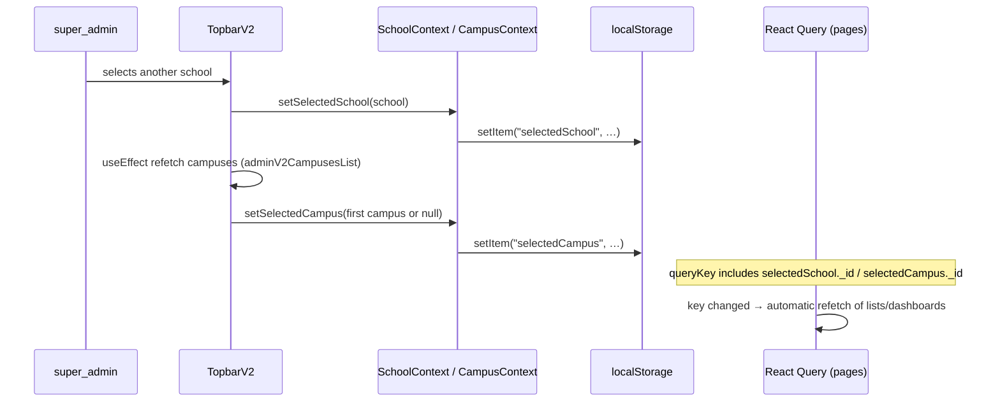

> **Code note (verified):** the hooks `useSchoolFilter` and `useCampusFilter` exist and install an
> Axios interceptor to inject `school_id`/`campus_id` into GET/POST/PUT/PATCH and invalidate queries.
> **No screen invokes them** (`grep` finds no usages outside the files themselves). The effective
> multi-tenant filter is done by passing the IDs explicitly in each query. There is also
> `useDashboardPrefetch` (prefetch of all periods), likewise **not referenced** by any page.
> Documented here because they exist, but flagged as **not wired up**.

---

## 7. Loading dashboards / analytics

**Files:** `src/pages-v2/Dashboard/*` (6 screens), `src/contexts/DashboardContext.tsx`
(`timePeriod`), `src/API/Api.ts` (`adminV2Dashboard*List`), `src/lib/queryClient.ts`.
There is also a `src/services/analyticsService.ts` (campus metrics by `campus_id`), used by
campus/safety analytics screens.

There are 6 dashboards: Engagement, Popular Features, User Interactions, Community, Student Safety,
Student Behavior (routes in `v2Routes.tsx`, protected by `PermissionGuard`).

### Fetch pattern (e.g., `Engagement.tsx`)

- Reads `selectedSchool`, `selectedCampus` (contexts) and `timePeriod` (DashboardContext, default `"month"`).
- Uses React Query's `useQuery`, with `queryKey` = `[name, timePeriod, schoolId, campusId]`.
- `queryFn` calls endpoints such as `adminV2DashboardStatsList`, `adminV2DashboardEngagementList`,
  `adminV2DashboardRetentionList`, `adminV2DashboardCommunityCreationList`, passing
  `{ period, schoolId, campusId }`.
- Changing the period/school/campus changes the key → refetch.

### `analyticsService` (campus metrics)

A service layer that wraps the `adminCampusMetrics*` and `adminCampusAlerts*` endpoints, converting
periods (`'7d'|'30d'|'90d'|'all'` → `undefined` for `all`) and deserializing dates:
`getSocialHealthMetrics`, `getWellbeingMetrics`, `getCampusKPIs`, `getActivityTimeline`,
`getCampusAlerts`, `markAlertAsRead`, `markAllAlertsAsRead`.

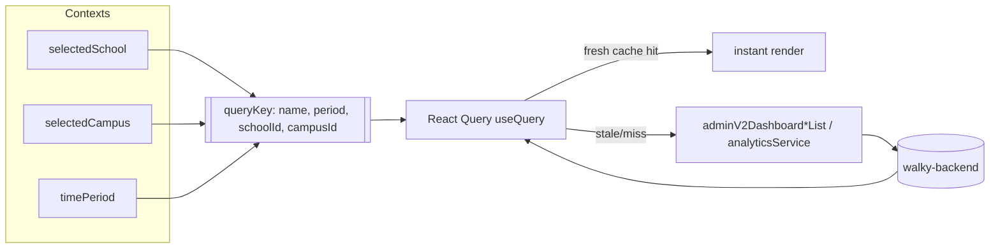

Cache configuration: see [§T3](#t3-react-query-cache-actual-values).

---

## 8. Student management (ban / deactivate / activate / flag)

**List files:** `src/pages-v2/Campus/ActiveStudents`, `BannedStudents`,
`DeactivatedStudents`, `DisengagedStudents` + `src/pages-v2/Campus/components/*` (StudentTable,
StatsCard, etc.). **Action modals:** `src/components-v2/{BanUserModal, UnbanUserModal,
DeactivateUserModal, ActivateUserModal, FlagUserModal, WriteNoteModal, SendPasswordResetModal,
LogoutAllDevicesModal, StudentProfileModal}`.

The lists follow the same pattern as `ActiveStudents.tsx`: `useQuery` with a key including
`school/campus/page/search/sort`, calling `adminV2StudentsList({ status, page, limit, search,
sortBy, sortOrder, schoolId, campusId })` + `adminV2StudentsStatsList`. Export is gated on
`canExport(<resource>)`.

### Actions and actual endpoints (verified)

The mutations live in the tables under `src/pages-v2/Campus/components/` (`StudentTable.tsx`,
`BannedStudentTable.tsx`, `DeactivatedStudentTable.tsx`), triggered via `ActionDropdown`/modals and
also from the `StudentProfileModal` (through the `onBanUser/onDeactivateUser/onUnbanUser/onActivateUser`
callbacks). They all use React Query's `useMutation` + toast + invalidation of `["students"]`
(and `["studentStats"]`).

| Action | `apiClient` | Endpoint | Payload | Invalidates | Success toast |
|---|---|---|---|---|---|
| **Ban** | `api.adminV2StudentsLockSettingsUpdate(id, …)` | `PUT /api/admin/v2/students/{id}/lock-settings` | `{ isLocked:true, lockReason, lockDuration }` (days) | `students`, `studentStats` | "Student banned successfully" |
| **Unban** | `api.adminV2StudentsUnbanCreate(id)` | `POST /api/admin/v2/students/{id}/unban` | — | `students`, `studentStats` | "User unbanned successfully" |
| **Deactivate** | `api.adminV2StudentsDelete(id)` | `DELETE /api/admin/v2/students/{id}` | — | `students`, `studentStats` | "Student deactivated successfully" |
| **Activate** | `api.adminV2StudentsActivateCreate(id)` | `POST /api/admin/v2/students/{id}/activate` | — | `students`, `studentStats` | "User activated successfully" |
| **Flag** | `api.adminV2StudentsFlagCreate(id, { reason })` | `POST /api/admin/v2/students/{id}/flag` | `{ reason }` | `students` | "Student flagged successfully" |
| **Unflag** | `api.adminV2StudentsUnflagCreate(id)` | `POST /api/admin/v2/students/{id}/unflag` | — | `students` | "Student unflagged successfully" |

Ban-duration mapping (`BanUserModal` → days): 1/3/7/14/30/90 days; "Permanent" → **36500**.

> **Caution (code divergence):** there is a `src/services/reportService.ts` with methods
> `banUserFromReport`, `getBannedUsers`, `unbanUser`, `getUserBanHistory`, `removeUser` that point
> to the **`adminReports*` / `adminUsersBanned*` / `adminUsers…Remove`** endpoints (old routes). The
> student screens do **not** use this service — they call the `adminV2Students*` endpoints from the
> table above directly. `reportService` is used in the reports flow (see §9) and/or is legacy.
> Documented as an **alternative/legacy path**.

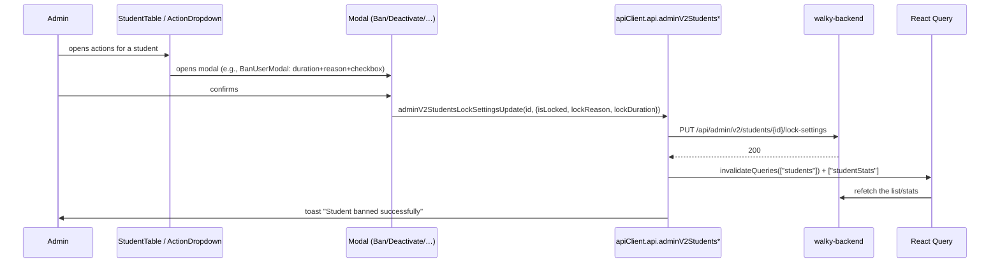

Business rules (ban durations, who can ban, email notification on deactivate, etc.):
[business-rules.md §3](./business-rules.md#3-moderation-and-student-management-rules).

---

## 9. Report moderation

**Files:** `src/pages-v2/Moderation/{ReportSafety, ReportHistory}`,
`src/components-v2/{ReportDetailModal, ReportDetailsModal, FlagModal, UnflagModal}`,
`src/services/reportService.ts`.

### Actual endpoints used by the screen (verified in `ReportSafety.tsx`)

The `ReportSafety` screen uses the `adminV2Reports*` endpoints **directly** (via `useQuery`/`useMutation`),
not `reportService`. Filters: `page`, `limit: 10`, `search`, `type` (Event/Idea/Space/Message/User,
CSV), `status` (CSV), `sortBy: "reportDate"`, `sortOrder`, `schoolId`, `campusId`.
**Valid statuses (labels on this screen):** `Pending review | Under evaluation | Resolved | Dismissed`.

| Action | `apiClient` | Endpoint |
|---|---|---|
| List | `api.adminV2ReportsList(query)` | `GET /api/admin/v2/reports` |
| Stats | `api.adminV2ReportsStatsList({schoolId,campusId})` | `GET /api/admin/v2/reports/stats` |
| Detail | `api.adminV2ReportsDetail(id)` | `GET /api/admin/v2/reports/{id}` |
| Change status | `api.adminV2ReportsStatusPartialUpdate(id, { status })` | `PATCH /api/admin/v2/reports/{id}/status` |
| Add note | `api.adminV2ReportsNoteCreate(id, { note })` | `POST /api/admin/v2/reports/{id}/note` |
| Flag the reported item | `api.adminV2{Students,Events,Ideas,Spaces}FlagCreate(id,{reason})` | `POST /api/admin/v2/{...}/{id}/flag` |
| Unflag the item | `api.adminV2{Students,Events,Ideas,Spaces}UnflagCreate(id)` | `POST /api/admin/v2/{...}/{id}/unflag` |
| Ban the reported user | `api.adminV2StudentsLockSettingsUpdate(id,{isLocked,lockReason,lockDuration})` | `PUT /api/admin/v2/students/{id}/lock-settings` |
| Deactivate the reported user | `api.adminV2StudentsDelete(id)` | `DELETE /api/admin/v2/students/{id}` |

**"Mandatory note" rule:** in the `StatusDropdown`, changing to **Resolved** or **Dismissed** triggers
`onNoteRequired` → opens `WriteNoteModal` (mandatory, non-empty note, `maxCharacters` 500) →
`adminV2ReportsNoteCreate` → **then** `adminV2ReportsStatusPartialUpdate`. Other statuses change
directly. Invalidation: `["reports"]`, `["reportStats"]`, `["history-reports"]`, `["history-report-stats"]`.

> **Divergence:** `src/services/reportService.ts` exposes `getReports/updateReportStatus/
> banUserFromReport/bulkUpdateReports` pointing to `adminReports*` endpoints (without `v2`) with statuses
> `pending|under_review|resolved|dismissed` and `bulk action: resolve|dismiss|under_review`. **The
> `ReportSafety` screen does not use this service** — it uses `adminV2Reports*`. `reportService` appears
> to be the old layer; documented in [business-rules.md §3](./business-rules.md#3-moderation-and-student-management-rules)
> as a legacy path.

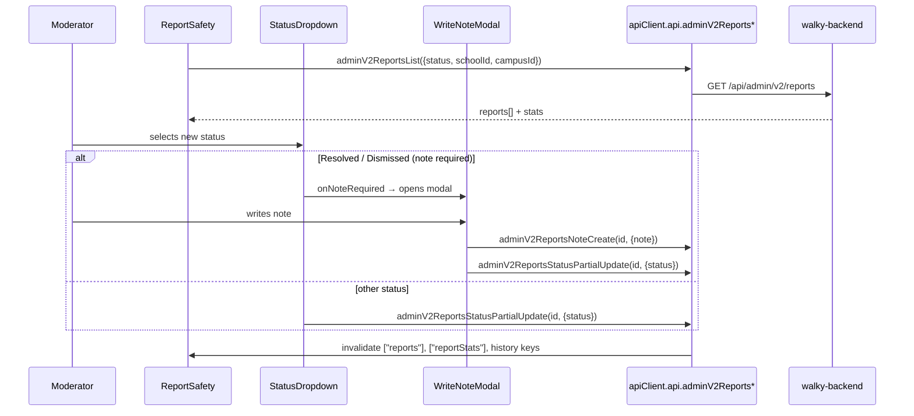

See [business-rules.md §3](./business-rules.md#3-moderation-and-student-management-rules) and the
backend controller in [docs/admin/admin-reports-controller.md](./admin/admin-reports-controller.md).

---

## 10. Campus and geofence management

**Files:** `src/pages-v2/Admin/Campuses*`, `src/pages-v2/CampusBoundary/*`,
`src/services/campusService.ts`, `src/services/campusSyncService.ts`,
`src/services/placeService.ts`.

`campusService` (confirmed) handles campus CRUD (`campusesList/Create/Update/Delete`), mapping
`_id → id`. The geofence is the `coordinates` field (`type: "Polygon"`, `coordinates: number[][][]`).

`campusSyncService` (confirmed) handles **place synchronization** by boundary via Google Places:
- `syncCampus(id)` → `adminCampusSyncSyncCreate`
- `syncAllCampuses()` → `adminCampusSyncSyncAllCreate`
- `getSyncLogs(params)` → `adminCampusSyncLogsList`
- `getCampusesWithSyncStatus()` → `adminCampusSyncCampusesList`
- `previewCampusBoundary(id)` → `adminCampusSyncCampusPreviewList` (returns bounds/center/area/search_points)

### Verified details

- **Listing** (`src/pages-v2/Admin/Campuses/Campuses.tsx`): uses `api.adminV2CampusesList({ school_id })`,
  pagination of 10, expands each campus to view its boundary on a read-only map.
- **Geofence** (`src/pages-v2/CampusBoundary/CampusBoundary.tsx`): Google Maps (`@react-google-maps/api`,
  libs `["places"]`). Manual polygon drawing by clicks (minimum **3** vertices); when finished, it
  closes the ring (repeats the first point) and generates a GeoJSON `Polygon` with coords
  `[lng, lat]` (WGS84). The polygon remains editable (drag vertices) and emits `onBoundaryChange`.
  > **Security note:** the **Google Maps key is hardcoded** in `CampusBoundary.tsx`
  > (`VITE_GOOGLE_MAPS_API_KEY` from `.env.example` is **not** used). This confirms the note in
  > [overview.md/integrations.md](./integrations.md).
- **Place sync:** `previewCampusBoundary(id)` shows bounds/center/area/search_points beforehand;
  `syncCampus(id)` runs it and returns `{ places_added, places_updated, places_removed, api_calls_used,
  sync_status }`.

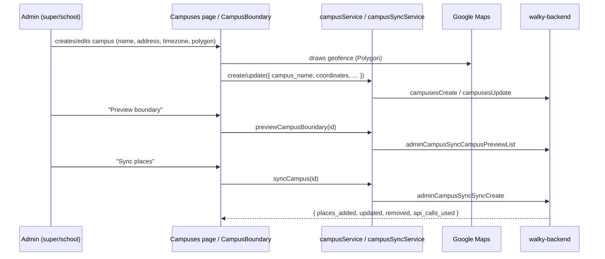

Campus rules/validations: [business-rules.md §6](./business-rules.md#6-campus-geofence-and-ambassador-rules).

---

## 11. Ambassadors

**Files:** `src/pages-v2/Admin/Ambassadors*`, `src/services/ambassadorService.ts`,
`src/components-v2/{AddAmbassadorModal, DeleteAmbassadorModal}`.

`ambassadorService` (confirmed) uses the `apiClient.ambassadors.*` client (legacy router at the root):
`ambassadorsList`, `ambassadorsDetail`, `ambassadorsCreate`, `ambassadorsUpdate`, `ambassadorsDelete`,
`campusDetail(campusId)` (ambassadors by campus). `getAll` returns `[]` on error (fail-soft);
`getById`/create/update/delete propagate the error.

The `src/pages-v2/Admin/Ambassadors/Ambassadors.tsx` screen actually uses v2 endpoints
(`api.adminAmbassadorsList({ schoolId, campusId })`, `adminAmbassadorsCreate`, `adminAmbassadorsDelete`),
whereas `ambassadorService` uses the legacy `apiClient.ambassadors.*` router. The
`AddAmbassadorModal` searches students by exact name via
`api.adminV2MembersList({ search, role:"student", limit:20, exactMatch:true, schoolId, campusId })`
and creates one ambassador per selected student with
`{ name, email, user_id, school_id, campuses_id[] }`. Actions are gated on `canCreate("ambassadors")`
and `canDelete("ambassadors")`.

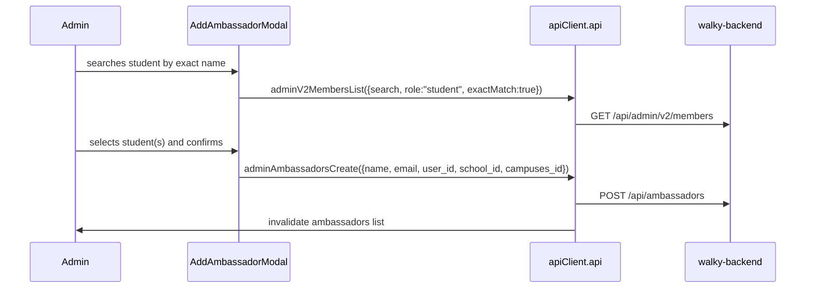

See [business-rules.md §6](./business-rules.md#6-campus-geofence-and-ambassador-rules).

---

## 12. Role Management / Administrator Settings / 2FA

**Files:** `src/pages-v2/Admin/{RoleManagement, AdministratorSettings}*`,
`src/services/rolesService.ts`, `src/lib/permissions.ts` (assignment hierarchy),
`src/components-v2/{CreateMemberModal, ChangeRoleModal, RolePermissionsModal, LogoutAllDevicesModal}`.
Profile endpoints (`src/API/Api.ts`): `adminV2SettingsPasswordUpdate`,
`adminProfile2FaEnableCreate` (`POST /api/admin/profile/2fa/enable`),
`adminProfile2FaDisableCreate` (`POST /api/admin/profile/2fa/disable`),
`adminProfileLogoutAllCreate` (`POST /api/admin/profile/logout-all`).

`rolesService` (confirmed): `getRoles`, `getPermissions`, `getUserRoles`, `assignRole`,
`removeRole`, `checkPermission`, `createRole`, `updateRole`, `deleteRole`, `createPermission`,
`deletePermission`.

### Assignment hierarchy (from `permissions.ts → roleHierarchy`)

- `super_admin` can assign: `school_admin`, `campus_admin`, `moderator`
- `school_admin` can assign: `campus_admin`, `moderator`
- `campus_admin` can assign: `moderator`
- `moderator` / `walky_internal`: nothing

Helpers: `getAssignableRoles`, `getAssignableRoleDisplayNames`, `canAssignRole`,
`canAssignRoleByDisplayName`.

### AdministratorSettings (verified) — 3 tabs

`src/pages-v2/Admin/AdministratorSettings/AdministratorSettings.tsx`.

- **Personal Information:** `api.adminProfileList()` (load), `api.adminV2SettingsProfileUpdate({ firstName, lastName, position })`, avatar via `api.adminProfileAvatarCreate({ avatar: File })` (image, max 5MB). Email/name are read-only; only `position` is editable.
- **Security:** change password via `api.adminV2SettingsPasswordUpdate({ currentPassword, newPassword })` (new password min. 8, confirm matching); **2FA** toggle via `api.adminProfile2FaEnableCreate()` / `api.adminProfile2FaDisableCreate()`; log out of all devices via `api.adminV2SettingsLogoutAllCreate()`.
- **Danger Zone:** request account deletion `api.adminV2SettingsDeleteAccountCreate({ reason })`, cancel `…DeleteAccountCancelCreate`, status `…DeleteAccountStatusList`.

### RoleManagement (verified)

`src/pages-v2/Admin/RoleManagement/RoleManagement.tsx` — lists members via
`api.adminV2MembersList({ page, limit, search, role, sortBy, sortOrder, schoolId, campusId })`.
Create (`adminV2MembersCreate({ name, email, role, title, school_id, campus_id })` — generates an
email invite), change role (`adminV2MembersRolePartialUpdate(id, { role })`), remove
(`adminV2MembersDelete(id)`), password reset (`adminV2MembersPasswordResetCreate(id)`), activate/deactivate
(`adminV2MembersStatusPartialUpdate(id, { isActive })`). The role dropdown in `CreateMemberModal`/
`ChangeRoleModal` is filtered by `getAssignableRoleDisplayNames(userRole)`. The `RolePermissionsModal`
shows the read/create/update/delete/export/manage matrix by resource.

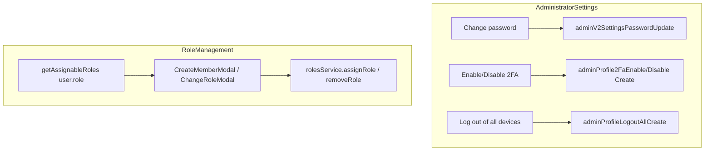

Full rules: [business-rules.md §5](./business-rules.md#5-session-and-security-rules) and
[§1](./business-rules.md#1-permission-matrix-by-role).

---

## Cross-cutting technical flows

### T1. Axios layer: interceptors, CSRF, token

**File:** `src/API/index.ts` (+ generated `src/API/http-client.ts`, `src/API/WalkyAPI.ts`).

There are **two** Axios instances with identical interceptors:
1. `API` (default export) — `axios.create({ baseURL: VITE_API_BASE_URL ?? "http://localhost:8080/api", withCredentials: true })`.
2. `apiClient` = `new Api(new HttpClient({ baseURL: baseURL.replace(/\/api\/?$/, "") }))` — the
   Swagger-generated client. The `/api` suffix is **stripped** from the baseURL because the admin
   routes already include `/api/...` and the legacy ones hit the root (`/ambassadors`, `/campus`, …).
   `withCredentials = true`.

**Request interceptor** (both instances):
- Injects `Authorization: Bearer <token>` from `localStorage.getItem("token")` (warns if missing).
- **CSRF on non-GET:** for methods other than `get/head/options`, it looks for the CSRF token in
  cookies (`csrf_cookie_rr`, `XSRF-TOKEN`, `csrf_token`, `_csrf`, in that order) and sends it in
  **two** headers: `X-CSRF-Token` and `X-XSRF-Token`.

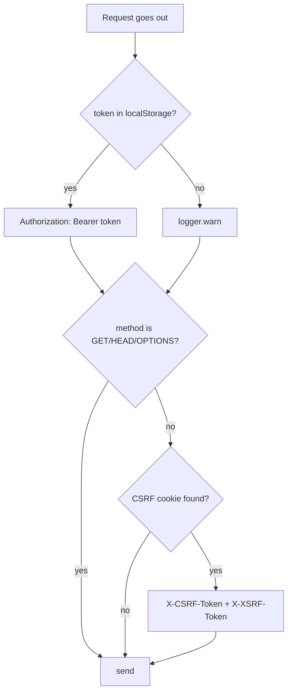

### T2. Handling 401 / 403 errors (ACCOUNT_DEACTIVATED)

**Files:** `src/API/index.ts` (response interceptor), `src/contexts/DeactivatedUserContext.tsx`,
`src/components-v2/DeactivatedUserModal/DeactivatedUserModal.tsx`, `src/layout-v2/LayoutV2.tsx`.

**Response interceptor** (both instances):
- **401:** removes `token` from `localStorage` and, if not already on `/login`, does
  `window.location.href = "/login"`. (No refresh attempt.)
- **403 with `code === "ACCOUNT_DEACTIVATED"` or `"USER_DEACTIVATED"`:** calls `triggerDeactivatedModal()`.
  An ordinary 403 (permission) does **not** open the modal.

**Bridge outside React:** `DeactivatedUserContext` exposes `registerDeactivatedSetter(setter)` and a
global `triggerDeactivatedModal()`. `LayoutV2` registers the setter on mount. This lets the interceptor
(code outside the React tree) trigger the modal. The modal's "Log Out" button clears `token`,
`refreshToken`, `user` and goes to `/login`.

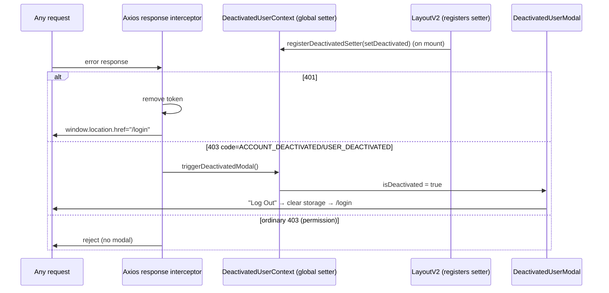

### T3. React Query cache (actual values)

**File:** `src/lib/queryClient.ts` (+ `main.tsx`, which injects the `QueryClientProvider`).

**Actual** `QueryClient` values:

| Option | Value | Effect |
|---|---|---|
| `queries.staleTime` | `1000 * 60 * 5` (**5 min**) | Data considered fresh for 5 min (no refetch). |
| `queries.gcTime` | `1000 * 60 * 10` (**10 min**) | Inactive cache is garbage-collected after 10 min. |
| `queries.retry` | custom function | Does **not** retry on 4xx (except **408**); otherwise up to **3** attempts. |
| `queries.refetchOnWindowFocus` | `false` | Does not refetch on window focus. |
| `mutations.retry` | `1` | Mutations retry once. |

There is a `queryKeys` factory (`campuses`, `campus(id)`, `students`, `geofences(campusId)`,
`ambassadors`, `ambassador(id)`, `ambassadorsByCampus(campusId)`), although several screens build
keys inline (e.g., `["students", page, search, status, sort, schoolId, campusId]`).

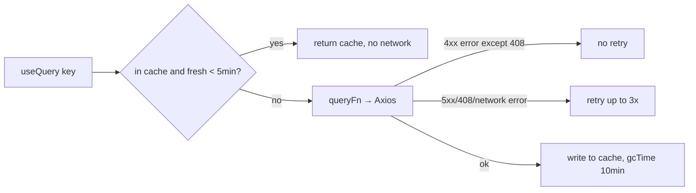

---

## Cross-links

- [business-rules.md](./business-rules.md) — business rules extracted from the code (RBAC matrix,
  session, moderation, campus/ambassadors, form validations).
- [overview.md](./overview.md) — purpose, stack, audience, env vars.
- [integrations.md](./integrations.md) — integrations and the API layer.
- [conventions.md](./conventions.md) — code conventions.
- [admin/admin-reports-controller.md](./admin/admin-reports-controller.md),
  [admin/admin-students-controller.md](./admin/admin-students-controller.md),
  [admin/admin-dashboard-controller.md](./admin/admin-dashboard-controller.md),
  [admin/admin-settings-controller.md](./admin/admin-settings-controller.md),
  [admin/admin-ambassadors-controller.md](./admin/admin-ambassadors-controller.md) — backend contracts.
